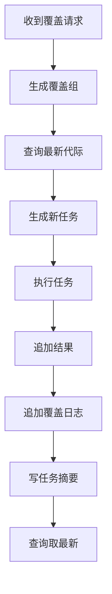

# FMDB 不支持删除时覆盖执行方案

生成时间：2026-07-21 13:54

## 一、问题背景

前置方案里提到 `dw.raha_job_run.overwrite_enabled` 用于表示是否覆盖执行。

但是如果 FMDB 不支持删除，那么不能采用：

```sql
delete from 目标表 where 批次条件;
insert into 目标表 ...
```

这种“先删后写”的物理覆盖方案。

因此，覆盖执行必须改成追加式逻辑覆盖。

核心原则：

```text
不删除旧数据。
只追加新版本。
查询时只取当前有效版本。
```

## 二、结论

`overwrite_enabled` 不能理解为“删除旧数据后重写”。

在 FMDB 不支持删除的前提下，它只能表示：

```text
本次任务允许在同一个业务覆盖组里生成新一代结果，并让查询侧把新一代作为当前结果。
```

换句话说：

```text
overwrite_enabled = true
```

代表“逻辑覆盖”，不是“物理覆盖”。

## 三、推荐总方案

推荐采用：

```text
追加式任务状态表
  + 结果代际字段
  + 覆盖关系表
  + 当前结果视图
```

整体流程：

```text
用户提交 overwrite=true
  -> 创建新任务
  -> 生成 overwriteGroupKey
  -> 生成 resultGeneration
  -> 追加新结果
  -> 追加覆盖关系记录
  -> 查询当前结果时只取最新 generation
```

## 四、为什么不能只在 `dw.raha_job_run` 加 `overwrite_enabled`

只加一个字段不够。

原因：

`dw.raha_job_run` 是任务状态表，只能说明：

```text
这个任务是否声明覆盖执行。
```

但真正要被覆盖的是业务结果，例如：

1. `dw.raha_detection_result`
2. `dw.raha_sample_record`
3. `dw.raha_training_cell`
4. `dw.raha_training_example`

如果结果表没有“哪一代是当前有效结果”的信息，查询方仍然会看到旧结果和新结果混在一起。

所以必须同时设计结果侧的版本选择规则。

## 五、方案一：结果代际字段

这是最推荐的方案。

### 1）核心字段

在可覆盖的结果表里增加：

| 字段 | 类型 | 说明 |
| --- | --- | --- |
| `overwrite_group_key` | string | 同一组可互相覆盖的业务结果 |
| `result_generation` | long | 覆盖代际，从 1 开始递增 |
| `is_current` | boolean | 可选，不推荐强依赖 |
| `supersedes_batch_id` | string | 被本次结果覆盖的上一批次 |
| `overwrite_reason` | string | 覆盖原因 |

如果 FMDB 不支持更新，`is_current` 不能靠更新旧行实现。

因此推荐查询时按 `result_generation` 取最新，不依赖旧行改状态。

### 2）检测结果示例

第一次检测：

| detection_batch_id | overwrite_group_key | result_generation | cell_id | is_error |
| --- | --- | --- | --- | --- |
| detect-001 | `person_info|dw.person_info|model-set-A` | 1 | cell-001 | true |
| detect-001 | `person_info|dw.person_info|model-set-A` | 1 | cell-002 | false |

覆盖执行后：

| detection_batch_id | overwrite_group_key | result_generation | cell_id | is_error |
| --- | --- | --- | --- | --- |
| detect-001 | `person_info|dw.person_info|model-set-A` | 1 | cell-001 | true |
| detect-001 | `person_info|dw.person_info|model-set-A` | 1 | cell-002 | false |
| detect-002 | `person_info|dw.person_info|model-set-A` | 2 | cell-001 | false |
| detect-002 | `person_info|dw.person_info|model-set-A` | 2 | cell-002 | false |

旧数据不删除。

当前结果查询只取：

```sql
max(result_generation)
```

即第 2 代。

### 3）当前结果查询

逻辑 SQL：

```sql
select r.*
from dw.raha_detection_result r
join (
  select overwrite_group_key, max(result_generation) as max_generation
  from dw.raha_detection_result
  group by overwrite_group_key
) g
on r.overwrite_group_key = g.overwrite_group_key
and r.result_generation = g.max_generation
```

如果 FMDB 对复杂查询支持有限，可以物化一个当前结果表。

## 六、方案二：覆盖关系表

如果不想改所有结果表，可以新增覆盖关系表。

建议表名：

```text
dw.raha_result_overwrite_log
```

字段：

| 字段 | 类型 | 说明 |
| --- | --- | --- |
| `overwrite_group_key` | string | 覆盖组 |
| `result_type` | string | `SAMPLING`、`TRAINING`、`DETECTION` |
| `old_batch_id` | string | 被覆盖批次 |
| `new_batch_id` | string | 新批次 |
| `old_job_id` | string | 被覆盖任务 |
| `new_job_id` | string | 新任务 |
| `generation` | long | 新代际 |
| `created_at` | long | 创建时间 |
| `reason` | string | 覆盖原因 |

查询时：

1. 先找某覆盖组最新 `generation`。
2. 拿到 `new_batch_id`。
3. 再去结果表按 `new_batch_id` 查。

优点：

1. 不需要大规模改已有结果表。
2. 覆盖审计清晰。
3. 旧数据完全保留。

缺点：

1. 查询多一步。
2. 每类结果都要定义 `batch_id` 字段。

## 七、方案三：当前结果索引表

新增一张“当前指针表”。

建议表名：

```text
dw.raha_current_result_index
```

字段：

| 字段 | 类型 | 说明 |
| --- | --- | --- |
| `overwrite_group_key` | string | 覆盖组 |
| `result_type` | string | 结果类型 |
| `current_batch_id` | string | 当前有效批次 |
| `current_job_id` | string | 当前有效任务 |
| `generation` | long | 当前代际 |
| `state_version` | long | 状态版本 |
| `created_at` | long | 写入时间 |

由于 FMDB 不支持更新，这张表也不能更新旧行。

它仍然采用追加快照：

| overwrite_group_key | current_batch_id | generation | state_version |
| --- | --- | --- | --- |
| group-A | detect-001 | 1 | 1 |
| group-A | detect-002 | 2 | 2 |

查询当前指针时取：

```sql
max(state_version)
```

优点：

1. 查询当前结果很快。
2. 不需要扫描结果明细表求最大 generation。

缺点：

1. 多一张索引表。
2. 写入时需要保证同一覆盖组串行。

## 八、推荐组合

第一期推荐：

```text
dw.raha_job_run 增加覆盖执行摘要
dw.raha_result_overwrite_log 记录覆盖关系
结果表暂不删除旧数据
查询侧通过 overwrite_log 取当前批次
```

第二期推荐：

```text
检测结果表增加 overwrite_group_key 和 result_generation
增加当前结果视图或索引表
```

不要第一期就尝试对所有结果表加字段。

## 九、`dw.raha_job_run.overwrite_enabled` 的正确含义

`overwrite_enabled` 建议只放在任务状态里，表达：

```text
本任务声明允许逻辑覆盖。
```

它不负责判断当前结果。

建议同时在 `result_summary_json` 写入：

```json
{
  "overwriteEnabled": true,
  "overwriteMode": "LOGICAL_GENERATION",
  "overwriteGroupKey": "person_info|dw.person_info|model-set-A",
  "resultGeneration": 2,
  "supersedesJobId": "job-001",
  "supersedesBatchId": "detect-001",
  "currentBatchId": "detect-002"
}
```

如果第一期不改表结构，也可以先不加 `overwrite_enabled` 物理列，只写入 `result_summary_json`。

## 十、覆盖组如何生成

覆盖组必须代表“同一类业务结果”。

### 1）检测覆盖组

推荐：

```text
datasetId
+ inputReference
+ snapshotId 或 sourceVersion
+ modelSetVersion
+ missingModelPolicy
+ rowIdentityConfig
```

示例：

```text
person_info|select * from dw.person_info|source-v20260721|model-set-A|PARTIAL|content-hash-v1
```

### 2）采样覆盖组

不推荐第一期覆盖采样。

如果必须支持：

```text
datasetId
+ inputReference
+ snapshotId 或 sourceVersion
+ samplingRound
+ labelingBudget
+ rowIdentityConfig
```

### 3）训练覆盖组

不推荐覆盖训练模型。

训练建议永远生成新模型集合。

如果要表达替代关系，只记录：

```text
newModelSetVersion supersedes oldModelSetVersion
```

但不要删除旧模型。

## 十一、覆盖执行流程



说明：

整个流程没有删除操作。

## 十二、重复覆盖并发怎么处理

FMDB 不支持更新和删除时，最大风险是两个覆盖任务同时写同一个覆盖组。

场景：

```text
任务 A 查询当前 generation=1
任务 B 也查询当前 generation=1
任务 A 写 generation=2
任务 B 也写 generation=2
```

这样会产生冲突。

推荐方案：

### 1）默认禁止同覆盖组并发

提交覆盖任务前查：

```text
同 overwriteGroupKey 下是否存在 RUNNING 任务
```

如果存在，返回：

```text
OVERWRITE_GROUP_RUNNING
```

### 2）代际包含任务时间

如果不能强锁，可以让当前版本选择规则变为：

```text
order by result_generation desc, created_at desc, job_id desc
```

这样即使 generation 冲突，也能选出确定的一版。

但这只是兜底，不是最佳方案。

### 3）使用外部锁

如果生产环境允许，可使用：

1. 调度系统锁。
2. Redis 锁。
3. 数据平台任务锁。
4. HDFS 锁文件。

锁粒度：

```text
overwriteGroupKey
```

## 十三、查询当前结果的方式

### 1）通过覆盖日志查询

```sql
select *
from dw.raha_detection_result r
where r.detection_batch_id = (
  select new_batch_id
  from dw.raha_result_overwrite_log
  where overwrite_group_key = 'group-A'
  order by generation desc, created_at desc
  limit 1
)
```

### 2）通过结果代际查询

```sql
select r.*
from dw.raha_detection_result r
join (
  select overwrite_group_key, max(result_generation) as generation
  from dw.raha_detection_result
  group by overwrite_group_key
) g
on r.overwrite_group_key = g.overwrite_group_key
and r.result_generation = g.generation
```

### 3）通过当前索引表查询

```sql
select r.*
from dw.raha_detection_result r
join (
  select overwrite_group_key, current_batch_id
  from dw.raha_current_result_index
  where state_version in (
    select max(state_version)
    from dw.raha_current_result_index
    group by overwrite_group_key
  )
) i
on r.detection_batch_id = i.current_batch_id
```

## 十四、任务幂等和覆盖执行的关系

覆盖执行不能绕开幂等体系。

推荐关系：

| 参数 | 作用 |
| --- | --- |
| `forceRun` | 是否创建新任务 |
| `overwrite` | 是否把新任务声明为当前有效结果 |
| `idempotentKey` | 防止无意重复提交 |
| `overwriteGroupKey` | 定义哪些结果互相覆盖 |
| `resultGeneration` | 定义覆盖代际 |

建议规则：

1. `overwrite=true` 时，通常也应隐含 `forceRun=true`。
2. 如果不强制新任务，就没有新结果可覆盖。
3. 覆盖任务仍然要保存自己的 `idempotentKey`。
4. 旧结果不删，只是不再作为当前结果。

## 十五、涉及修改文件

### 1）第一期最小改造

| 文件 | 修改内容 |
| --- | --- |
| `RahaDetectionUdfService.java` | 解析 `overwrite`，写入任务摘要 |
| `RahaTaskExecutionRequest.java` | 增加覆盖参数或执行选项 |
| `RahaTaskRequestFactory.java` | 生成 `overwriteGroupKey` |
| `RahaTaskApplicationService.java` | 覆盖任务创建和复用判断 |
| `RahaJobOrchestrator.java` | `overwrite=true` 时配合 `forceRun` 创建新任务 |
| `SparkSqlFmdbResultWriter.java` | 结果摘要写入覆盖信息 |
| `FmdbTableSchemas.java` | 可选新增覆盖日志表 schema |
| `FmdbPhysicalTable.java` | 可选新增 `RESULT_OVERWRITE_LOG` |

### 2）推荐新增文件

| 文件 | 作用 |
| --- | --- |
| `OverwriteExecutionOptions.java` | 覆盖执行参数 |
| `OverwriteGroupKeyGenerator.java` | 覆盖组生成器 |
| `ResultGenerationAllocator.java` | 结果代际分配器 |
| `ResultOverwriteLogRepository.java` | 覆盖日志仓储接口 |
| `FmdbResultOverwriteLogRepository.java` | FMDB 覆盖日志实现 |

### 3）第二期增强

| 文件 | 修改内容 |
| --- | --- |
| `FmdbTableSchemas.java` | 检测结果表增加 `overwrite_group_key`、`result_generation` |
| `SparkSqlFmdbResultWriter.java` | 写检测结果时填充覆盖字段 |
| `FmdbDetectionResultRepository.java` | 增加查询当前检测结果 |
| `RahaDetectionUdfService.java` | 返回当前批次、覆盖代际 |

## 十六、最终效果

### 1）用户第一次检测

请求：

```json
{
  "overwrite": "false"
}
```

结果：

```json
{
  "detectionBatchId": "detect-001",
  "overwriteEnabled": false,
  "resultGeneration": 1
}
```

### 2）用户覆盖检测

请求：

```json
{
  "overwrite": "true",
  "overwriteReason": "修正数据后重新检测"
}
```

结果：

```json
{
  "detectionBatchId": "detect-002",
  "overwriteEnabled": true,
  "overwriteMode": "LOGICAL_GENERATION",
  "overwriteGroupKey": "person_info|dw.person_info|model-set-A",
  "resultGeneration": 2,
  "supersedesBatchId": "detect-001"
}
```

查询当前结果时只返回 `detect-002`。

历史 `detect-001` 仍然保留，可审计、可回溯。

## 十七、最终建议

在 FMDB 不支持删除的前提下，不建议实现物理覆盖。

推荐采用：

```text
逻辑覆盖
```

第一期最稳方案：

1. 不改已有结果表。
2. 新增覆盖日志表。
3. `dw.raha_job_run.result_summary_json` 写入覆盖摘要。
4. 查询当前结果时通过覆盖日志定位最新批次。

第二期再考虑：

1. 检测结果表加 `overwrite_group_key`。
2. 检测结果表加 `result_generation`。
3. 建当前结果视图或当前索引表。

这样既满足“覆盖执行”的用户体验，又不破坏 FMDB 追加式存储和历史审计能力。
