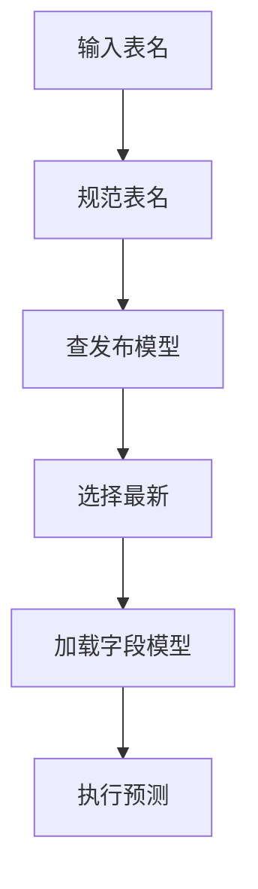
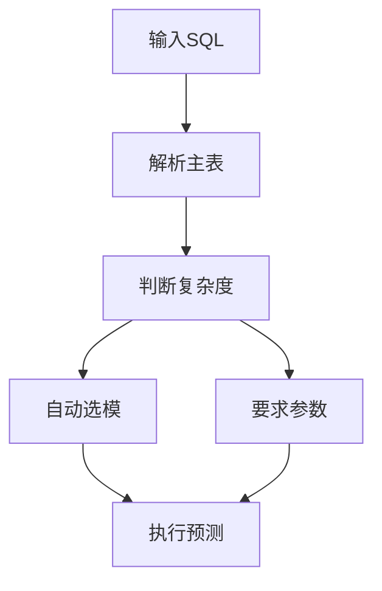

# SHA-256 字段梳理与模型可读版本改造分析

生成时间：2026-07-21 09:35

## 一、结论摘要

当前工程在 FMDB 物理表、JSON 字段、模型文件名和模型路径中都使用了 SHA-256 或 SHA-256 截断值。整体上可以分成两类：

- 第一类是指纹、幂等、隐私保护、单元格坐标、行内容摘要，这类字段继续使用 SHA-256 是合理的。
- 第二类是模型集合版本、字段模型版本、模型文件名、快照标识、训练快照标识，这类字段承担业务定位和人工排查职责，继续只用哈希会显著降低可读性。

建议优先改造的字段和对象是：

- `model_set_version`：当前是完整 SHA-256，建议改为或新增可读模型集合版本，例如 `dw.customer@202607210935`。
- `model_version`：当前是完整 SHA-256，建议改为或新增字段级可读版本，例如 `dw.customer.name@202607210935`。
- `model_path` 和本地模型文件名：当前依赖 `model_version`，文件名形如 `<64位哈希>.properties`，建议使用库表字段版本号生成安全文件名。
- `modelName`：当前存在于模型对象、模型载荷 JSON 和检测原因 JSON 中，但不是独立物理列，且默认只由前缀和字段名组成，建议补充库名、表名、字段名。
- `snapshot_id` 和 `training_snapshot_id`：当前默认是前缀加截断哈希，建议新增可读快照编码，保留哈希做指纹。

预测入口也需要同步调整：当前检测 UDF 明确要求传入 `modelSetVersion`。如果要实现“默认只输入表名或 SQL，系统自动选择最新模型”，需要在模型仓储层新增“按表查最新已发布模型集合”的能力，并把 `modelSetVersion` 改成可选参数。

## 二、分析范围

本次主要检查以下范围：

- 数据库结构：`src/main/resources/db/fmdb/raha-fmdb-schema.sql`
- 表结构映射：`src/main/java/com/fiberhome/ml/raha/repository/adapter/fmdb/schema/FmdbTableSchemas.java`
- 哈希工具：`src/main/java/com/fiberhome/ml/raha/util/HashUtils.java`
- 快照、行、单元格、表结构摘要生成逻辑
- 采样、标注、训练、模型发布、检测结果写入逻辑
- 文件模型存储和 FMDB 模型存储逻辑
- UDF 检测参数解析和任务请求组装逻辑

## 三、物理表中的 SHA-256 字段清单

### 3.1 `dw.raha_sample_record`

| 字段 | 当前形态 | 生成位置 | 业务作用 | 建议 |
|---|---|---|---|---|
| `sample_batch_id` | `sample-` 加 24 位 SHA-256 截断值 | `SampleRecordService` | 采样批次标识 | 可保留哈希，同时新增可读批次号，便于按表和轮次排查。 |
| `input_reference` | 表输入通常可读，SQL 输入可能是 `sql:` 加 24 位 SHA-256 截断值 | `RahaUdfRequestParser` | 输入来源引用 | SQL 场景可保留摘要，但建议新增原始 SQL 摘要说明或主表名字段。 |
| `row_id` | SHA-256，来源可能是业务键序列化或内容哈希 | `RowIdentityService` | 行身份 | 保留哈希。若有业务主键，建议额外保存受控可读业务键展示列。 |
| `row_content_hash` | 完整 SHA-256 | `RowIdentityService` | 行内容指纹 | 保留，用于变更检测和去重。 |
| `schema_hash` | 完整 SHA-256 | `SchemaHasher` | 表结构指纹 | 保留，建议额外展示库表名和结构版本。 |
| `sampling_version` | 完整 SHA-256 | `SamplingVersioner` | 采样策略版本 | 保留内部指纹，可新增采样策略可读版本。 |

### 3.2 `dw.raha_annotation_record`

| 字段 | 当前形态 | 生成位置 | 业务作用 | 建议 |
|---|---|---|---|---|
| `annotation_batch_id` | `ann-` 加完整 SHA-256 | `AnnotationImportService` | 标注导入批次 | 可保留，若人工频繁查询，新增可读标注批次号。 |
| `sample_batch_id` | 继承采样批次哈希 | `SampleRecordService` | 关联采样批次 | 保留，同时通过可读批次号辅助查询。 |
| `annotation_task_id` | 完整 SHA-256 | `SamplingService` | 标注任务标识 | 保留，任务内部稳定性更重要。 |
| `row_id` | SHA-256 | `RowIdentityService` | 行身份 | 保留。 |
| `row_content_hash` | 完整 SHA-256 | `RowIdentityService` | 行内容指纹 | 保留。 |
| `schema_hash` | 完整 SHA-256 | `SchemaHasher` | 表结构指纹 | 保留。 |

### 3.3 `dw.raha_training_column_artifact`

| 字段 | 当前形态 | 生成位置 | 业务作用 | 建议 |
|---|---|---|---|---|
| `schema_hash` | 完整 SHA-256 | `SchemaHasher` | 训练输入结构指纹 | 保留。 |
| `strategy_plan_version` | 完整 SHA-256 | `StrategyPlanVersioner` | 策略计划版本 | 保留内部指纹，可新增可读计划版本。 |
| `feature_dictionary_version` | 完整 SHA-256 | `FeatureDictionaryVersioner` 和 `RahaTrainService` | 特征字典版本 | 保留内部指纹，可新增可读特征版本。 |
| `cluster_version` | 完整 SHA-256 | `ClusterVersioner` | 聚类结果版本 | 保留内部指纹，可新增可读聚类版本。 |

### 3.4 `dw.raha_training_cell`

| 字段 | 当前形态 | 生成位置 | 业务作用 | 建议 |
|---|---|---|---|---|
| `training_snapshot_id` | `train-` 加 32 位 SHA-256 截断值 | `TrainingInputMergeService` | 训练合并快照 | 建议新增可读训练快照编码，例如 `train_dw.customer@202607210935`。 |
| `row_id` | SHA-256 | `RowIdentityService` | 行身份 | 保留。 |
| `cell_id` | 完整 SHA-256 | `CellCoordinate` | 单元格稳定标识 | 保留，避免明文拼接过长且避免敏感值泄露。 |
| `feature_dictionary_version` | 完整 SHA-256 | `FeatureDictionaryVersioner` 和 `RahaTrainService` | 特征字典版本 | 保留内部指纹，可新增可读特征版本。 |

### 3.5 `dw.raha_training_example`

| 字段 | 当前形态 | 生成位置 | 业务作用 | 建议 |
|---|---|---|---|---|
| `model_set_version` | 完整 SHA-256 | `RahaTrainService` | 模型集合版本 | 高优先级改造，建议按库名、表名、发布时间或递增版本生成。 |
| `row_id` | SHA-256 | `RowIdentityService` | 行身份 | 保留。 |
| `cell_id` | 完整 SHA-256 | `CellCoordinate` | 单元格标识 | 保留。 |
| `feature_dictionary_version` | 完整 SHA-256 | `FeatureDictionaryVersioner` 和 `RahaTrainService` | 特征字典版本 | 保留内部指纹，可新增可读特征版本。 |

### 3.6 `dw.raha_model_artifact`

| 字段 | 当前形态 | 生成位置 | 业务作用 | 建议 |
|---|---|---|---|---|
| `model_set_version` | 完整 SHA-256 | `RahaTrainService` | 模型集合版本 | 高优先级改造，建议新增 `model_set_key`、`model_set_digest`、`source_table_name`、`is_latest` 等字段。 |
| `schema_hash` | 完整 SHA-256 | `SchemaHasher` | 表结构指纹 | 保留。 |
| `strategy_plan_version` | 完整 SHA-256 | `StrategyPlanVersioner` | 策略计划版本 | 保留内部指纹，可新增可读计划版本。 |
| `model_version` | 完整 SHA-256 | `ColumnModelVersioner` | 字段模型版本 | 高优先级改造，建议改为或新增字段级可读版本。 |
| `feature_dictionary_version` | 完整 SHA-256 | `FeatureDictionaryVersioner` 和 `RahaTrainService` | 特征字典版本 | 保留内部指纹，可新增可读特征版本。 |
| `model_path` | 文件存储时包含 64 位 `model_version`，FMDB 存储时形如 `fmdb-model://表名/模型版本` | `FileColumnModelStore` 和 `FmdbModelStore` | 模型位置 | 高优先级改造，建议路径中包含库名、表名、字段名、版本号。 |

补充说明：当前物理表没有独立的 `model_name` 字段，模型名称写在 `model_payload_json` 中；检测导出时会从 `error_reason_json` 读出 `modelName` 并展示为 `model_name`。

### 3.7 `dw.raha_detection_result`

| 字段 | 当前形态 | 生成位置 | 业务作用 | 建议 |
|---|---|---|---|---|
| `model_set_version` | 训练侧通常是完整 SHA-256 | `RahaTrainService` 和检测结果写入上下文 | 检测所用模型集合 | 高优先级改造，默认展示可读版本。 |
| `model_version` | 完整 SHA-256 | `ColumnModelVersioner` | 检测所用字段模型 | 高优先级改造，默认展示字段级可读版本。 |
| `row_id` | SHA-256 | `RowIdentityService` | 行身份 | 保留。 |
| `cell_id` | 完整 SHA-256 | `CellCoordinate` | 单元格标识 | 保留。 |

### 3.8 `dw.raha_job_run`

| 字段 | 当前形态 | 生成位置 | 业务作用 | 建议 |
|---|---|---|---|---|
| `idempotent_key` | 完整 SHA-256 | `IdempotencyKeyGenerator` | 任务幂等键 | 保留，不建议改成可读值。 |
| `snapshot_id` | 默认 `snapshot-` 加 24 位 SHA-256 截断值，也允许外部显式传入 | `SnapshotMetadataFactory` | 输入快照标识 | 建议新增可读快照编码，哈希快照继续作为不可变指纹。 |
| `config_version` | 完整 SHA-256 | `ConfigVersioner` | 任务配置版本 | 保留，不建议改成纯可读值。 |
| `current_stage_id` | 阶段类型加 16 位 SHA-256 截断值 | `DefaultRahaIdGenerator` | 当前阶段标识 | 可保留，必要时新增阶段序号或阶段名称展示字段。 |

### 3.9 `dw.raha_job_stage_attempt`

| 字段 | 当前形态 | 生成位置 | 业务作用 | 建议 |
|---|---|---|---|---|
| `stage_id` | 阶段类型加 16 位 SHA-256 截断值 | `DefaultRahaIdGenerator` | 阶段尝试标识 | 可保留。 |
| `checkpoint_id` | 预留字段，`StageCheckpoint` 可生成完整 SHA-256，但当前 FMDB 写入多为 `null` | `StageCheckpoint` 和 `FmdbStageRepository` | 阶段检查点 | 暂不作为核心改造项。 |
| `input_fingerprint` | 预留字段，当前 FMDB 写入多为 `null` | `FmdbStageRepository` | 阶段输入指纹 | 暂不作为核心改造项。 |

## 四、JSON 字段和文件中的 SHA-256 清单

| 位置 | 当前哈希内容 | 影响 | 建议 |
|---|---|---|---|
| `sampling_context_json` | `annotationTaskId`、`snapshotId` 等可能是哈希标识 | 采样记录追踪需要翻上下文 | 保留，同时补充可读快照编码和采样轮次。 |
| `annotation_json` | `sourceSnapshotId`、标签标识等可能是哈希标识 | 标注回放依赖哈希上下文 | 保留，标注批次可增加可读编号。 |
| `training_context_json` | `trainingSnapshotId`、`sampleBatchId`、`annotationBatchId` | 训练来源可读性一般 | 新增库名、表名、训练版本、源批次可读名。 |
| `profile_json` | 值频率摘要中可能使用 `valueHash` | 避免保存原始敏感值 | 保留。 |
| `strategy_plan_json` | `strategyId`、`configurationHash` | 策略去重和复现 | 保留内部哈希，另加策略名称和参数摘要。 |
| `cluster_summary_json` | `clusterVersion` 等 | 聚类结果复现 | 保留内部哈希，另加可读聚类版本。 |
| `propagation_summary_json` | 传播摘要标识、来源指纹等 | 标签传播追踪 | 保留内部哈希。 |
| `model_payload_json` | `modelVersion`、`featureDictionaryVersion`、`schemaHash`，并保存 `modelName` | 模型载荷仍以哈希版本为主 | 新增可读模型键和模型版本，哈希改名为摘要字段。 |
| `error_reason_json` | `snapshotId`、`configVersion`、`stageId`、`valueHash`、`featureDictionaryVersion`、`strategyIds`、`modelName` | 检测结果排查时需要读 JSON | 保留隐私和复现字段，额外写出可读模型名、表名、字段名、模型集合版本。 |
| 本地模型文件 | `<modelVersion>.properties`，且当前强校验 `modelVersion` 必须是 64 位十六进制 | 文件名无法看出表和字段 | 放宽文件名规则，改为安全编码后的库表字段版本号。 |
| FMDB 模型路径 | `fmdb-model://模型表/模型版本` | 路径无法看出字段模型 | 路径中加入库名、表名、字段名和发布时间。 |

## 五、当前设计带来的可读性问题

1. 快照标识无法直接看出来自哪个库、哪张表、哪个源版本。
2. 模型集合版本是完整哈希，检测结果里的 `model_set_version` 无法直接定位训练对象。
3. 字段模型版本和模型文件名是完整哈希，无法直接看出模型对应字段。
4. `modelName` 不是物理列，默认形态接近 `raha-字段名`，缺少库表上下文。
5. 检测 UDF 当前把 `modelSetVersion` 作为必填参数，不符合“只输入表名或 SQL 自动选择最新模型”的默认使用方式。
6. SQL 输入场景更复杂：简单单表 SQL 可以从 SQL 中推断表名，复杂 SQL、关联查询和子查询需要显式指定模型查找表或模型集合版本。

## 六、推荐命名规则

### 6.1 可读版本和摘要分离

建议不要直接删除 SHA-256，而是把“可读业务键”和“不可变摘要”拆开：

| 用途 | 建议字段 | 示例 |
|---|---|---|
| 表级模型集合可读版本 | `model_set_key` 或新的 `model_set_version` | `dw.customer@202607210935` |
| 表级模型集合摘要 | `model_set_digest` | 64 位 SHA-256 |
| 字段级模型可读版本 | `model_key` 或新的 `model_version` | `dw.customer.name@202607210935` |
| 字段级模型摘要 | `model_digest` | 64 位 SHA-256 |
| 快照可读编码 | `snapshot_key` | `snapshot_dw.customer@202607210935` |
| 快照摘要 | `snapshot_digest` 或继续使用原 `snapshot_id` | `snapshot-` 加截断 SHA-256 |

### 6.2 表级版本规则

推荐展示形态：

```text
<database>.<table>@<yyyyMMddHHmmss>
```

示例：

```text
dw.customer@202607210935
```

推荐文件安全形态：

```text
<database>_<table>__v<yyyyMMddHHmmss>
```

示例：

```text
dw_customer__v202607210935
```

### 6.3 字段级模型规则

推荐展示形态：

```text
<database>.<table>.<column>@<yyyyMMddHHmmss>
```

示例：

```text
dw.customer.phone@202607210935
```

推荐文件安全形态：

```text
<database>_<table>__<column>__v<yyyyMMddHHmmss>.properties
```

示例：

```text
dw_customer__phone__v202607210935.properties
```

### 6.4 特殊字符处理

库名、表名、字段名进入文件名或 URL 路径前必须做安全编码：

- 统一小写或保留原大小写需要提前确定，不要混用。
- 点号用于层级展示，文件名中替换为下划线。
- 空格、中文、特殊符号需要百分号编码或稳定转义。
- 超长表名和字段名需要长度限制，末尾可追加短摘要防冲突。
- 可读版本不能直接包含敏感值。

## 七、自动选模流程建议

### 7.1 表输入默认流程



表输入默认逻辑：

1. 根据输入表名生成稳定 `datasetId`，当前表输入已有 `fmdb-table:` 加规范化表名的基础。
2. 如果用户没有传 `modelSetVersion`，按 `datasetId` 或规范化表名查询已发布模型集合。
3. 只允许选择 `PUBLISHED` 状态的模型集合。
4. 最新版本按 `published_at`、`created_at`、`state_version` 降序选择。
5. 如果用户传了 `modelSetVersion`，继续走精确版本加载，保证兼容历史调用。

### 7.2 SQL 输入默认流程



SQL 输入建议：

1. 简单单表 SQL 可以自动提取库名和表名，然后按表查最新发布模型。
2. 复杂 SQL、关联查询、子查询、临时视图，必须显式传入 `datasetId`、`modelLookupTable` 或 `modelSetVersion`。
3. 如果 SQL 字段别名和原表字段不同，需要提供字段映射，否则字段模型无法可靠匹配。
4. SQL 的原文可以继续用摘要做 `input_reference`，但模型查找不应只依赖 SQL 摘要。

## 八、建议的落地改造清单

### 8.1 数据库结构

优先在 `dw.raha_model_artifact` 增加以下字段：

| 字段 | 用途 |
|---|---|
| `source_database_name` | 训练来源库名。 |
| `source_table_name` | 训练来源表名。 |
| `model_set_key` | 表级模型集合可读键。 |
| `model_set_digest` | 模型集合不可变摘要。 |
| `model_name` | 字段模型可读名称，建议物理列化。 |
| `model_key` | 字段模型可读键。 |
| `model_digest` | 字段模型不可变摘要。 |
| `is_latest` | 可选字段，用于加速默认选最新模型。 |

可选增加：

| 表 | 字段 | 用途 |
|---|---|---|
| `dw.raha_job_run` | `snapshot_key` | 快照可读编码。 |
| `dw.raha_sample_record` | `source_table_name` | 采样来源表名。 |
| `dw.raha_training_cell` | `training_snapshot_key` | 训练快照可读编码。 |
| `dw.raha_detection_result` | `model_set_key`、`model_key`、`model_name` | 检测结果直接展示可读模型信息。 |

### 8.2 代码改造点

| 模块 | 当前问题 | 改造建议 |
|---|---|---|
| `RahaTrainService` | 生成完整 SHA-256 的 `modelSetVersion` | 生成可读版本，同时保存摘要。 |
| `ColumnModelVersioner` | 只生成完整 SHA-256 的 `model_version` | 拆出可读版本生成器和摘要生成器。 |
| `FileColumnModelStore` | 强校验 `modelVersion` 必须是 64 位十六进制 | 改成安全文件名校验，并保留摘要校验。 |
| `FmdbModelStore` | 模型路径只包含模型版本 | 路径加入库名、表名、字段名和可读版本。 |
| `FmdbModelMetadataRepository` | 只按 `model_set_version` 查询 | 新增按表查最新已发布模型集合的查询方法。 |
| `ModelSetRepository` | 只支持精确版本查找 | 新增 `findLatestPublishedByDataset` 或 `findLatestPublishedByTable`。 |
| `RahaTaskRequestFactory` | 检测入口要求 `modelSetVersion` | 增加默认自动解析模型集合的重载方法。 |
| `RahaDetectionUdfService` | UDF 参数里 `modelSetVersion` 必填 | 调整为可选，未传时按表或 SQL 自动选模。 |
| `README.md` | 示例使用可读 `model-set-...`，代码实际生成 SHA | 更新文档，说明默认选模和手动指定方式。 |

### 8.3 兼容策略

1. 历史哈希版本继续可用，用户显式传 `modelSetVersion` 时按旧逻辑精确加载。
2. 新版本训练同时写入可读键和摘要，避免改造期间丢失复现能力。
3. 检测结果同时保留原 `model_set_version` 和新增可读字段，导出优先展示可读字段。
4. 本地模型文件迁移时支持同时读取旧的 `<64位哈希>.properties` 和新的可读文件名。
5. 对所有新增可读字段增加唯一约束或冲突处理规则，防止同名表、同名字段、同一时间戳并发训练冲突。

## 九、保留 SHA-256 的字段建议

以下字段不建议直接改成可读值：

- `row_content_hash`
- `cell_id`
- `valueHash`
- `schema_hash`
- `config_version`
- `idempotent_key`
- `strategyId`
- `configurationHash`
- `labelId`
- `sourceFingerprint`
- `annotation_task_id`

原因是这些字段主要承担去重、幂等、隐私保护、复现和稳定引用，不应该为了展示可读性牺牲唯一性和安全性。

## 十、优先级建议

第一优先级：

- 改造 `model_set_version` 的可读版本能力。
- 改造 `model_version` 和 `model_path`。
- 给 `modelName` 增加库表字段上下文，并物理列化。
- 检测入口支持不传 `modelSetVersion` 时自动按表选择最新发布模型。

第二优先级：

- 给 `snapshot_id`、`training_snapshot_id` 增加可读别名。
- 检测结果表增加可读模型字段，减少排查时解析 JSON 的成本。
- README 和 UDF 参数说明同步更新。

第三优先级：

- 评估 `sample_batch_id`、`annotation_batch_id` 是否需要可读批次号。
- 对有业务主键的数据增加受控的可读主键展示列，但不要替代 `row_id`。

## 十一、最终建议

这次问题的核心不是“不能用 SHA-256”，而是“业务定位字段不应该只有 SHA-256”。建议保留哈希作为不可变摘要，同时为模型训练和预测主链路补充可读业务键：

- 表级模型集合用库名、表名、版本号定位。
- 字段级模型用库名、表名、字段名、版本号定位。
- 默认预测只输入表名时，系统自动选择最新已发布模型集合。
- SQL 预测只在简单单表场景自动推断，复杂 SQL 要求显式指定模型查找参数。

这样既保留当前系统的可复现性和幂等能力，又能显著提升模型排查、文件定位、结果导出和 UDF 调用的可读性。
