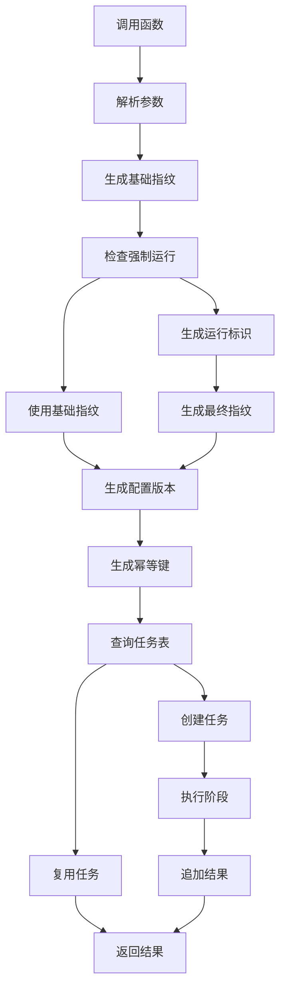
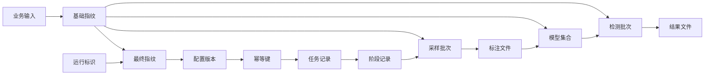

# forceRun 指纹追加改造完整方案

## 一、结论

可以采用“请求阶段追加运行标识”的简化方案，不需要为 FMDB 增加删除、覆盖或复杂覆盖表。

核心规则是：正常请求继续使用稳定的 `executionInputFingerprint`；当 `forceRun=true` 时，在稳定业务指纹后追加一次请求级 `runNonce`，再生成新的最终 `executionInputFingerprint`。由于当前 `RahaJobConfig.toCanonicalString()` 已经包含 `executionInputFingerprint`，最终指纹变化会自然带动 `configVersion` 和 `idempotentKey` 变化，`RahaJobOrchestrator.submit()` 就会创建新任务，旧任务和旧结果继续保留。

但“只追加时间戳”不能完整解决所有问题。完整落地还必须补齐三件事：

1. 返回结果明确输出 `reused=true/false`、`jobId`、`configVersion`、`idempotentKey`、基础指纹和最终指纹。
2. 复用任务时不能再只返回空属性，否则 UDF 里的 `requirePayload` 仍可能出现“复用任务缺少 payload”的现象。
3. 追加多个批次后，需要有“当前结果选择规则”，否则旧结果和新结果都在表里，调用方不知道应该看哪一批。

推荐最终规则：`forceRun=true` 时使用 `runNonce = forceRunId 或 时间戳加随机值`，不要只用单纯时间戳。

## 二、改造目标

本方案目标如下：

| 目标 | 说明 |
| --- | --- |
| 默认幂等 | 不传 `forceRun` 时，同一输入重复执行继续复用已有任务 |
| 强制新跑 | `forceRun=true` 且不传 `forceRunId` 时，每次生成新任务 |
| 强制重试幂等 | `forceRun=true` 且传相同 `forceRunId` 时，重复请求复用同一次强制运行 |
| 不删除旧数据 | FMDB 只追加新任务、新阶段、新结果，不做物理删除 |
| 返回可解释 | UDF 返回行明确标记是否复用、使用了哪个指纹、哪个任务、哪个当前批次 |
| 可追溯 | 通过基础指纹把多次强制运行归到同一业务输入血缘下 |

## 三、字段定义

| 字段 | 是否稳定 | 用途 | 保存位置 |
| --- | --- | --- | --- |
| `baseExecutionInputFingerprint` | 稳定 | 表示不含强制运行参数的业务输入指纹，用于血缘归组和当前结果查询 | 建议写入 `result_summary_json`，并在 UDF 返回 |
| `executionInputFingerprint` | 可能变化 | 实际进入 `RahaJobConfig` 的最终执行输入指纹，用于生成配置版本和幂等键 | 已通过 `RahaJobConfig.executionInputFingerprint` 进入配置版本；建议同步写入 `result_summary_json` |
| `configVersion` | 随最终配置变化 | 表示完整任务配置版本，包含最终执行输入指纹 | `dw.raha_job_run.config_version` |
| `idempotentKey` | 随最终配置变化 | 任务查重键，当前按 `dataset_id + idempotent_key` 查重 | `dw.raha_job_run.idempotent_key` |
| `forceRun` | 请求参数 | 是否强制新跑 | 建议写入 `result_summary_json`，并在 UDF 返回 |
| `forceRunId` | 请求参数 | 调用方指定的强制运行幂等标识 | 建议写入 `result_summary_json`，并在 UDF 返回 |
| `runNonce` | 请求级运行标识 | `forceRun=true` 时参与最终指纹计算 | 建议写入 `result_summary_json`，排障可见 |
| `reused` | 执行结果 | 标记本次是否复用已有任务 | UDF 返回 |

## 四、指纹生成规则

### 4.1 正常请求

不传 `forceRun` 或 `forceRun=false` 时：

```text
baseExecutionInputFingerprint = sha256(稳定业务输入)
executionInputFingerprint = baseExecutionInputFingerprint
```

此时同一请求重复执行会得到相同的 `configVersion` 和 `idempotentKey`，统一入口会复用已有任务。

### 4.2 强制运行请求

传入 `forceRun=true` 时：

```text
baseExecutionInputFingerprint = sha256(稳定业务输入)
runNonce = forceRunId 或 yyyyMMddHHmmssSSS-uuid
executionInputFingerprint = sha256(baseExecutionInputFingerprint, forceRun, runNonce)
```

注意：`runNonce` 必须是请求级别，只生成一次。不能对每一行、每一个字段、每一个阶段内部循环重复生成。

### 4.3 为什么不用单纯时间戳

单纯时间戳能让大多数串行请求生成新任务，但存在三个边界问题：

| 问题 | 现象 | 建议 |
| --- | --- | --- |
| 并发碰撞 | 同一毫秒内两个请求可能得到相同时间戳 | 默认使用时间戳加 UUID |
| 重试失控 | 网络超时后调用方重试，会再次生成新任务 | 支持调用方传 `forceRunId` |
| 血缘丢失 | 只有最终指纹时，难以判断多次强制运行属于同一业务输入 | 同时保留基础指纹 |

因此最终采用“时间戳加随机值”的默认策略，同时保留 `forceRunId` 供外部系统做请求级幂等。

## 五、涉及的统一入口场景

| 函数 | 默认复用条件 | `forceRun=true` 后效果 | 备注 |
| --- | --- | --- | --- |
| `F_DW_DETCOLLECT` | 输入表、快照、采样轮次、已有标签、采样配置一致 | 生成新的采样任务和采样批次 | 旧采样批次保留 |
| `F_DW_DETTRAIN` | 采样批次、标注批次、训练参数、输入覆盖一致 | 生成新的训练任务和模型集合 | 旧模型集合保留 |
| `F_DW_DETRUN` | 输入表、模型集合、缺失模型策略一致 | 生成新的检测任务和检测批次 | 旧检测结果保留 |

如果三个函数都传 `forceRun=true`，三个阶段都会分别新建任务。  
如果只想重新检测，不要给采样和训练传 `forceRun=true`，只给 `F_DW_DETRUN` 传即可。

本方案不改变策略配置。若本次验证要求只使用 OD 和 PV，需要在策略配置层确认工程内 PV 对应的枚举或策略名；从当前项目命名看，通常应按 `OD` 和 `PVD` 落到工程实现。

## 六、涉及文件修改清单

### 6.1 必须修改

| 文件 | 修改内容 | 最终效果 |
| --- | --- | --- |
| `src/main/java/com/fiberhome/ml/raha/udf/RahaUdfRequestParser.java` | 增加 `forceRun`、`forceRunId`、`debugFingerprint` 参数解析辅助方法 | 三个 UDF 可以统一读取强制运行参数 |
| `src/main/java/com/fiberhome/ml/raha/udf/RahaDetectionUdfService.java` | 在 collect、train、detect 中解析强制运行参数并传入任务选项；返回行补充任务元数据；复用时按持久化结果回填 | SQL 结果能看出是否复用，并避免复用 payload 缺失 |
| `src/main/java/com/fiberhome/ml/raha/udf/RahaUdfFields.java` | 在公共返回字段中增加 `jobId`、`configVersion`、`idempotentKey`、`reused`、`forceRun`、`forceRunId`、`baseExecutionInputFingerprint`、`executionInputFingerprint`、`currentSelectRule` | 三个 UDF 返回结构统一可观测 |
| `src/main/java/com/fiberhome/ml/raha/service/task/ExecutionOverrideOptions.java` | 新增强制运行选项值对象 | 统一表达 `forceRun`、`forceRunId`、`runNonce` |
| `src/main/java/com/fiberhome/ml/raha/service/task/ExecutionFingerprint.java` | 新增指纹结果值对象 | 同时携带基础指纹、最终指纹和运行标识 |
| `src/main/java/com/fiberhome/ml/raha/service/task/SamplingRequestOptions.java` | 增加强制运行选项字段、构造重载和 getter | 采样任务可参与强制运行 |
| `src/main/java/com/fiberhome/ml/raha/service/task/TrainingRequestOptions.java` | 增加强制运行选项字段、构造重载和 getter | 训练任务可参与强制运行 |
| `src/main/java/com/fiberhome/ml/raha/service/task/DetectionRequestOptions.java` | 增加强制运行选项字段、构造重载和 getter | 检测任务可参与强制运行 |
| `src/main/java/com/fiberhome/ml/raha/service/task/RahaTaskRequestFactory.java` | 将现有 `inputFingerprint`、`trainingFingerprint` 拆成“基础指纹”和“最终指纹”；`forceRun=true` 时追加 `runNonce` | 最小改动触发新的 `configVersion` 和 `idempotentKey` |
| `src/main/java/com/fiberhome/ml/raha/service/task/RahaTaskExecutionRequest.java` | 增加执行指纹元数据字段和 getter | 应用服务和返回结果可以拿到基础指纹 |
| `src/main/java/com/fiberhome/ml/raha/service/task/RahaTaskExecutionResult.java` | 增加执行指纹元数据、配置版本、幂等键的访问能力；复用结果不再只携带空属性 | UDF 可以稳定输出排障字段 |
| `src/main/java/com/fiberhome/ml/raha/service/task/RahaTaskApplicationService.java` | 复用分支构造结果时传入请求元数据；必要时从持久化摘要恢复属性 | 复用任务返回 `reused=true` 且不丢核心元数据 |
| `src/main/java/com/fiberhome/ml/raha/repository/adapter/fmdb/result/SparkSqlFmdbResultWriter.java` | 确保完成态写入的 `result_summary_json` 包含基础指纹、最终指纹、强制运行标识、当前批次、结果位置 | 追加模式下仍可追踪当前结果 |
| `src/main/java/com/fiberhome/ml/raha/repository/adapter/fmdb/repository/FmdbJobRepository.java` | 增加读取最新任务摘要的能力，或扩展现有恢复对象 | 复用时可取回上次成功结果摘要 |

### 6.2 建议修改

| 文件 | 修改内容 | 原因 |
| --- | --- | --- |
| `src/main/java/com/fiberhome/ml/raha/repository/port/DetectionResultRepository.java` | 增加按基础指纹或任务标识查询最新成功检测批次的方法 | 解决多批次追加后的当前结果选择 |
| `src/main/java/com/fiberhome/ml/raha/repository/adapter/fmdb/repository/FmdbDetectionResultRepository.java` | 实现最新检测批次查询 | 让 `F_DW_DETRUN` 可以返回当前批次 |
| `src/main/java/com/fiberhome/ml/raha/repository/adapter/fmdb/schema/FmdbTableSchemas.java` | 第一阶段不强制改；高频查询时可选增加 `base_execution_input_fingerprint`、`execution_input_fingerprint`、`force_run`、`force_run_id` 物理列 | JSON 查询可先满足兼容，物理列只用于性能优化 |
| `src/main/java/com/fiberhome/ml/raha/job/execution/RahaJobOrchestrator.java` | 不需要绕过幂等；只建议补充日志，打印最终指纹、配置版本和幂等键 | 指纹变化已经能创建新任务 |

### 6.3 不建议修改

| 文件或表 | 不建议原因 |
| --- | --- |
| `dw.raha_job_run` 删除旧行 | FMDB 不支持删除，且删除会破坏血缘审计 |
| 新增复杂覆盖表 | 当前诉求只需要强制新跑和当前结果选择，复杂覆盖表成本过高 |
| 将 `forceRun` 直接并入业务基础指纹 | 会导致基础血缘不稳定，无法归并多次强制运行 |
| 合并 `executionInputFingerprint`、`configVersion`、`idempotentKey` | 三者职责不同，合并后会丢失可解释性和分层边界 |

## 七、结果摘要建议结构

完成态写入 `dw.raha_job_run.result_summary_json` 时建议包含：

```json
{
  "baseExecutionInputFingerprint": "稳定业务指纹",
  "executionInputFingerprint": "最终执行指纹",
  "forceRun": true,
  "forceRunId": "manual-20260721-001",
  "runNonce": "manual-20260721-001",
  "currentSelectRule": "LATEST_SUCCESS_BY_BASE_FINGERPRINT",
  "currentBatchId": "job_20260721141300001",
  "resultLocation": "hdfs 或 zip 地址",
  "zipUrl": "可下载地址"
}
```

如果 `forceRunId` 为空，`runNonce` 可为 `20260721141315999-uuid` 这类系统生成值。

## 八、流程图



图中 `n04` 表示普通条件分支：未强制运行时直接使用基础指纹，强制运行时先生成运行标识再生成最终指纹。

## 九、血缘关系图



基础指纹用于把多次强制运行归并到同一业务输入；最终指纹用于真正创建和复用任务。

## 十、执行示例

### 10.1 默认幂等复用

```sql
select *
from F_DW_DETRUN(
  'sourceType=TABLE;tableName=person_info;modelSetVersion=ms_001'
);
```

第一次执行结果：

| 字段 | 示例 |
| --- | --- |
| `reused` | `false` |
| `jobId` | `job_a` |
| `baseExecutionInputFingerprint` | `fp_base_001` |
| `executionInputFingerprint` | `fp_base_001` |

第二次执行相同请求：

| 字段 | 示例 |
| --- | --- |
| `reused` | `true` |
| `jobId` | `job_a` |
| `baseExecutionInputFingerprint` | `fp_base_001` |
| `executionInputFingerprint` | `fp_base_001` |

### 10.2 每次强制新跑

```sql
select *
from F_DW_DETRUN(
  'sourceType=TABLE;tableName=person_info;modelSetVersion=ms_001;forceRun=true'
);
```

第一次强制运行：

| 字段 | 示例 |
| --- | --- |
| `reused` | `false` |
| `jobId` | `job_b` |
| `baseExecutionInputFingerprint` | `fp_base_001` |
| `executionInputFingerprint` | `fp_force_001` |

再次执行相同强制请求：

| 字段 | 示例 |
| --- | --- |
| `reused` | `false` |
| `jobId` | `job_c` |
| `baseExecutionInputFingerprint` | `fp_base_001` |
| `executionInputFingerprint` | `fp_force_002` |

### 10.3 强制运行但允许请求重试复用

```sql
select *
from F_DW_DETRUN(
  'sourceType=TABLE;tableName=person_info;modelSetVersion=ms_001;forceRun=true;forceRunId=manual-20260721-001'
);
```

第一次执行：

| 字段 | 示例 |
| --- | --- |
| `reused` | `false` |
| `jobId` | `job_d` |
| `executionInputFingerprint` | `fp_force_manual_001` |

网络超时后用相同 `forceRunId` 重试：

| 字段 | 示例 |
| --- | --- |
| `reused` | `true` |
| `jobId` | `job_d` |
| `executionInputFingerprint` | `fp_force_manual_001` |

## 十一、追加模式下的当前结果选择

由于 FMDB 不删除旧结果，强制运行后同一业务输入会存在多个任务和多个结果批次。建议统一使用以下选择规则：

```text
currentSelectRule = LATEST_SUCCESS_BY_BASE_FINGERPRINT
```

含义：

1. 只看同一 `baseExecutionInputFingerprint` 下的任务。
2. 只选择 `status=SUCCESS` 的任务。
3. 按 `finished_at`、`created_at`、`job_id` 倒序选择最新成功批次。
4. 如果最新强制运行失败，不覆盖上一次成功结果。

这样可以保证旧结果保留，新结果追加，同时“当前结果”稳定可解释。

## 十二、复用结果回填方案

当前 `RahaTaskExecutionResult.reused()` 使用空属性构造结果，UDF 中 `requirePayload()` 会在复用任务时可能报错。需要补齐复用回填，否则即使 `forceRun` 解决了新任务创建，普通重复执行仍可能失败。

推荐处理方式：

| 函数 | 复用回填来源 | 返回策略 |
| --- | --- | --- |
| `F_DW_DETCOLLECT` | 通过 `jobId` 或摘要里的 `sampleBatchId` 查询采样批次和采样记录 | 重新组装采样返回行和标注包地址 |
| `F_DW_DETTRAIN` | 通过摘要里的 `modelSetVersion` 查询模型集合和训练报告 | 重新组装训练返回行和报告包地址 |
| `F_DW_DETRUN` | 通过 `detection_batch_id=jobId` 查询检测结果表 | 重新组装检测返回行和明细包地址 |

如果短期不实现完整业务对象恢复，至少要保证复用返回公共元数据和已有 `zipUrl`，并在缺少明细时返回明确错误码，不要抛出模糊的 payload 缺失异常。

## 十三、日志要求

需要在以下位置补充日志：

| 位置 | 级别 | 内容 |
| --- | --- | --- |
| UDF 入参解析完成 | `info` | `forceRun`、`forceRunId`、函数名、请求标识 |
| 指纹生成完成 | `debug` | 基础指纹、最终指纹、是否强制运行 |
| 任务提交前 | `info` | `jobType`、`datasetId`、最终指纹 |
| 命中复用任务 | `info` | `jobId`、`status`、`reused=true` |
| 创建新任务 | `info` | `jobId`、`configVersion`、`idempotentKey` |
| 复用回填失败 | `warn` | `jobId`、缺失字段、回填来源 |
| 阶段执行失败 | `error` | `jobId`、阶段、错误码、异常堆栈 |

## 十四、测试清单

| 测试文件 | 验证点 |
| --- | --- |
| `src/test/java/com/fiberhome/ml/raha/service/task/RahaTaskRequestFactoryTest.java` | `forceRun=false` 指纹稳定；`forceRun=true` 指纹变化；相同 `forceRunId` 指纹稳定 |
| `src/test/java/com/fiberhome/ml/raha/service/task/RahaTaskApplicationServiceIntegrationTest.java` | 普通重复请求复用；强制运行生成新任务；强制运行重试复用 |
| `src/test/java/com/fiberhome/ml/raha/service/task/RahaTaskExecutionRequestTest.java` | 强制运行选项默认值和非法值校验 |
| `src/test/java/com/fiberhome/ml/raha/udf/RahaDetectionUdfServiceForceRunTest.java` | 三个 UDF 都能解析并返回 `reused`、`jobId`、指纹字段 |
| `src/test/java/com/fiberhome/ml/raha/repository/adapter/fmdb/repository/FmdbDetectionResultRepositoryTest.java` | 多个检测批次追加后能选出最新成功批次 |

验收 SQL 现象：

| 场景 | 期望 |
| --- | --- |
| 相同请求执行两次 | 第二次 `reused=true`，`jobId` 不变 |
| `forceRun=true` 执行两次 | 两次 `reused=false`，`jobId` 不同 |
| `forceRun=true` 且相同 `forceRunId` 执行两次 | 第二次 `reused=true`，`jobId` 不变 |
| 最新强制运行失败 | 当前结果仍指向上一条成功批次 |
| 查询任务表 | 旧任务和新任务都存在，按追加模式保留血缘 |

## 十五、实施顺序

1. 增加 `ExecutionOverrideOptions` 和 `ExecutionFingerprint` 两个值对象。
2. 给采样、训练、检测三个 options 增加强制运行选项。
3. 在 `RahaTaskRequestFactory` 中拆分基础指纹和最终指纹。
4. 在 UDF 服务中解析参数、传递选项、返回公共元数据。
5. 在任务结果和任务应用服务中补齐复用元数据。
6. 将指纹和强制运行信息写入 `result_summary_json`。
7. 实现最新成功结果选择规则。
8. 补齐单元测试、集成测试和 UDF 行为测试。

## 十六、最终效果

改造完成后，系统会呈现以下效果：

| 操作 | 任务行为 | 结果行为 |
| --- | --- | --- |
| 不传 `forceRun` 重复执行 | 复用已有任务 | 返回 `reused=true` |
| 传 `forceRun=true` | 新建任务 | 追加新结果 |
| 传 `forceRun=true;forceRunId=固定值` 重试 | 复用同一次强制运行 | 返回 `reused=true` |
| 多次强制运行 | 多个任务并存 | 通过基础指纹和最新成功规则选当前结果 |
| FMDB 不支持删除 | 不受影响 | 只追加，不删除 |

这个方案能解决“我想在不删除旧数据的情况下重新跑一次”的问题，也能保留幂等复用能力。  
它不能等价于物理覆盖旧数据，因为旧数据仍会保留；如果业务页面或下游查询只想看到最新结果，必须使用“最新成功批次选择规则”过滤。

## 十七、当前工程需要特别注意的问题

| 问题 | 现象 | 本方案是否解决 |
| --- | --- | --- |
| 复用结果属性为空 | 普通重复执行可能报 payload 缺失 | 需要按本方案补齐复用回填 |
| UDF 返回字段缺少任务元数据 | 调用方看不出是否复用 | 需要修改公共返回字段 |
| 只追加不选当前批次 | 下游可能读到旧检测批次 | 需要增加当前结果选择规则 |
| 时间戳并发碰撞 | 极端并发下可能没有真正新跑 | 用时间戳加 UUID 解决 |
| 同一失败任务默认复用失败结果 | 不传 `forceRun` 时无法重新跑失败任务 | 传 `forceRun=true` 解决 |
| 源码中文显示疑似编码不一致 | 命令行查看部分注释可能乱码 | 修改文件时必须统一 UTF-8 无 BOM |

## 十八、简化方案边界

本方案是“追加新任务”的简化方案，不是“覆盖旧任务”的复杂方案。

适用场景：

1. FMDB 不支持删除。
2. 需要保留历史运行血缘。
3. 调用方需要手动强制重新采样、训练或检测。
4. 下游可以按最新成功批次读取当前结果。

不适用场景：

1. 法规或业务要求旧结果必须物理消失。
2. 下游 SQL 完全无法改造，必须沿用无批次条件的旧查询。
3. 要求失败任务自动覆盖重跑，而不是显式传 `forceRun`。

如果只问“`forceRun=true` 加时间戳能不能让本次重新执行”，答案是可以。  
如果问“是否完整解决幂等、复用、返回、血缘、当前结果选择”，答案是还需要本文列出的配套改造。
