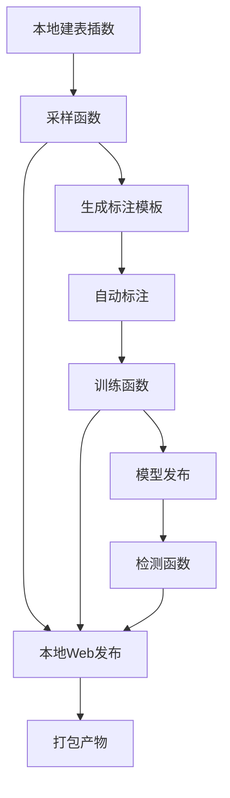

# 本地 UDF 执行结果

## 一、结论

本地可以执行 `F_DW_DETCOLLECT`、`F_DW_DETTRAIN`、`F_DW_DETRUN`。

本次已在本机 Spark 本地模式中完成：

1. 使用 `doc/20260720/person-info-raha-run-202607201851/sql/person_info_create_insert_202607201851.sql` 初始化 `dw.person_info`。
2. 使用 `F_DW_DETCOLLECT` 对 `select * from dw.person_info limit 450` 完成采样。
3. 对采样生成的 Excel 执行自动标注。
4. 使用 `F_DW_DETTRAIN` 训练并自动发布模型。
5. 使用 `F_DW_DETRUN` 对 `select * from dw.person_info limit 450` 完成检测。
6. 在本地启动静态 Web 服务，三个函数返回的 ZIP URL 均可访问。
7. 已将本次执行产物整体打包到工程内。

## 二、本地环境处理

本机没有 `spark-sql` 和 `spark-submit` 命令，因此本次通过 Maven 执行工程内 Driver 类。

本地 Hadoop 使用：

```text
C:\hadoop\hadoop-3.2.2
```

本机 Java 为 JDK 17，Spark 3.3.1 在 Java 17 下需要补充模块参数；同时 Windows 需要将 Hadoop 本地库加入 `PATH` 和 `java.library.path`。

关键运行参数：

```powershell
$env:HADOOP_HOME='C:\hadoop\hadoop-3.2.2'
$env:Path='C:\hadoop\hadoop-3.2.2\bin;' + $env:Path
$env:SPARK_LOCAL_IP='127.0.0.1'
$env:JAVA_TOOL_OPTIONS='--add-opens=java.base/sun.nio.ch=ALL-UNNAMED --add-exports=java.base/sun.nio.ch=ALL-UNNAMED --add-opens=java.base/java.nio=ALL-UNNAMED --add-opens=java.base/java.lang=ALL-UNNAMED --add-opens=java.base/java.util=ALL-UNNAMED --add-opens=java.base/java.lang.invoke=ALL-UNNAMED --add-opens=java.base/java.net=ALL-UNNAMED'
```

本地 Web 服务：

```text
http://127.0.0.1:18080
```

Web 根目录：

```text
doc/20260721/notes/local-udf-run-202607211230/web
```

## 三、执行产物

本次运行目录：

```text
doc/20260721/notes/local-udf-run-202607211230
```

整体打包文件：

```text
doc/20260721/person-info-local-udf-run-202607211540.zip
```

请求文件：

| 文件 | 用途 |
| --- | --- |
| `requests/collect-local.json` | 本地采样 UDF 请求 |
| `requests/train-local.json` | 本地训练 UDF 请求 |
| `requests/detect-local-limit450.json` | 本地检测 UDF 请求，检测 SQL 使用 `select * from dw.person_info limit 450` |

结果文件：

| 文件 | 用途 |
| --- | --- |
| `outputs/sql-run-summary.txt` | 建表插数脚本执行摘要 |
| `outputs/collect-local-result.json` | 采样 UDF 返回值 |
| `outputs/auto-label-local-summary.json` | 自动标注摘要 |
| `outputs/train-local-result.json` | 训练 UDF 返回值 |
| `outputs/detect-local-limit450-result.json` | 检测 UDF 返回值 |

## 四、函数执行结果

### 1. F_DW_DETCOLLECT

| 项 | 值 |
| --- | --- |
| 状态 | `SUCCESS` |
| 采样 SQL | `select * from dw.person_info limit 450` |
| 输入行数 | `450` |
| 采样记录数 | `300` |
| 标注任务数 | `300` |
| 字段数 | `6` |
| 有效字段数 | `6` |
| 聚类数 | `12` |
| 复用 | `false` |
| 强制执行 | `true` |
| `forceRunId` | `local-collect-20260721-1` |
| `sampleBatchId` | `sample_dw.person_info@20260721072331.552` |
| ZIP URL | `http://127.0.0.1:18080/2026/7/21/raha-collect_sample_dw.person_info_20260721072331.552_20260721152338.zip` |
| URL 校验 | HTTP 200 |
| ZIP 大小 | `55348` 字节 |

### 2. 自动标注

| 项 | 值 |
| --- | --- |
| 状态 | 成功 |
| 标注行数 | `300` |
| 错误行数 | `69` |
| 正确行数 | `231` |
| 未匹配行 | `0` |
| 输出文件 | `annotation-upload/raha-annotation_sample_dw.person_info@20260721072331.552_20260721152338_labeled.xls` |

说明：第一次训练直接使用采样模板时失败，原因是模板还未填写标签，返回 `ANNOTATION_IMPORT_FAILED`。自动标注后重新训练成功。

### 3. F_DW_DETTRAIN

| 项 | 值 |
| --- | --- |
| 状态 | `SUCCESS` |
| 输出行数 | `6` |
| 有效标注数 | `300` |
| 无效标注数 | `0` |
| 模型状态 | `PUBLISHED` |
| 模型集合版本 | `dw.person_info@20260721073639.556-job-3963b1bf-7218-41b8-87b0-9b59818a230c` |
| 复用 | `false` |
| 强制执行 | `true` |
| `forceRunId` | `local-train-20260721-1` |
| ZIP URL | `http://127.0.0.1:18080/2026/7/21/raha-dettrain_dw.person_info_20260721073639.556-job-3963b1bf-7218-41b8-87b0-9b59818a230c_20260721153707.zip` |
| URL 校验 | HTTP 200 |
| ZIP 大小 | `3454` 字节 |

训练过程中有字段聚类 `INPUT_LIMIT_EXCEEDED` 警告，服务已回退到直接标签训练，最终 6 个字段模型均发布成功。

### 4. F_DW_DETRUN

| 项 | 值 |
| --- | --- |
| 状态 | `SUCCESS` |
| 检测 SQL | `select * from dw.person_info limit 450` |
| 输入行数 | `450` |
| 字段数 | `6` |
| 有效字段数 | `6` |
| 参与检测模型字段数 | `5` |
| 失败字段数 | `1` |
| 检测单元格数 | `2250` |
| 检出错误数 | `177` |
| 结果表 | `dw.raha_detection_result` |
| 复用 | `false` |
| 强制执行 | `true` |
| `forceRunId` | `local-detect-20260721-1` |
| ZIP URL | `http://127.0.0.1:18080/2026/7/21/raha-detrun_dw.person_info_20260721073639.556-job-3963b1bf-7218-41b8-87b0-9b59818a230c_20260721154022.zip` |
| URL 校验 | HTTP 200 |
| ZIP 大小 | `15889` 字节 |

检测返回 `SUCCESS`，但 `failedFieldCount=1`。日志显示 `id_card` 字段出现模型与当前特征维度不兼容，因请求使用 `missingModelPolicy=PARTIAL`，所以整体任务允许部分字段失败并继续输出其余字段检测结果。

## 五、耗时

| 阶段 | 耗时 |
| --- | --- |
| 重新打包工程 | 约 `49` 秒 |
| 本地建表插数 | 约 `43` 秒 |
| 采样 UDF | 约 `7` 分 `33` 秒 |
| 自动标注 | 约 `6` 秒 |
| 第一次训练失败验证 | 约 `47` 秒 |
| 第二次训练成功 | 约 `5` 分 `13` 秒 |
| 检测 UDF | 约 `2` 分 `2` 秒 |
| 成功链路合计，不含打包与失败重试 | 约 `15` 分 `37` 秒 |
| 含工程打包与失败重试 | 约 `17` 分 `13` 秒 |

耗时主要集中在采样和训练：

1. 采样阶段会读取 Spark 表、生成样本批次、聚类和 Excel 模板，且本地 Maven 启动 Spark 有固定冷启动开销。
2. 训练阶段会导入 300 条标注、生成特征、训练 6 个字段模型并写入 FMDB 表，是本次最重阶段。
3. 检测阶段只对 450 行预测，但存在模型字典和运行时字典校验，且有一个字段失败后进入部分成功路径。

## 六、已发现问题

| 问题 | 现象 | 本次处理 |
| --- | --- | --- |
| 本地没有 `spark-sql` | 无法直接执行 `.sql` 脚本 | 新增本地 SQL 执行器 `RahaSqlScriptRunnerApp` |
| JDK 17 与 Spark 3.3.1 兼容参数不足 | `DirectBuffer`、`java.net.URI` 访问异常 | 使用 `JAVA_TOOL_OPTIONS` 增加模块开放参数 |
| Windows Hadoop 本地库未进入运行环境 | `NativeIO$Windows.access0` 异常 | 配置 `HADOOP_HOME`、`PATH`、`java.library.path` |
| 采样生成的文件名安全化后与 `sampleBatchId` 不完全一致 | 训练定位不到标注 Excel | 复制一份带原始 `sampleBatchId` 的文件名后再自动标注 |
| 原始采样模板没有人工标签 | 训练返回 `ANNOTATION_IMPORT_FAILED` | 使用已有自动标注脚本生成 labeled xls |
| 检测存在一个字段特征维度不兼容 | `failedFieldCount=1`，但整体 `SUCCESS` | 使用 `PARTIAL` 策略继续输出其余字段结果 |
| 本地没有远端 Web 发布能力 | SSH 到 `kubernetes.docker.internal` 失败 | 自动降级到本地 Web，返回 `http://127.0.0.1:18080` 链接 |

## 七、流程图



## 八、涉及代码修改

| 文件 | 说明 |
| --- | --- |
| `src/main/java/com/fiberhome/ml/raha/app/RahaSqlScriptRunnerApp.java` | 新增本地 SQL 脚本执行入口，用于没有 `spark-sql` 命令时初始化本地 Spark 表 |
| `src/main/java/com/fiberhome/ml/raha/app/RahaUdfDriverApp.java` | 增加默认 `local[*]` Spark master，便于本地直接执行 UDF |

