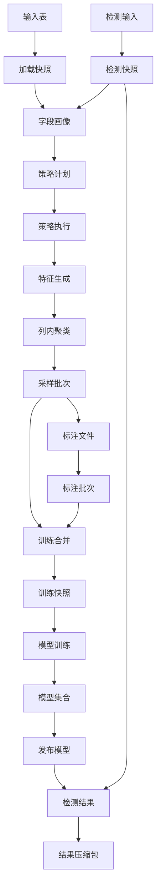
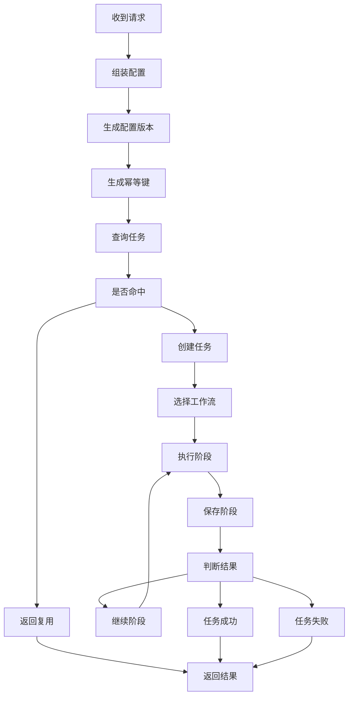
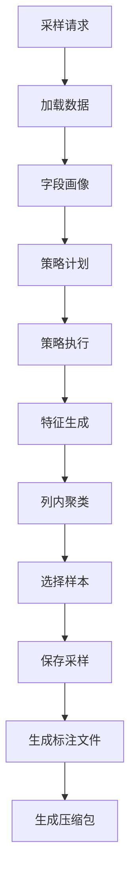
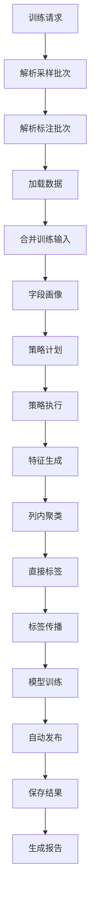
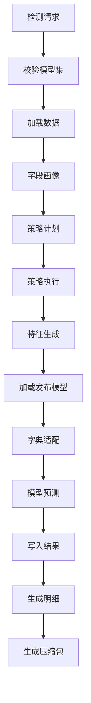

# 统一入口幂等复用与血缘流程说明

生成时间：2026-07-21 11:19

## 一、文档目的

本文整理当前工程统一入口下的幂等键组成、复用场景、复用条件、血缘关系和完整流程图。

同时给出后续建议补充的 `forceRun`、`overwrite` 和 `reused=true/false` 返回契约。

本文分析范围包括：

1. `RahaTaskApplicationService`
2. `RahaJobOrchestrator`
3. `RahaTaskRequestFactory`
4. `IdempotencyKeyGenerator`
5. `RahaTaskExecutionResult`
6. 采样、训练、检测三类 `Workflow`
7. 采样批次、标注批次、策略计划、模型集合等领域仓储

## 二、当前统一入口有哪些场景

当前统一入口可以理解为：

```text
RahaTaskApplicationService.execute(RahaTaskExecutionRequest)
```

它根据 `JobType` 分发到三类任务：

| 任务类型 | 对应函数 | 主要入口方法 | 说明 |
| --- | --- | --- | --- |
| `SAMPLING` | `F_DW_DETCOLLECT` | `samplingTable`、`samplingSql`、`sampling` | 从表或 SQL 加载数据，生成采样任务 |
| `TRAINING` | `F_DW_DETTRAIN` | `training(sampleBatchId)`、`training(sampleBatchIds)`、`trainingBatches` | 基于采样批次和标注批次训练模型 |
| `DETECTION` | `F_DW_DETRUN` | `detectionTable`、`detectionSql`、`detection` | 基于已发布模型集合执行检测 |

当前三函数 UDF 外层也是围绕这个统一入口组装请求，然后执行任务。

## 三、当前幂等复用分几层

当前工程里需要区分三层复用。

| 层级 | 当前是否接入统一入口 | 说明 |
| --- | --- | --- |
| 任务级幂等复用 | 已接入 | 相同幂等键命中已有任务时，不重复执行整个任务 |
| 阶段检查点复用 | 代码存在，但主链路未接入 | `StageCheckpointRunner` 能按阶段输入复用，但统一入口主编排器当前没有调用它 |
| 领域产物复用 | 部分接入 | 策略计划、采样批次、标注批次、模型集合等可按业务键复用 |

最重要的现实结论：

1. 当前统一入口已经有任务级幂等。
2. 当前统一入口没有真正启用阶段级检查点复用。
3. 当前部分阶段内部会复用领域产物，例如策略计划。
4. UDF 返回字段目前没有明确暴露 `reused`、`idempotencyKey`。

## 四、任务级幂等键组成

任务级幂等键由 `IdempotencyKeyGenerator` 生成。

当前生成逻辑可以简化为：

```text
sha256(
  jobType
  datasetId
  inputReference
  snapshotId 或 pending
  configVersion
)
```

其中 `configVersion` 又由 `RahaJobConfig.toCanonicalString()` 生成，包含：

| 配置片段 | 是否进入配置版本 | 说明 |
| --- | --- | --- |
| `jobType` | 是 | 采样、训练、检测不同任务不会互相复用 |
| `datasetId` | 是 | 逻辑数据集标识 |
| `snapshotId` | 是 | 显式快照会影响幂等 |
| `inputReference` | 是 | 表名、SQL 或文件引用 |
| `rowIdentityConfig` | 是 | 行身份规则 |
| `randomSeed` | 是 | 随机种子会影响采样和训练确定性 |
| `strategyConfig` | 是 | 策略族、策略参数 |
| `featureConfig` | 是 | 特征生成配置 |
| `modelConfig` | 是 | 模型配置 |
| `clusteringConfig` | 是 | 聚类配置 |
| `samplingConfig` | 是 | 采样预算等配置 |
| `resourceConfig` | 是 | 资源配置指纹 |
| `failureToleranceConfig` | 是 | 重试和容错配置 |
| `executionConfigFingerprint` | 是 | 运行语义相关配置指纹 |
| `executionInputFingerprint` | 是 | 调用级输入指纹 |

注意：

`requestId`、`caller`、`publishZip`、`localWebRoot`、`artifactBaseDir` 这类 UDF 展示和导出参数，不一定进入任务级幂等键。

所以只改这些字段，可能不会创建新任务。

## 五、执行输入指纹组成

统一入口在不同任务里会把任务特有内容放入 `executionInputFingerprint`。

### 1）采样输入指纹

采样指纹来源包括：

| 内容 | 说明 |
| --- | --- |
| 固定任务名 `sampling` | 区分任务类型 |
| 规范化输入 | `datasetId`、表名或 SQL、来源类型、行身份、快照、来源版本、列过滤等 |
| 采样轮次 | `samplingRound` |
| 已有标签摘要 | 如果传入已有标签，会按稳定顺序参与指纹 |
| 标注预算 | 通过 `samplingConfig` 进入配置版本 |

例子：

```json
{
  "sourceType": "SQL",
  "datasetId": "person_info",
  "sqlText": "select * from dw.person_info limit 450",
  "labelingBudget": "300",
  "samplingRound": "4"
}
```

相同数据集、相同 SQL、相同采样轮次、相同预算时，会命中同一个任务级幂等键。

### 2）训练输入指纹

训练指纹来源包括：

| 内容 | 说明 |
| --- | --- |
| 固定任务名 `training` | 区分任务类型 |
| 采样批次引用 | `sampleBatchId`、采样分区、标注批次、标注分区 |
| 规范化训练输入 | 来自采样批次还原的表或 SQL |
| 标签传播方法 | 如同质性传播 |
| 模型名前缀 | `modelNamePrefix` |

训练入口会先解析 `sampleBatchId`，再定位最新可训练标注批次。

所以同一个 `sampleBatchId` 如果后来上传了新的标注批次，训练指纹可能变化。

### 3）检测输入指纹

检测指纹来源包括：

| 内容 | 说明 |
| --- | --- |
| 固定任务名 `detection` | 区分任务类型 |
| 规范化检测输入 | 表名或 SQL、数据集、行身份、快照、来源版本等 |
| `modelSetVersion` | 使用哪个不可变模型集合 |
| `missingModelPolicy` | 缺少字段模型时失败或部分成功 |

所以同一张表使用不同模型集合检测，会生成不同任务。

## 六、任务级复用条件

任务级复用发生在：

```text
RahaJobOrchestrator.submit(config)
```

查询条件是：

```text
datasetId + idempotentKey
```

如果查到已有任务：

| 已有任务状态 | 当前统一入口行为 |
| --- | --- |
| `CREATED` | 继续执行已有任务 |
| `RUNNING` | 返回复用结果，不重复执行 |
| `SUCCEEDED` | 返回复用结果，不重复执行 |
| `PARTIAL_SUCCESS` | 返回复用结果，不重复执行 |
| `FAILED` | 返回复用结果，不自动重跑 |
| `CANCELLED` | 返回复用结果，不自动重跑 |

当前 `RahaTaskExecutionResult` 内部有：

```text
reused = true 或 false
```

但是 UDF 输出字段还没有把它暴露出来。

更重要的是：

任务级复用时，当前返回对象里通常没有业务 `payload`。

所以 UDF 外层如果继续强制读取 `SAMPLE_OUTPUT`、`TRAIN_OUTPUT` 或 `DETECT_OUTPUT`，可能出现：

```text
幂等任务复用结果缺少 payload
```

这就是目前必须补 `reused` 返回字段和复用结果恢复逻辑的原因。

## 七、领域产物复用条件

### 1）采样批次复用

采样批次通过 `sampleBatchId` 定位。

使用场景：

1. 训练函数根据 `sampleBatchId` 找采样记录。
2. 标注 Excel 导出根据 `sampleBatchId` 找采样明细。
3. 后续训练可以复用同一批采样任务。

复用条件：

| 条件 | 说明 |
| --- | --- |
| `sampleBatchId` 存在 | 必须能在采样记录仓储中查到 |
| `datasetId` 一致 | 采样批次归属数据集不能变 |
| 分区月份命中 | 仓储读取需要定位分区 |
| 行身份规则一致 | 训练标签回连原始行时必须一致 |

不能复用的情况：

1. `sampleBatchId` 不存在。
2. 采样批次和标注批次数据集不一致。
3. 训练输入覆盖改变了行身份规则。
4. 训练输入覆盖改变了来源类型。

### 2）标注批次复用

训练函数会根据 `sampleBatchId` 找最新可训练标注批次。

复用条件：

| 条件 | 说明 |
| --- | --- |
| `sampleBatchId` 匹配 | 标注必须属于该采样批次 |
| 标注状态为 `IMPORTED` | 默认只接受完整导入 |
| `allowPartialAnnotation=true` | 才允许 `PARTIAL` 状态 |
| `datasetId` 一致 | 标注批次和采样批次必须属于同一数据集 |

如果同一个采样批次后来上传了新的标注文件：

1. 训练入口会选最新可训练标注。
2. 训练输入指纹会因为标注批次不同而变化。
3. 可以生成新的训练任务和新的模型集合。

### 3）策略计划复用

策略计划通过 `StrategyPlanService.generateAndSave()` 处理。

当前逻辑是：

```text
先按 datasetId + snapshotId 查已有策略计划
如果存在则复用
如果不存在则重新生成并保存
```

复用条件：

| 条件 | 说明 |
| --- | --- |
| `datasetId` 相同 | 同一个逻辑数据集 |
| `snapshotId` 相同 | 同一个数据快照 |
| 仓储能恢复策略计划 | 策略计划 JSON 存在且可解析 |

注意：

策略计划复用不是任务级复用。

即使当前任务是新任务，只要数据快照一样，也可能复用已经持久化的策略计划。

### 4）模型集合复用

检测入口必须指定已发布模型集合。

当前模型集合通过：

```text
modelSetVersion
```

定位。

复用条件：

| 条件 | 说明 |
| --- | --- |
| `modelSetVersion` 存在 | 模型集合仓储可查到 |
| 模型集合已发布 | `requirePublished()` 校验通过 |
| `datasetId` 一致 | 检测输入数据集和模型集合一致 |
| 行身份规则兼容 | 检测输入行身份不能和模型集合冲突 |
| 字段模型兼容 | 缺少字段时按 `missingModelPolicy` 处理 |

检测不会重新训练模型。

它复用已发布模型集合中的列模型。

### 5）检测结果复用

当前检测结果写入是追加式。

检测批次通常等于 `jobId`。

任务级幂等命中已有成功检测任务时，统一入口不会重新执行检测，因此不会重新追加检测结果。

但是当前 UDF 返回没有完整恢复旧检测 payload 的能力。

所以可能出现：

```text
底层任务复用了旧检测任务
UDF 外层拿不到 DETECT_OUTPUT
```

这属于返回契约缺口，不是检测模型本身失败。

## 八、当前哪些阶段可以复用

以下按统一入口阶段列出当前状态。

| 阶段 | 采样 | 训练 | 检测 | 当前复用状态 | 复用条件 |
| --- | --- | --- | --- | --- | --- |
| `LOAD_DATA` | 有 | 有 | 有 | 任务级复用时整体跳过 | 同一任务幂等键命中 |
| `MERGE_TRAINING_INPUT` | 无 | 可选 | 无 | 不单独复用 | 训练使用持久化采样和标注批次时执行 |
| `PROFILE` | 有 | 有 | 有 | 不单独复用 | 任务级复用时整体跳过 |
| `GENERATE_STRATEGY` | 有 | 有 | 有 | 可复用领域产物 | `datasetId + snapshotId` 命中策略计划 |
| `RUN_STRATEGY` | 有 | 有 | 有 | 不单独复用 | 任务级复用时整体跳过 |
| `GENERATE_FEATURE` | 有 | 有 | 有 | 不单独复用 | 任务级复用时整体跳过 |
| `CLUSTER` | 有 | 有 | 无 | 不单独复用 | 任务级复用时整体跳过 |
| `SAMPLE` | 有 | 无 | 无 | 结果可被后续训练复用 | 后续训练按 `sampleBatchId` 引用 |
| `LABEL` | 无 | 有 | 无 | 不单独复用 | 直接标签或持久化标注进入训练 |
| `PROPAGATE` | 无 | 有 | 无 | 不单独复用 | 任务级复用时整体跳过 |
| `TRAIN` | 无 | 有 | 无 | 模型产物可被检测复用 | 检测按 `modelSetVersion` 引用 |
| `PREDICT` | 无 | 无 | 有 | 不单独复用 | 任务级复用时整体跳过 |
| `EVALUATE` | 可选 | 可选 | 可选 | 不单独复用 | 仅有 evaluator 时执行 |
| `PERSIST_RESULT` | 有 | 有 | 有 | 不单独复用 | 任务级复用时整体跳过 |

重要说明：

`StageCheckpointRunner` 支持阶段级复用，但当前没有接入 `RahaJobOrchestrator.execute()` 主链路。

因此目前不要把单个阶段当成稳定可恢复的幂等单元。

## 九、完整血缘关系

当前三函数闭环的血缘可以分成数据血缘、标注血缘、训练血缘、模型血缘和检测血缘。

### 1）数据血缘

```text
输入表或 SQL
  -> DataLoadRequest
  -> DatasetSnapshot
  -> RahaDataset
  -> schemaHash
  -> rowIdentityConfig
```

关键字段：

| 字段 | 含义 |
| --- | --- |
| `datasetId` | 逻辑数据集 |
| `inputReference` | 表名或 SQL |
| `snapshotId` | 数据快照 |
| `sourceVersion` | 调用方声明的数据版本 |
| `schemaHash` | 表结构摘要 |
| `rowIdentityConfig` | 行身份规则 |

### 2）采样血缘

```text
DatasetSnapshot
  -> ColumnProfile
  -> StrategyPlan
  -> StrategyHit
  -> FeatureRows
  -> Clusters
  -> SampleBatch
  -> AnnotationExcel
```

关键字段：

| 字段 | 含义 |
| --- | --- |
| `sampleBatchId` | 采样批次 |
| `samplingRound` | 采样轮次 |
| `labelingBudget` | 标注预算 |
| `partitionMonth` | 采样记录分区 |
| `annotationTaskId` | 单条标注任务 |

### 3）标注血缘

```text
AnnotationExcel
  -> LabeledExcel
  -> HDFS annotationDir
  -> AnnotationBatch
  -> AnnotationRecord
```

关键字段：

| 字段 | 含义 |
| --- | --- |
| `annotationBatchId` | 标注批次 |
| `sampleBatchId` | 来源采样批次 |
| `annotationStatus` | 标注批次状态 |
| `annotationPartitionMonth` | 标注分区 |

### 4）训练血缘

```text
SampleBatch
  -> AnnotationBatch
  -> TrainingInputMerge
  -> TrainingSnapshot
  -> TrainingExamples
  -> ColumnModel
  -> ModelSet
```

关键字段：

| 字段 | 含义 |
| --- | --- |
| `trainingBatchId` | 训练批次 |
| `trainingSnapshotId` | 训练快照 |
| `modelVersion` | 单列模型版本 |
| `modelSetVersion` | 模型集合版本 |
| `featureDictionaryVersion` | 特征字典版本 |
| `strategyPlanVersion` | 策略计划版本 |

### 5）检测血缘

```text
DetectInput
  -> DetectSnapshot
  -> RuntimeFeatureDictionary
  -> PublishedModelSet
  -> ColumnPrediction
  -> DetectionResult
  -> DetailZip
```

关键字段：

| 字段 | 含义 |
| --- | --- |
| `modelSetVersion` | 使用的模型集合 |
| `detectionBatchId` | 检测批次，通常是 `jobId` |
| `detectedCellCount` | 检测单元格数量 |
| `detectedErrorCount` | 检出错误数量 |
| `resultTable` | 检测结果表 |

## 十、血缘关系图



说明：

检测阶段也会做画像、策略、特征等准备工作，但最终错误判断使用的是已发布模型集合。

## 十一、统一入口总流程图



说明：

图中“是否命中”在当前代码里实际由 `datasetId + idempotentKey` 判断。

命中后如果已有任务状态不是 `CREATED`，统一入口直接返回复用结果。

## 十二、采样流程图



复用点：

1. 顶层任务幂等命中时，整个采样任务复用。
2. 策略计划可按同一 `datasetId + snapshotId` 复用。
3. 采样结果可被后续训练按 `sampleBatchId` 复用。

## 十三、训练流程图



复用点：

1. 顶层任务幂等命中时，整个训练任务复用。
2. 训练入口可复用已有 `sampleBatchId`。
3. 训练入口可复用最新可训练 `annotationBatchId`。
4. 策略计划可按训练快照复用。
5. 训练完成的模型集合可被检测复用。

## 十四、检测流程图



复用点：

1. 顶层任务幂等命中时，整个检测任务复用。
2. 检测复用已发布 `modelSetVersion`。
3. 策略计划可按检测快照复用。
4. 检测结果当前不主动重算，依赖任务级幂等控制。

## 十五、重复执行示例

### 示例 1：只改 `requestId`

第一次：

```json
{
  "datasetId": "person_info",
  "sqlText": "select * from dw.person_info limit 450",
  "requestId": "r1"
}
```

第二次：

```json
{
  "datasetId": "person_info",
  "sqlText": "select * from dw.person_info limit 450",
  "requestId": "r2"
}
```

如果其他任务输入完全相同，当前大概率命中同一个幂等任务。

现象：

1. 不重新执行阶段。
2. 返回 `RahaTaskExecutionResult.reused=true`。
3. UDF 返回里目前看不到 `reused`。
4. UDF 外层可能因为缺少 payload 报错。

### 示例 2：改采样 SQL

第一次：

```sql
select * from dw.person_info limit 450
```

第二次：

```sql
select * from dw.person_info limit 500
```

因为 `inputReference` 和规范化输入变化，会生成新幂等键。

现象：

1. 创建新采样任务。
2. 生成新 `sampleBatchId`。
3. 后续训练会引用新的采样批次。

### 示例 3：同一采样批次上传新标注

第一次训练使用：

```text
sampleBatchId = sample-A
annotationBatchId = annotation-1
```

第二次训练如果同一采样批次下新增：

```text
annotationBatchId = annotation-2
```

训练入口会选最新可训练标注。

现象：

1. 训练输入指纹变化。
2. 生成新的训练任务。
3. 生成新的 `modelSetVersion`。

### 示例 4：同一检测输入换模型集合

第一次检测：

```text
modelSetVersion = model-set-A
```

第二次检测：

```text
modelSetVersion = model-set-B
```

检测输入指纹变化。

现象：

1. 生成新的检测任务。
2. 结果表追加新的检测批次。
3. 结果可按 `detectionBatchId` 区分。

### 示例 5：底层表数据变化但没有传版本

第一次：

```json
{
  "sourceType": "TABLE",
  "tableName": "dw.person_info"
}
```

第二次：

```json
{
  "sourceType": "TABLE",
  "tableName": "dw.person_info"
}
```

如果表内容实际变了，但请求里没有显式 `snapshotId` 或 `sourceVersion`，顶层幂等键可能仍然相同。

风险：

系统可能复用旧任务，不重新读取新数据。

建议：

生产调度必须传入稳定递增的 `sourceVersion` 或平台 `snapshotId`。

## 十六、建议新增返回字段

建议三函数公共返回字段增加：

| 字段 | 类型 | 说明 |
| --- | --- | --- |
| `jobId` | string | 当前任务标识 |
| `idempotencyKey` | string | 任务级幂等键 |
| `configVersion` | string | 配置版本 |
| `reused` | boolean | 是否复用已有任务 |
| `reuseLevel` | string | `NONE`、`JOB`、`STAGE`、`ARTIFACT` |
| `reusedJobId` | string | 复用的任务标识 |
| `resultLocation` | string | 可恢复业务结果的位置 |
| `forceRun` | boolean | 是否强制新跑 |
| `overwrite` | boolean | 是否覆盖同业务结果 |

最低限度建议先加：

```json
{
  "jobId": "job-xxx",
  "idempotencyKey": "sha256...",
  "reused": false
}
```

## 十七、建议新增 `forceRun`

`forceRun` 的建议语义：

```text
忽略已有任务级幂等命中，强制创建新任务并重新执行。
```

推荐默认值：

```text
false
```

建议行为：

| 场景 | 行为 |
| --- | --- |
| `forceRun=false` | 保持当前幂等复用 |
| `forceRun=true` | 不复用已有任务，创建新 `jobId` |
| `forceRun=true` 且旧任务成功 | 旧结果保留，新结果追加 |
| `forceRun=true` 且旧任务运行中 | 可以拒绝，也可以并行，建议默认拒绝 |

推荐实现方式：

1. 在 UDF 请求参数中接收 `forceRun`。
2. 在 `RahaTaskExecutionRequest` 或提交选项中传递。
3. `RahaJobOrchestrator.submit` 根据该标志跳过 `findByIdempotentKey`。
4. 新任务仍保存原始 `idempotentKey`，同时记录 `forceRun=true`。

不建议通过随机改 `requestId` 来强制重跑。

原因是 `requestId` 更适合做追踪号，不适合改变业务语义。

## 十八、建议新增 `overwrite`

`overwrite` 的建议语义：

```text
允许当前任务结果覆盖同业务键的旧结果。
```

推荐默认值：

```text
false
```

注意：

`overwrite` 比 `forceRun` 危险。

`forceRun` 是新跑一次，旧结果保留。

`overwrite` 是替换旧结果，可能影响下游审计。

建议只允许在明确分区键或批次键下覆盖。

建议行为：

| 场景 | 行为 |
| --- | --- |
| 覆盖采样结果 | 按 `sampleBatchId` 或新批次策略替换 |
| 覆盖训练结果 | 不建议覆盖已发布模型，建议生成新模型集合 |
| 覆盖检测结果 | 可按 `detectionBatchId` 或业务分区替换 |
| 覆盖 ZIP | 可覆盖同名文件，但建议生成新文件名 |

推荐约束：

1. 已发布模型默认不可覆盖。
2. 检测结果覆盖必须带 `detectionBatchId` 或业务分区。
3. 覆盖动作必须写审计日志。
4. 覆盖前必须记录旧结果位置。

## 十九、建议复用恢复逻辑

当前任务级复用会返回已有任务和阶段，但业务 payload 为空。

建议补充恢复逻辑：

| 任务类型 | 复用时如何恢复 payload |
| --- | --- |
| 采样 | 根据 `sampleBatchId` 或阶段结果位置读取采样批次 |
| 训练 | 根据 `modelSetVersion` 读取模型集合和训练产物 |
| 检测 | 根据 `jobId` 作为 `detectionBatchId` 读取检测结果 |

需要新增或明确的字段：

| 字段 | 用途 |
| --- | --- |
| `resultLocation` | 指向可恢复业务结果 |
| `sampleBatchId` | 恢复采样输出 |
| `trainingBatchId` | 恢复训练输出 |
| `modelSetVersion` | 恢复模型输出 |
| `detectionBatchId` | 恢复检测输出 |

建议统一入口在复用任务时不要只返回阶段记录，而是恢复业务输出。

## 二十、推荐最终契约

### 1）采样返回

建议采样返回中增加：

```json
{
  "jobId": "job-001",
  "idempotencyKey": "sha256...",
  "reused": false,
  "reuseLevel": "NONE",
  "sampleBatchId": "sample-001",
  "resultLocation": "repository://sample/sample-001"
}
```

### 2）训练返回

建议训练返回中增加：

```json
{
  "jobId": "job-002",
  "idempotencyKey": "sha256...",
  "reused": false,
  "reuseLevel": "NONE",
  "trainingBatchId": "train-001",
  "modelSetVersion": "model-set-001",
  "resultLocation": "repository://model-set/model-set-001"
}
```

### 3）检测返回

建议检测返回中增加：

```json
{
  "jobId": "job-003",
  "idempotencyKey": "sha256...",
  "reused": false,
  "reuseLevel": "NONE",
  "detectionBatchId": "job-003",
  "modelSetVersion": "model-set-001",
  "resultLocation": "repository://detection-result/job-003"
}
```

## 二十一、目前工程问题与建议

| 问题 | 当前现象 | 建议 |
| --- | --- | --- |
| UDF 不返回 `reused` | 用户无法判断是否复用 | 公共字段增加 `reused` |
| 复用任务 payload 为空 | UDF 可能报缺少输出 | 增加复用恢复逻辑 |
| 无 `forceRun` | 强制重跑只能改业务输入 | 增加显式参数 |
| 无 `overwrite` | 覆盖语义不明确 | 先设计审计和分区约束 |
| 阶段检查点未接入主链路 | 单阶段不能稳定复用 | 后续按阶段引入 |
| 数据版本未显式传入时可能误复用 | 表数据变了但请求没变 | 生产必须传 `sourceVersion` 或 `snapshotId` |

## 二十二、推荐落地顺序

第一步：

1. 三函数公共返回字段增加 `jobId`、`idempotencyKey`、`reused`、`resultLocation`。
2. 复用任务时恢复采样、训练、检测 payload。

第二步：

1. 增加 `forceRun` 参数。
2. `forceRun=true` 时创建新任务。
3. 返回里标记 `forceRun=true` 和 `reused=false`。

第三步：

1. 设计 `overwrite`。
2. 只允许检测结果按批次覆盖。
3. 模型和采样默认不覆盖，只生成新版本。

第四步：

1. 将 `StageCheckpointRunner` 接入主编排链路。
2. 给每个阶段定义稳定输入指纹。
3. 让阶段级复用返回 `reuseLevel=STAGE`。

## 二十三、最终结论

当前统一入口已经具备任务级幂等能力。

当前已经能复用的主要是：

1. 整个已存在任务。
2. 已保存的采样批次。
3. 已导入的标注批次。
4. 同快照策略计划。
5. 已发布模型集合。

当前还没有完整做到的是：

1. 返回值明确告诉用户是否复用。
2. 任务复用后恢复业务 payload。
3. 显式强制重跑。
4. 显式覆盖旧结果。
5. 主链路阶段级检查点复用。

因此建议优先补 `reused` 返回字段和复用 payload 恢复。

这两个点解决后，用户就能清楚知道一次调用到底是新执行、复用旧任务，还是复用了某个领域产物。
