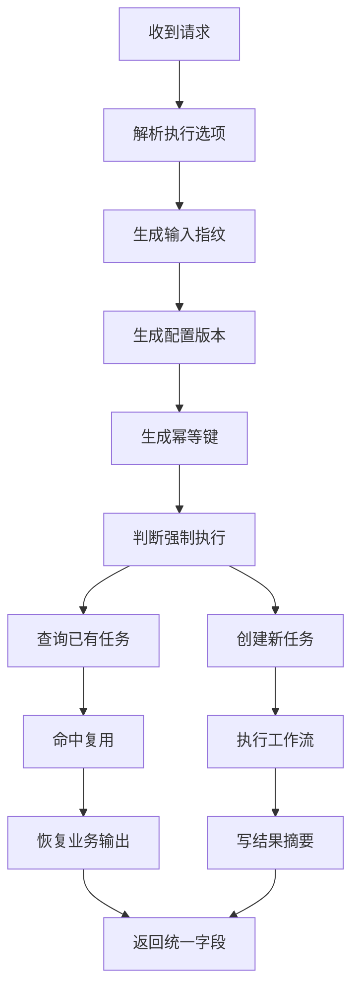
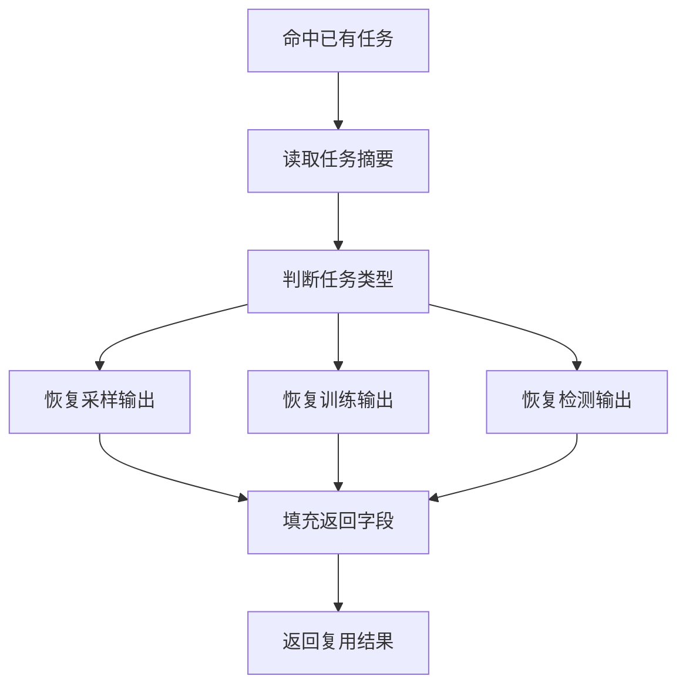
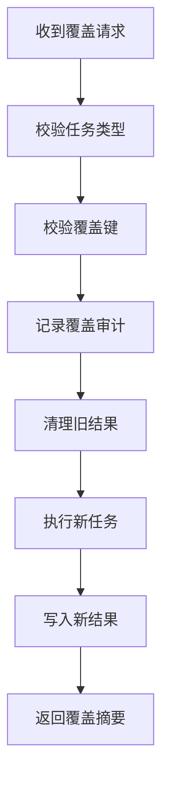

# 统一入口幂等复用改造完整方案

生成时间：2026-07-21 12:54

## 一、方案背景

本文基于 `doc/20260721/统一入口幂等复用与血缘流程说明-202607211119.md`，整理当前工程在统一入口幂等复用、复用结果恢复、强制重跑、覆盖执行和血缘展示方面存在的问题，并给出完整改造方案。

本文只做方案设计，不直接修改源码。

## 二、当前工程已有能力

当前统一入口已经具备以下能力：

| 能力 | 当前状态 | 说明 |
| --- | --- | --- |
| 任务级幂等 | 已有 | `RahaJobOrchestrator.submit` 按 `datasetId + idempotentKey` 查重 |
| 任务复用标记 | 内部已有 | `RahaTaskExecutionResult.isReused()` 已存在 |
| 配置版本 | 已有 | `configVersion` 已写入 `dw.raha_job_run.config_version` |
| 幂等键 | 已有 | `idempotentKey` 已写入 `dw.raha_job_run.idempotent_key` |
| 任务结果摘要 | 表结构已有 | `dw.raha_job_run.result_summary_json` 已存在 |
| 阶段状态 | 已有 | `dw.raha_job_stage_attempt` 保存阶段尝试 |
| 阶段检查点模型 | 代码已有 | `StageCheckpointRunner` 存在，但主链路未接入 |
| 领域产物复用 | 部分已有 | 采样批次、标注批次、策略计划、模型集合可复用 |

## 三、当前主要问题

### 1）UDF 返回看不到是否复用

当前内部 `RahaTaskExecutionResult` 有 `reused` 字段。

但三函数 UDF 返回字段 `RahaUdfFields.COMMON` 没有：

1. `jobId`
2. `idempotentKey`
3. `configVersion`
4. `executionInputFingerprint`
5. `reused`
6. `reuseLevel`
7. `resultLocation`

用户重复执行后，只能看到业务结果，很难判断是新跑还是复用旧任务。

### 2）任务级复用时 payload 可能为空

当前逻辑：

```text
RahaTaskApplicationService.execute
  -> 命中已有任务
  -> RahaTaskExecutionResult.reused(job, stages)
  -> attributes 为空
  -> payload 为空
```

UDF 外层调用 `requirePayload()` 时可能报：

```text
幂等任务复用结果缺少 payload
```

这说明底层复用了任务，但没有把业务输出恢复出来。

### 3）没有显式 `forceRun`

当前如果想强制重跑，只能人为改变 SQL、采样轮次、来源版本或模型版本。

这会让调用方误把“追踪字段”当成“业务字段”使用。

### 4）没有明确 `overwrite`

当前检测结果、采样结果、训练模型更偏追加式。

如果用户想覆盖旧结果，没有统一契约。

这会带来两个风险：

1. 调用方以为覆盖了，实际只是追加新批次。
2. 调用方误删或覆盖已发布模型，影响审计。

### 5）阶段检查点未接入主链路

`StageCheckpointRunner` 能按阶段输入复用成功检查点，但 `RahaJobOrchestrator.execute()` 当前没有调用它。

结果是：

1. 顶层任务命中时可以整体复用。
2. 顶层任务没命中时，各阶段基本重新跑。
3. 单阶段失败后不能稳定从上一个成功阶段恢复。

### 6）`executionInputFingerprint` 未落表

当前 `executionInputFingerprint` 只进入 `configVersion` 计算，不作为独立字段保存。

这不影响幂等逻辑，但影响排查。

用户看到 `configVersion` 变化时，不能直接知道是调用输入变化还是基础配置变化。

## 四、改造目标

本方案目标如下：

| 目标 | 说明 |
| --- | --- |
| 可见 | 返回值明确展示是否复用、复用层级、幂等键和配置版本 |
| 可恢复 | 命中已有任务时能恢复采样、训练、检测业务输出 |
| 可强制 | 支持 `forceRun=true` 强制创建新任务 |
| 可覆盖 | 支持受控 `overwrite`，优先覆盖检测结果，不覆盖已发布模型 |
| 可追踪 | 返回和表中都能串起任务、阶段、批次、模型和结果血缘 |
| 可兼容 | 默认行为保持现状，不破坏历史调用 |

## 五、推荐总体设计

推荐把改造拆成四层：

```text
请求层
  -> 增加 forceRun、overwrite、debugFingerprint

任务层
  -> 扩展提交选项和复用结果恢复

返回层
  -> 三函数统一返回 jobId、idempotentKey、configVersion、reused

持久层
  -> 保存可恢复结果摘要和可选执行输入指纹
```

## 六、统一返回字段设计

建议三函数公共返回字段增加：

| 字段 | 类型 | 默认 | 说明 |
| --- | --- | --- | --- |
| `jobId` | string | 空 | 当前任务标识 |
| `configVersion` | string | 空 | 完整任务配置版本 |
| `idempotentKey` | string | 空 | 任务级幂等键 |
| `executionInputFingerprint` | string | 空 | 调用级业务输入指纹，建议调试模式返回 |
| `reused` | boolean | false | 是否复用已有任务 |
| `reuseLevel` | string | `NONE` | `NONE`、`JOB`、`STAGE`、`ARTIFACT` |
| `reuseReason` | string | 空 | 复用原因 |
| `resultLocation` | string | 空 | 可恢复业务结果位置 |
| `forceRun` | boolean | false | 是否强制新跑 |
| `overwrite` | boolean | false | 是否覆盖旧业务结果 |

最小落地版本建议先加：

1. `jobId`
2. `configVersion`
3. `idempotentKey`
4. `reused`
5. `reuseLevel`
6. `resultLocation`

`executionInputFingerprint` 可先只写日志和 `result_summary_json`，避免 UDF 返回列过多。

## 七、请求参数设计

### 1）`forceRun`

语义：

```text
忽略已有任务级幂等命中，强制创建一个新任务执行。
```

默认：

```text
false
```

行为：

| 条件 | 行为 |
| --- | --- |
| `forceRun=false` | 保持当前幂等复用 |
| `forceRun=true` | 跳过任务级复用，创建新 `jobId` |
| `forceRun=true` 且已有任务运行中 | 建议默认拒绝，返回 `DUPLICATE_RUNNING_JOB` |
| `forceRun=true` 且已有任务已完成 | 创建新任务，旧结果保留 |

### 2）`overwrite`

语义：

```text
允许覆盖同业务键的旧结果。
```

默认：

```text
false
```

推荐范围：

| 任务 | 是否支持 overwrite | 建议 |
| --- | --- | --- |
| 采样 | 暂不支持 | 生成新 `sampleBatchId` 更安全 |
| 训练 | 暂不支持覆盖已发布模型 | 生成新 `modelSetVersion` |
| 检测 | 支持受控覆盖 | 可按 `detectionBatchId` 或业务分区覆盖 |

建议第一期只实现：

```text
overwrite 对检测结果有效
```

并且要求：

1. 必须带显式 `detectionBatchId` 或业务结果分区。
2. 覆盖前记录审计日志。
3. 不覆盖模型产物。

### 3）`debugFingerprint`

语义：

```text
是否在返回值和日志中展示 executionInputFingerprint。
```

默认：

```text
false
```

原因：

`executionInputFingerprint` 主要用于排查，不一定需要每次暴露给普通业务方。

## 八、复用结果恢复设计

### 1）为什么要恢复

当前任务命中复用后只返回已有任务和阶段记录，业务 payload 为空。

这会导致 UDF 外层拿不到：

1. `SampleBatch`
2. `RahaTrainOutput`
3. `RahaDetectOutput`

因此需要新增复用恢复器。

### 2）新增接口建议

建议新增：

```text
com.fiberhome.ml.raha.service.task.TaskPayloadRecoveryService
```

接口职责：

```text
根据任务类型、jobId、resultLocation、resultSummaryJson 恢复业务 payload。
```

建议方法：

```java
Object recover(RahaJob job, List<RahaStage> stages);
```

或拆成强类型：

```java
SampleBatch recoverSample(RahaJob job);
RahaTrainOutput recoverTrain(RahaJob job);
RahaDetectOutput recoverDetect(RahaJob job);
```

### 3）采样恢复

恢复来源：

| 来源 | 字段 |
| --- | --- |
| `result_summary_json` | `sampleBatchId`、`partitionMonth` |
| `dw.raha_sample_record` | 采样明细 |

恢复过程：

```text
读取 job.result_summary_json
  -> 找 sampleBatchId
  -> SampleRecordRepository.findByBatchId(sampleBatchId)
  -> 还原 SampleBatch
  -> 构造 SAMPLE_OUTPUT
```

### 4）训练恢复

恢复来源：

| 来源 | 字段 |
| --- | --- |
| `result_summary_json` | `trainingBatchId`、`modelSetVersion` |
| `dw.raha_model_artifact` | 模型元数据 |
| `dw.raha_training_column_artifact` | 训练列产物 |
| `dw.raha_training_example` | 训练样本，按需读取 |

恢复过程：

```text
读取 modelSetVersion
  -> ModelSetRepository.find(modelSetVersion)
  -> TrainingArtifactRepository 按 modelSetVersion 读取列产物
  -> 还原 RahaTrainOutput
```

### 5）检测恢复

恢复来源：

| 来源 | 字段 |
| --- | --- |
| `jobId` | 作为 `detectionBatchId` |
| `dw.raha_detection_result` | 检测明细 |
| `result_summary_json` | 统计摘要 |

恢复过程：

```text
读取 jobId
  -> DetectionResultRepository.findByBatchId(jobId)
  -> 还原 RahaDetectOutput
```

如果当前仓储没有 `findByBatchId`，需要补接口。

## 九、任务结果摘要设计

`dw.raha_job_run.result_summary_json` 当前已存在。

建议每个任务完成时写入稳定摘要。

### 1）采样摘要

```json
{
  "resultType": "SAMPLING",
  "resultLocation": "repository://sample/sample-001",
  "sampleBatchId": "sample-001",
  "partitionMonth": "202607",
  "datasetId": "person_info",
  "snapshotId": "snapshot-001",
  "rowCount": 450,
  "sampleRecordCount": 300
}
```

### 2）训练摘要

```json
{
  "resultType": "TRAINING",
  "resultLocation": "repository://model-set/model-set-001",
  "trainingBatchId": "train-001",
  "modelSetVersion": "model-set-001",
  "publishedModelCount": 6,
  "sampleBatchIds": ["sample-001"],
  "annotationBatchIds": ["annotation-001"]
}
```

### 3）检测摘要

```json
{
  "resultType": "DETECTION",
  "resultLocation": "repository://detection-result/job-001",
  "detectionBatchId": "job-001",
  "modelSetVersion": "model-set-001",
  "detectedCellCount": 6000,
  "detectedErrorCount": 576,
  "resultTable": "dw.raha_detection_result"
}
```

## 十、落表设计

### 1）第一期不改表结构

第一期建议不改 FMDB DDL。

原因：

1. `config_version` 已存在。
2. `idempotent_key` 已存在。
3. `result_summary_json` 已存在。
4. `input_version_json` 已存在。

可以先把新增信息写进：

```text
dw.raha_job_run.result_summary_json
```

### 2）第二期可选加列

如果后续需要频繁查询，可新增列：

| 表 | 新列 | 说明 |
| --- | --- | --- |
| `dw.raha_job_run` | `execution_input_fingerprint` | 调用级输入指纹 |
| `dw.raha_job_run` | `force_run` | 是否强制新跑 |
| `dw.raha_job_run` | `overwrite_enabled` | 是否覆盖执行 |
| `dw.raha_job_run` | `reuse_source_job_id` | 复用来源任务 |
| `dw.raha_job_run` | `reuse_level` | 复用层级 |

第二期需要同步修改：

1. `FmdbTableSchemas`
2. `SparkSqlFmdbResultWriter`
3. `FmdbJobRepository`
4. 历史表兼容读取逻辑

## 十一、涉及修改文件清单

### 1）请求与执行入口

| 文件 | 修改内容 |
| --- | --- |
| `src/main/java/com/fiberhome/ml/raha/service/task/RahaTaskExecutionRequest.java` | 增加 `forceRun`、`overwrite`、`debugFingerprint` 或新增执行选项对象 |
| `src/main/java/com/fiberhome/ml/raha/service/task/RahaTaskRequestFactory.java` | 从 UDF 参数组装执行选项，保留现有指纹计算 |
| `src/main/java/com/fiberhome/ml/raha/service/task/RahaTaskApplicationService.java` | 命中复用任务时调用 payload 恢复器 |
| `src/main/java/com/fiberhome/ml/raha/job/execution/RahaJobOrchestrator.java` | `submit` 支持 `forceRun`，可选返回复用命中原因 |

### 2）返回模型

| 文件 | 修改内容 |
| --- | --- |
| `src/main/java/com/fiberhome/ml/raha/service/task/RahaTaskExecutionResult.java` | 增加 `reuseLevel`、`reuseReason`、`idempotentKey`、`configVersion`、`forceRun`、`overwrite` 等访问方法 |
| `src/main/java/com/fiberhome/ml/raha/udf/RahaUdfFields.java` | 三函数公共返回字段增加 `jobId`、`configVersion`、`idempotentKey`、`reused`、`reuseLevel`、`resultLocation` |
| `src/main/java/com/fiberhome/ml/raha/udf/RahaDetectionUdfService.java` | 三函数返回行填充新增字段；解析 `forceRun`、`overwrite`、`debugFingerprint` |

### 3）复用恢复

| 文件 | 修改内容 |
| --- | --- |
| `src/main/java/com/fiberhome/ml/raha/service/task/TaskPayloadRecoveryService.java` | 新增复用 payload 恢复服务 |
| `src/main/java/com/fiberhome/ml/raha/service/task/DefaultTaskPayloadRecoveryService.java` | 新增默认实现，按任务类型恢复输出 |
| `src/main/java/com/fiberhome/ml/raha/service/task/RahaTaskApplicationServiceFactory.java` | 装配恢复服务依赖 |
| `src/main/java/com/fiberhome/ml/raha/repository/port/DetectionResultRepository.java` | 增加按检测批次读取结果的方法 |
| `src/main/java/com/fiberhome/ml/raha/repository/adapter/fmdb/repository/FmdbDetectionResultRepository.java` | 实现按 `detectionBatchId` 读取 |

### 4）任务摘要持久化

| 文件 | 修改内容 |
| --- | --- |
| `src/main/java/com/fiberhome/ml/raha/job/domain/RahaJob.java` | 可选增加结果摘要字段；或保持领域对象不变，通过 attributes 写入 |
| `src/main/java/com/fiberhome/ml/raha/job/execution/RahaJobOrchestrator.java` | 任务完成时把 `RESULT_LOCATION` 和摘要写入 job 保存流程 |
| `src/main/java/com/fiberhome/ml/raha/repository/adapter/fmdb/result/SparkSqlFmdbResultWriter.java` | 确保 `result_summary_json` 写入完整恢复字段 |
| `src/main/java/com/fiberhome/ml/raha/repository/adapter/fmdb/repository/FmdbJobRepository.java` | 恢复任务时可读取摘要，必要时扩展返回对象 |

### 5）覆盖执行

| 文件 | 修改内容 |
| --- | --- |
| `src/main/java/com/fiberhome/ml/raha/service/task/ExecutionOverrideOptions.java` | 新增执行控制参数对象 |
| `src/main/java/com/fiberhome/ml/raha/repository/port/DetectionResultRepository.java` | 增加覆盖或删除指定批次结果接口 |
| `src/main/java/com/fiberhome/ml/raha/repository/adapter/fmdb/result/SparkSqlFmdbResultWriter.java` | 支持覆盖写入前清理或分区替换 |
| `src/main/java/com/fiberhome/ml/raha/repository/adapter/fmdb/repository/FmdbDetectionResultRepository.java` | 实现检测结果按批次覆盖 |

### 6）阶段检查点接入

| 文件 | 修改内容 |
| --- | --- |
| `src/main/java/com/fiberhome/ml/raha/checkpoint/StageCheckpointRunner.java` | 复用现有能力，必要时扩展 payload 恢复 |
| `src/main/java/com/fiberhome/ml/raha/job/execution/RahaJobOrchestrator.java` | 在阶段执行前后接入检查点运行器 |
| `src/main/java/com/fiberhome/ml/raha/job/stage/core/StageHandler.java` | 可选增加阶段输入指纹方法 |
| `src/main/java/com/fiberhome/ml/raha/job/stage/core/StageExecutionContext.java` | 提供上游依赖摘要给阶段指纹计算 |
| `src/main/java/com/fiberhome/ml/raha/repository/adapter/fmdb/repository/FmdbStageRepository.java` | 当前 `checkpoint_id` 写 `null`，需要写入真实检查点 |

### 7）测试文件

| 文件 | 修改内容 |
| --- | --- |
| `src/test/java/com/fiberhome/ml/raha/service/task/RahaTaskApplicationServiceIntegrationTest.java` | 增加重复执行复用和 payload 恢复测试 |
| `src/test/java/com/fiberhome/ml/raha/service/task/RahaTaskRequestFactoryTest.java` | 验证 `forceRun`、`overwrite` 参数解析和指纹不被误改 |
| `src/test/java/com/fiberhome/ml/raha/service/task/RahaTaskExecutionRequestTest.java` | 验证执行选项默认值和非法组合 |
| `src/test/java/com/fiberhome/ml/raha/checkpoint/StageCheckpointRunnerTest.java` | 保留并扩展阶段检查点复用测试 |
| 新增 `src/test/java/com/fiberhome/ml/raha/udf/RahaDetectionUdfServiceReuseTest.java` | 验证 UDF 返回 `reused`、`idempotentKey` 和复用结果 |

## 十二、代码设计细节

### 1）新增执行选项对象

建议新增：

```java
public final class ExecutionOverrideOptions {
    private final boolean forceRun;
    private final boolean overwrite;
    private final boolean debugFingerprint;
}
```

放置位置：

```text
src/main/java/com/fiberhome/ml/raha/service/task/ExecutionOverrideOptions.java
```

默认值：

```text
forceRun=false
overwrite=false
debugFingerprint=false
```

### 2）任务提交结果对象

建议新增：

```java
public final class JobSubmitResult {
    private final RahaJob job;
    private final boolean reused;
    private final String reuseReason;
}
```

这样 `RahaJobOrchestrator.submit()` 不再只返回 `RahaJob`，而是能告诉调用方是否命中复用。

### 3）复用层级枚举

建议新增：

```java
public enum ReuseLevel {
    NONE,
    JOB,
    STAGE,
    ARTIFACT
}
```

放置位置：

```text
src/main/java/com/fiberhome/ml/raha/service/task/ReuseLevel.java
```

### 4）任务摘要模型

建议新增：

```java
public final class TaskResultSummary {
    private final String resultType;
    private final String resultLocation;
    private final Map<String, String> identifiers;
    private final Map<String, String> metrics;
}
```

用于统一写入 `result_summary_json`。

## 十三、流程图

### 1）改造后统一入口流程



说明：

`forceRun=true` 时跳过 `n07` 的普通复用路径，但仍建议检查是否已有运行中任务。

### 2）复用恢复流程



### 3）覆盖执行流程



## 十四、兼容性策略

### 1）历史请求兼容

历史请求不传新参数时：

```text
forceRun=false
overwrite=false
debugFingerprint=false
```

行为保持当前幂等复用。

### 2）历史结果兼容

如果旧任务没有 `result_summary_json`，复用恢复器应降级：

| 任务类型 | 降级方式 |
 --- | --- |
| 采样 | 根据阶段记录或返回错误提示需要重跑 |
| 训练 | 根据模型集合版本可选恢复，不能恢复则提示 |
| 检测 | 根据 `jobId` 查检测结果 |

如果无法恢复 payload，应返回明确错误：

```text
REUSED_PAYLOAD_NOT_RECOVERABLE
```

不要继续抛空 payload 的模糊异常。

### 3）返回列兼容

新增 UDF 返回列会改变 Spark SQL `inline` 展开结果。

需要同步更新：

1. UDF 契约文档。
2. 调用方 SQL 示例。
3. 自动化测试期望字段。

## 十五、最终效果

改造完成后，用户重复执行同一请求时可以看到：

```json
{
  "status": "SUCCESS",
  "jobId": "job-001",
  "configVersion": "sha256...",
  "idempotentKey": "sha256...",
  "reused": true,
  "reuseLevel": "JOB",
  "reuseReason": "JOB_IDEMPOTENT_HIT",
  "resultLocation": "repository://detection-result/job-001"
}
```

### 1）采样最终效果

重复执行相同采样请求：

1. 不重新加载数据。
2. 不重新画像。
3. 不重新聚类。
4. 返回旧 `sampleBatchId`。
5. 返回 `reused=true`。

强制重跑采样：

1. 传 `forceRun=true`。
2. 创建新 `jobId`。
3. 生成新 `sampleBatchId`。
4. 旧采样批次保留。

### 2）训练最终效果

重复执行相同训练请求：

1. 不重新训练模型。
2. 恢复旧 `modelSetVersion`。
3. 返回 `reused=true`。
4. 不出现 payload 为空错误。

同一采样批次上传新标注后再训练：

1. 输入指纹变化。
2. 创建新训练任务。
3. 生成新 `modelSetVersion`。

### 3）检测最终效果

重复执行相同检测请求：

1. 不重新检测。
2. 不重复写 `dw.raha_detection_result`。
3. 读取旧检测批次摘要。
4. 返回 `reused=true`。

换模型集合检测：

1. 输入指纹变化。
2. 创建新检测任务。
3. 写入新 `detectionBatchId`。

覆盖检测：

1. 传 `overwrite=true`。
2. 按显式批次或分区覆盖旧检测结果。
3. 记录覆盖审计日志。

## 十六、实施步骤

### 第一步：补返回可见性

修改：

1. `RahaUdfFields`
2. `RahaDetectionUdfService`
3. `RahaTaskExecutionResult`

目标：

三函数返回 `jobId`、`configVersion`、`idempotentKey`、`reused`、`reuseLevel`、`resultLocation`。

### 第二步：补复用 payload 恢复

新增：

1. `TaskPayloadRecoveryService`
2. `DefaultTaskPayloadRecoveryService`

修改：

1. `RahaTaskApplicationService`
2. `RahaTaskApplicationServiceFactory`
3. 相关仓储读取接口

目标：

任务级复用时不再缺业务输出。

### 第三步：补 `forceRun`

新增：

1. `ExecutionOverrideOptions`
2. `JobSubmitResult`

修改：

1. `RahaJobOrchestrator`
2. `RahaTaskExecutionRequest`
3. `RahaTaskRequestFactory`
4. `RahaDetectionUdfService`

目标：

用户可以明确强制重跑。

### 第四步：补检测覆盖

修改：

1. `DetectionResultRepository`
2. `FmdbDetectionResultRepository`
3. `SparkSqlFmdbResultWriter`

目标：

检测结果支持受控覆盖。

### 第五步：接入阶段检查点

修改：

1. `RahaJobOrchestrator`
2. `StageHandler`
3. `StageExecutionContext`
4. `FmdbStageRepository`

目标：

顶层任务没命中时，仍可按阶段复用成功结果。

## 十七、验收用例

| 用例 | 预期 |
| --- | --- |
| 同一采样请求执行两次 | 第二次 `reused=true`，`sampleBatchId` 相同 |
| 采样只改 `requestId` | 仍复用 |
| 采样改 `samplingRound` | 新任务 |
| 同一训练请求执行两次 | 第二次 `reused=true`，`modelSetVersion` 相同 |
| 同一采样批次新标注后训练 | 新任务，新模型集合 |
| 同一检测请求执行两次 | 第二次 `reused=true`，不重复写检测结果 |
| 检测换 `modelSetVersion` | 新任务 |
| 传 `forceRun=true` | 新任务，`reused=false` |
| 传 `overwrite=true` 检测 | 旧检测结果按规则替换 |
| 旧任务缺摘要 | 返回明确 `REUSED_PAYLOAD_NOT_RECOVERABLE` |

## 十八、风险与控制

| 风险 | 控制 |
| --- | --- |
| 新增返回列影响调用方 | 文档和测试同步更新 |
| 复用恢复读错旧结果 | 使用 `result_summary_json` 中的明确批次键 |
| `forceRun` 导致并发重复执行 | 对运行中同幂等任务默认拒绝 |
| `overwrite` 误删结果 | 第一期只支持检测，并要求显式覆盖键 |
| 阶段检查点复用旧中间结果 | 每阶段必须定义稳定输入指纹 |
| 历史任务无摘要 | 降级提示，不静默返回错误数据 |

## 十九、建议优先级

第一优先级：

1. UDF 返回 `reused`、`jobId`、`configVersion`、`idempotentKey`。
2. 任务复用时恢复 payload。
3. 写完整 `result_summary_json`。

第二优先级：

1. `forceRun`。
2. 调试模式返回 `executionInputFingerprint`。
3. 检测结果按批次读取接口。

第三优先级：

1. `overwrite`。
2. 阶段检查点接入主链路。
3. `execution_input_fingerprint` 独立落表。

## 二十、最终结论

当前工程的核心问题不是没有幂等，而是幂等复用对用户不可见，并且复用后业务输出恢复不完整。

最推荐的改造路线是：

```text
先让复用可见
再让复用可恢复
再让用户可以强制重跑
最后再做受控覆盖和阶段级复用
```

这样改造风险最低，也能最快解决用户最关心的重复执行、复用判断、结果血缘和返回可解释性问题。
