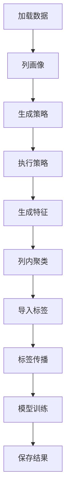

# 100 字段 5 万行模型训练可行性分析

生成时间：2026-07-22 17:52

## 一、结论

以当前工程实现看，`100` 个字段、`5` 万行数据直接做完整模型训练，技术上不是绝对不可行，但不建议按“每次训练都重新跑全量 `LOAD_DATA -> PROFILE -> RUN_STRATEGY -> GENERATE_FEATURE -> CLUSTER -> TRAIN`”的方式作为生产默认路径。

更准确的判断如下：

| 场景 | 可行性 | 结论 |
| --- | --- | --- |
| 直接全量训练，100 字段、5 万行 | 低到中 | 有较大 driver 内存、Spark 小作业过多、检查点写入膨胀风险 |
| 先采样生成检查点，再训练复用同一快照 | 中 | 训练本身可行性较高，但采样检查点那次仍有 500 万单元格级中间态压力 |
| 只用少量字段白名单训练 | 中到高 | 字段数降到 10 到 30 时，当前实现更接近可控 |
| 完成批量画像、批量策略和特征表化后 | 高 | 更适合 100 字段、5 万行及更大规模 |

当前最关键的限制不是 Spark 集群算力，而是当前工程仍有大量中间结果在 driver JVM 中以 Java 对象形式保存。

`100 * 50000 = 5000000`，也就是一次准备阶段会产生约 `500` 万个单元格级特征行。当前 `FeatureAssembler` 会把这些行 `collectAsList()` 拉回 driver，然后构造 `SparseFeatureRow`、聚类成员、传播标签和可能的检查点记录。这个规模已经进入需要严格压测和资源保护的区间。

## 二、依据的既有文档

本分析结合以下文档和当前代码实现：

| 文档 | 相关结论 |
| --- | --- |
| `doc/20260722/PROFILE与RUN_STRATEGY分布式执行可行性分析-202607221734.md` | `PROFILE` 和 `RUN_STRATEGY` 可以由 driver 发起 Spark 作业，但当前作业粒度偏碎 |
| `doc/20260722/person-info-driver闭环执行与性能分析-202607221654.md` | 450 行、6 字段时 `RUN_STRATEGY` 已是采样和预测主要耗时 |
| `doc/20260722/统一快照检查点落地优化对比报告-202607221347.md` | 训练复用采样检查点后可跳过重阶段 |
| `doc/20260721/UDF三函数SQL直接调用可行性与Executor嵌套Spark作业分析-202607211502.md` | 普通 executor UDF 内部不适合直接发起完整 Spark 工作流 |
| `doc/20260722/SparkKMeansColumnClusterer接入方案-202607221712.md` | 大样本聚类需要 driver 侧 Spark MLlib 路径 |

另外，当前代码已经出现了文档之后的新进展：`AutoColumnClusterer` 已能在大样本且存在 SparkSession 时路由到 `SparkKMeansColumnClusterer`，这是 5 万行场景的正向变化。

## 三、当前训练工作流

普通训练未复用快照检查点时，核心流程如下：



如果训练请求启用采样快照复用，则训练流程会变成：

```text
RESTORE_SNAPSHOT_CHECKPOINT -> LABEL -> PROPAGATE -> TRAIN -> PERSIST_RESULT
```

这能跳过 `LOAD_DATA`、`PROFILE`、`GENERATE_STRATEGY`、`RUN_STRATEGY`、`GENERATE_FEATURE` 和 `CLUSTER`。

## 四、数据规模估算

假设 100 个字段都可检测，5 万行都进入训练准备阶段。

| 对象 | 数量估算 | 说明 |
| --- | ---: | --- |
| 原始行 | 50000 | 表级行数 |
| 可检测字段 | 100 | 假设全部字段参与 |
| 单元格 | 5000000 | `50000 * 100` |
| 列画像 | 100 | 每列一个 `ColumnProfile` |
| 单列策略 | 约 400 到 700 | 每列通常 4 到 7 个 OD/PVD 策略 |
| RVD 策略 | 默认 0 | 默认配置是 `OD,PVD`，未启用 RVD |
| 特征行 | 约 5000000 | 每个单元格一个 `SparseFeatureRow` |
| 聚类成员 | 约 5000000 | 每个单元格一个 `ClusterAssignment` |
| 检查点记录 | 约 1000 万以上 | 特征行和聚类成员会分别写记录，外加画像、字典、摘要 |

如果启用 RVD，100 字段有向字段对理论上是 `100 * 99 = 9900`，但配置 `raha.strategy.max-rvd-column-pairs=500` 会截断。即使截断，RVD 的长表和 join 成本也会明显增加。因此 100 字段场景不建议默认启用 RVD。

## 五、各阶段可行性分析

### 5.1 LOAD_DATA

`FmdbDatasetLoader` 使用 `sparkSession.table` 或 `sparkSession.sql` 读取输入，并通过行身份服务做行标识、去重、校验和快照元数据生成。

5 万行、100 字段本身不是大数据规模，Spark 读取可行。

主要风险：

1. 如果未提供 `snapshotId` 或 `sourceVersion`，可能触发内容指纹计算。
2. 内容指纹会对数据排序并通过本地迭代读取，100 字段时会放大耗时。
3. 业务键去重和校验会触发多次 `count()`。

建议：

1. 生产请求尽量提供稳定 `snapshotId` 或 `sourceVersion`。
2. 避免每次训练都重新生成内容指纹。
3. 行身份列优先使用业务键，不要默认全字段哈希。

### 5.2 PROFILE

当前 `ColumnProfiler` 按字段循环，每列至少触发两类 action：

1. 单列聚合 `first()`。
2. 单列高频值 `collectAsList()`。

100 字段意味着约 200 个以上 Spark action。每个 action 可以利用 executor，但作业粒度很碎。

可行性判断：

1. 数据量 5 万行不算大，单个聚合可行。
2. 字段数 100 会让调度开销和重复扫描变明显。
3. 画像结果小，driver 保存画像本身不是问题。

建议：

1. 短期可以跑，但要预期 `PROFILE` 明显变慢。
2. 中期应做批量画像，减少按列 action。
3. 输入 DataFrame 应在准备阶段受控缓存。

### 5.3 GENERATE_STRATEGY

策略计划生成主要是 driver 本地逻辑，根据画像生成 OD、PVD、RVD 计划。

当前默认配置：

```properties
raha.strategy.families=OD,PVD
raha.strategy.max-count=1000
```

100 字段下，OD/PVD 单列策略数量大概率在 400 到 700 之间，未超过 1000。

可行性判断：

1. 本阶段可行。
2. 需要通过字段白名单、策略类型白名单控制策略数量。
3. 不建议默认开启 RVD。

### 5.4 RUN_STRATEGY

当前 `RUN_STRATEGY` 已经会由 driver 发起 Spark action，但普通 OD/PVD 策略仍是按策略执行。

关键现状：

1. `StrategyRunStageHandler` 当前调用不带并发参数的重载，普通策略默认并发为 1。
2. 低频、长度、字符集、类型格式等策略会各自触发 `groupBy`、`count`、`collectAsList`。
3. `RVD_ONE_TO_MANY` 已有批量执行器，但默认未启用 RVD。

5 万行、100 字段时，普通策略数量可能达到数百个。若每个策略触发 1 到多次 Spark action，`RUN_STRATEGY` 会成为明显瓶颈。

可行性判断：

1. 能跑，但耗时可能很长。
2. 若低频策略命中很多，候选结果会大量回到 driver。
3. 当前策略命中缓存在 `FmdbStrategyRepository.pendingHits`，没有物理中间表承接。

建议：

1. 短期先修正 `StrategyRunStageHandler`，传入 `maxParallelStrategies`。
2. 并发先压测 2 和 4，不要盲目调高。
3. 中期把 OD/PVD 常用策略改为批量执行。
4. 大规模下策略命中应表化，不应长期留在 driver List。

### 5.5 GENERATE_FEATURE

这是当前 100 字段、5 万行场景最关键的硬瓶颈。

当前 `FeatureAssembler.buildCellRows` 会：

1. 用 `stack` 把所有可检测字段展开成长表。
2. 生成 `column_name`、`row_id`、`text_value`、`value_hash`。
3. 按 `column_name,value_hash` 统计频率。
4. join 回单元格。
5. `collectAsList()` 把全部单元格行拉回 driver。
6. driver 按列构造 `MutableCellFeatures` 和 `SparseFeatureRow`。

100 字段、5 万行会产生约 500 万行长表结果。即使每行只保留少数字段，拉回 driver 后也会形成大量 Java 对象。

风险：

1. driver 内存峰值高。
2. GC 压力大。
3. `FeatureAssemblyResult.rows` 会长期传给聚类、标签传播、训练和检查点。
4. 当前 `FeatureStageHandler` 调用的是 `assembleAndSave`，没有走并行列特征入口。
5. 即使使用 `assembleAndSaveParallel`，每列仍会收集回 driver，只是并发方式不同。

可行性判断：

当前实现下，500 万特征行是最需要压测的风险点。没有足够 driver 内存和中间态表化之前，不建议直接作为生产默认路径。

建议：

1. 先通过字段白名单把字段数降到可控范围。
2. 关闭不必要上下文特征会降低单行特征维度，但不能减少 500 万行数量。
3. 中期把特征行写为 Spark Dataset 或物理中间表，避免全量 driver 收集。
4. 检查点也应避免逐单元格 JSON 记录膨胀。

### 5.6 CLUSTER

当前代码已有大样本 Spark KMeans 路径：

1. `AutoColumnClusterer` 小样本走 Smile。
2. 单列样本数超过 `raha.clustering.max-sample-count=5000` 且存在 SparkSession 时，走 `SparkKMeansColumnClusterer`。
3. `SparkKMeansColumnClusterer` 使用 Spark MLlib KMeans，`distanceMeasure=cosine`。
4. 该聚类器声明不支持本地列并发。

5 万行单列超过 5000，因此 100 个字段会走 100 次 Spark KMeans。由于不支持本地列并发，整体是按列串行提交 Spark KMeans 作业。

可行性判断：

1. 单列 5 万样本 KMeans 可行。
2. 100 列串行 KMeans 耗时可能很长。
3. KMeans 输入仍由 driver 的 `List<SparseFeatureRow>` 构造 `List<Row>`，没有完全消除 driver 内存压力。
4. 聚类输出仍是 500 万 `ClusterAssignment`。

建议：

1. 100 字段训练时应重点观察 `CLUSTER` 耗时。
2. 可降低 `targetClusterCount`，默认 100 对 100 列会生成最多 1 万簇。
3. 如果只是训练模型，不一定每次都需要全量聚类，可优先复用采样检查点。
4. 后续应考虑特征 DataFrame 直接进入 Spark KMeans，减少 driver 二次构造。

### 5.7 LABEL 与 PROPAGATE

标签传播基于聚类成员在 driver 本地分组。

5 万行、100 字段时，如果聚类成员是 500 万条，标签传播会在 driver 对 500 万成员分组和遍历。

可行性判断：

1. 若标注预算仍是 20 到数百行，直接标签数量不大。
2. 聚类成员数量大，传播分组成本和内存仍不可忽略。
3. 传播结果数量取决于簇覆盖，可能明显大于直接标签数量。

建议：

1. 控制聚类簇数和采样预算。
2. 大规模场景下标签传播也应考虑按列或按簇分批处理。

### 5.8 TRAIN

模型训练使用 `RahaTrainService` 按列并行训练，逻辑回归由 `SparkMllibLogisticRegressionTrainer` 调用 Spark MLlib。

但训练器输入来自 `ColumnTrainingDataset`，该对象由 driver 从 `SparseFeatureRow` 和标签构造。也就是说：

1. 模型 fit 是 Spark MLlib 分布式作业。
2. 训练样本构造仍是 driver 内存逻辑。
3. 如果传播标签不多，每列实际训练样本可能远小于 5 万。
4. 如果传播覆盖大量单元格，每列训练样本可能接近 5 万。

可行性判断：

1. 100 个列模型训练本身可以并行，但不能把并发调得过高。
2. 单列 5 万样本逻辑回归可行。
3. 真正风险仍来自前置特征、聚类和标签传播中间态。

建议：

1. `maxParallelColumns` 先用 2 到 4 压测。
2. 关注 `TRAIN` 阶段 Spark UI 和 driver 内存。
3. 如果训练样本很少，MLlib 启动作业开销可能大于收益，可考虑保留轻量模型回退。

## 六、当前实现的主要风险清单

| 风险 | 严重程度 | 说明 |
| --- | --- | --- |
| 500 万特征行 driver 收集 | 高 | `FeatureAssembler.collectAsList()` 是最主要硬瓶颈 |
| 500 万聚类成员常驻内存 | 高 | 聚类、传播、检查点都会继续使用 |
| 检查点记录超过 1000 万 | 高 | `CELL_FEATURE` 和 `CLUSTER_ASSIGNMENT` 分别写记录 |
| 普通策略串行调度 | 中到高 | `StrategyRunStageHandler` 未透传策略并发配置 |
| 画像按列多 action | 中 | 100 字段会触发大量小 Spark 作业 |
| Spark KMeans 100 列串行 | 中到高 | 单列可行，总耗时可能很长 |
| 普通 SQL UDF 入口 | 高 | 不能在 executor UDF 内安全发起完整 Spark 工作流 |
| RVD 误开启 | 高 | 100 字段组合爆炸，必须限制 |
| driver 堆配置不足 | 高 | 当前中间态大量 Java 对象化 |

## 七、推荐使用方式

### 7.1 不推荐方式

不建议直接让用户通过普通 SQL UDF 跑：

```sql
SELECT inline(F_DW_DETTRAIN('...'));
```

原因是当前三函数内部会执行完整 Spark 工作流，普通 Spark SQL 可能在 executor task 中初始化或执行 UDF，存在嵌套 Spark 作业风险。

### 7.2 推荐方式

推荐使用 driver 侧入口或平台 driver 侧任务服务：

1. 采样阶段：用 driver 侧入口读取 5 万行和必要字段，生成采样批次和快照检查点。
2. 标注阶段：人工或自动标注采样结果。
3. 训练阶段：传 `sampleBatchId + snapshotId` 且不传输入 SQL 或表名，启用 `RESTORE_SNAPSHOT_CHECKPOINT`。
4. 重复训练：尽量复用同一个采样检查点，不重复跑重阶段。

如果必须全量 5 万行训练，建议先限制字段：

```properties
raha.strategy.included-columns=字段1,字段2,...
```

或通过请求参数只传核心字段，先把可检测字段控制在 10 到 30 个。

## 八、生产参数建议

| 参数 | 建议 |
| --- | --- |
| `raha.strategy.families` | 保持 `OD,PVD`，不要默认开启 RVD |
| `raha.strategy.max-count` | 100 字段下可保留 1000，但建议配合策略类型白名单 |
| `raha.resource.max-parallel-strategies` | 修正代码后先压测 2 和 4 |
| `raha.resource.max-parallel-columns` | 先压测 2 和 4，不建议过高 |
| `raha.clustering.provider` | 保持 `AUTO`，大样本会走 Spark KMeans |
| `raha.clustering.target-cluster-count` | 先从 30 到 50 压测，不建议一开始 100 |
| `raha.clustering.max-sample-count` | 默认 5000 可以触发 Spark KMeans |
| `raha.persistence.table.training-cell.enabled` | 默认关闭是合理的，避免 500 万训练单元格直接入库 |
| `raha.persistence.table.training-example.enabled` | 默认关闭或只在需要复现时开启 |
| `raha.persistence.table.snapshot-checkpoint.enabled` | 复用训练需要开启，但要关注记录膨胀 |

## 九、建议压测矩阵

不要直接从 6 字段 450 行跳到 100 字段 5 万行。建议分层压测。

| 轮次 | 行数 | 字段数 | 目的 |
| --- | ---: | ---: | --- |
| 1 | 5000 | 20 | 验证基础链路和资源参数 |
| 2 | 50000 | 20 | 验证行数放大 |
| 3 | 50000 | 50 | 验证字段数放大 |
| 4 | 50000 | 100 | 最终目标压测 |

每轮至少记录：

1. 阶段耗时。
2. Spark job 数量。
3. driver 堆内存峰值。
4. executor 内存和 shuffle。
5. `FeatureAssemblyResult.rows.size()`。
6. `ClusteringBatchResult.assignmentCount`。
7. 检查点 `recordCount`。
8. 训练成功字段数和失败字段数。
9. 模型指标和异常字段。

## 十、必须优先改造点

### 第一优先级

1. `StrategyRunStageHandler` 传递 `maxParallelStrategies` 和 `stageTimeoutMillis`。
2. `FeatureStageHandler` 至少支持按列受限并行或分批输出。
3. 准备阶段统一受控缓存输入 DataFrame。
4. 训练入口强制走 driver 侧，不走普通 executor UDF。

### 第二优先级

1. 批量画像，减少 100 字段下的多 action。
2. OD/PVD 批量策略执行，减少几百个小 Spark job。
3. 特征行表化，避免 500 万 `SparseFeatureRow` 全量 driver 常驻。
4. 聚类输入直接使用 Spark DataFrame，减少 driver 构造 `List<Row>`。

### 第三优先级

1. 检查点瘦身，把单元格特征和聚类成员压缩或列式化。
2. 标签传播按列或按簇分批。
3. 训练样本表只保存最终入模样本，不保存全量单元格。
4. 增加大规模运行的资源保护和失败降级策略。

## 十一、最终判断

当前工程已经具备 5 万行训练的若干基础能力：

1. FMDB 输入通过 SparkSession 读取。
2. `PROFILE` 和策略执行可以由 driver 发起 Spark 作业。
3. 大样本聚类已有 Spark KMeans 路径。
4. 逻辑回归训练使用 Spark MLlib。
5. 快照检查点已经能让训练复用采样前置产物。

但对于 100 字段、5 万行，当前实现仍不适合直接生产化全量训练，主要因为：

1. 特征生成会把约 500 万单元格行收集到 driver。
2. 聚类、传播、检查点会继续放大这 500 万中间态。
3. `RUN_STRATEGY` 和 `PROFILE` 的 Spark 作业粒度偏碎。
4. 中间产物仓储当前大量依赖当前任务内存缓冲。

因此推荐口径是：

可以做验证性压测；不建议不改造就作为稳定生产方案。生产上线前，至少要完成策略并发配置透传、输入缓存、字段范围控制和 driver 侧入口固化。若目标就是长期支持 100 字段、5 万行甚至更大规模，必须继续推进批量画像、批量策略、特征表化和检查点瘦身。
