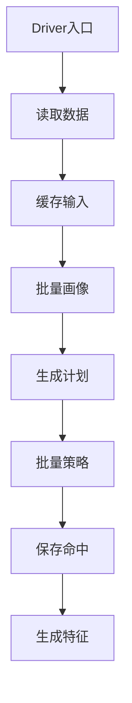

# PROFILE 与 RUN_STRATEGY 分布式执行可行性分析

生成时间：2026-07-22 17:34

## 一、问题结论

`PROFILE` 和 `RUN_STRATEGY` 阶段可以由 Spark driver 发起分布式作业，并利用 executor 集群资源。

但要分清两个层面：

1. 如果入口是 `RahaUdfDriverApp` 或其它明确运行在 Spark driver 侧的任务服务，那么当前 `PROFILE` 和多数 `RUN_STRATEGY` 策略已经会通过 Spark DataFrame action 提交 Spark 作业，executor 会参与计算。
2. 如果入口是普通 `SELECT F_DW_DETRUN(...)` 这类 `GenericUDF` 执行路径，则不能指望在 executor task 内部再安全发起完整 Spark 作业。正确方向是让 UDF 变成 driver 侧代理、平台命令或继续使用 driver 应用入口。
3. 当前真正的问题不是完全没有用 Spark，而是 Spark 作业组织方式偏碎：`PROFILE` 按列多次 action，`RUN_STRATEGY` 普通策略按策略多次 action，命中结果大量回收到 driver，且阶段处理器没有把 `raha.resource.max-parallel-strategies` 传给策略执行服务。

因此，推荐结论是：

短期先保持 driver 侧入口，修正 `RUN_STRATEGY` 阶段配置传递和输入缓存策略；中期把 `PROFILE` 改为批量画像，把 `RUN_STRATEGY` 改为按策略族批量执行；长期把策略命中和特征生成尽量保持为 Spark Dataset 或物理表，减少 driver 收集。

## 二、本次耗时基线

用户给出的阶段耗时如下：

| 阶段 | 开始时间 | 结束时间 | 耗时 | 占比 |
| --- | --- | --- | ---: | ---: |
| `LOAD_DATA` | 2026-07-21 13:41:19 | 2026-07-21 13:41:28 | 8.786 秒 | 3.36% |
| `PROFILE` | 2026-07-21 13:41:32 | 2026-07-21 13:41:47 | 14.415 秒 | 5.50% |
| `GENERATE_STRATEGY` | 2026-07-21 13:41:50 | 2026-07-21 13:41:52 | 1.332 秒 | 0.51% |
| `RUN_STRATEGY` | 2026-07-21 13:41:55 | 2026-07-21 13:42:27 | 31.786 秒 | 12.14% |
| `GENERATE_FEATURE` | 2026-07-21 13:42:29 | 2026-07-21 13:42:32 | 2.304 秒 | 0.88% |

从百分比反推，本次端到端总耗时约为 261.8 秒。`PROFILE + RUN_STRATEGY` 合计约 46.201 秒，占总耗时约 17.64%。

这两个阶段值得优化，但它们不是唯一瓶颈。如果同一次任务还有 `CLUSTER`、`TRAIN`、文件发布、FMDB 写入等阶段，最终收益还取决于其它阶段是否同步优化。

## 三、当前调用链证据

当前采样、训练和检测工作流都会复用公共准备阶段。

关键代码：

| 文件 | 作用 |
| --- | --- |
| `src/main/java/com/fiberhome/ml/raha/service/task/AbstractRahaWorkflow.java` | 装配 `LOAD_DATA`、`PROFILE`、`GENERATE_STRATEGY`、`RUN_STRATEGY`、`GENERATE_FEATURE` |
| `src/main/java/com/fiberhome/ml/raha/job/stage/data/ColumnProfileStageHandler.java` | 调用 `ColumnProfileService.profileAndSave` |
| `src/main/java/com/fiberhome/ml/raha/data/profile/ColumnProfileService.java` | 调用 `ColumnProfiler.profile` 并保存画像 |
| `src/main/java/com/fiberhome/ml/raha/data/profile/ColumnProfiler.java` | 使用 Spark 聚合生成列画像 |
| `src/main/java/com/fiberhome/ml/raha/job/stage/strategy/StrategyRunStageHandler.java` | 调用 `StrategyExecutionService.execute` |
| `src/main/java/com/fiberhome/ml/raha/strategy/execution/StrategyExecutionService.java` | 普通策略并发调度，RVD 策略批量执行 |
| `src/main/java/com/fiberhome/ml/raha/strategy/execution/StrategyExecutor.java` | 单策略设置 Spark job group 并调用策略实现 |
| `src/main/java/com/fiberhome/ml/raha/strategy/execution/RvdBatchStrategyExecutor.java` | 将一对多关系策略合并成批量 Spark 作业 |

当前 `FmdbDatasetLoader` 通过当前 SparkSession 执行 `sparkSession.table` 或 `sparkSession.sql`，后续 Dataset action 会由 driver 提交 Spark job。

## 四、当前 PROFILE 实现分析

`ColumnProfiler.profile` 会遍历 `dataset.getColumns()`，每个字段调用一次 `profileColumn`。

单列画像内部主要有两类 Spark action：

1. `values.agg(...).first()`：统计总数、空值、不同值、长度、数值统计、分位数、字符类型计数。
2. `values.groupBy(md5(text_value)).count().orderBy(...).limit(...).collectAsList()`：统计单列高频值哈希。

这说明：

1. 当前画像计算不是纯 driver 本地计算，聚合本身可以由 Spark executor 分布式执行。
2. 但当前是按列串行触发 Spark action，字段越多，作业数量越多，反复扫描输入 DataFrame。
3. 画像结果最终是小对象，回收到 driver 保存是合理的。
4. 对小样本数据，主要成本可能是 Spark 作业启动和调度开销；对大表，主要成本会变成重复扫描和 shuffle。

当前 PROFILE 的主要缺口：

| 缺口 | 影响 |
| --- | --- |
| 按列串行 | 无法充分利用字段维度并行，也增加多次扫描 |
| 每列至少两个 action | Spark job 数量多，调度开销高 |
| 未统一缓存输入 | 多阶段可能反复读取或重算上游 lineage |
| 画像逻辑与策略生成强绑定 | 复用和跳过阶段时需要严格保证快照一致 |

## 五、当前 RUN_STRATEGY 实现分析

`StrategyRunStageHandler` 当前调用的是：

```text
executionService.execute(jobId, stageId, dataset, plans, timeoutMillis, version)
```

该重载内部默认 `maxParallelStrategies=1`。也就是说，在公共准备阶段中，普通 OD、PVD 策略大概率是串行调度的。

配置文件里虽然有：

```properties
raha.resource.max-parallel-strategies=4
```

但该值没有通过 `StrategyRunStageHandler` 传入 `StrategyExecutionService` 的并发重载。`RahaFeaturePreparationService` 会传该配置，但当前采样、训练、检测工作流走的是 `AbstractRahaWorkflow` 的阶段处理器链。

普通策略执行方式如下：

1. `StrategyExecutionService` 将计划拆成普通策略和 RVD 批量策略。
2. 普通策略由 `BoundedParallelExecutor` 调度。
3. `StrategyExecutor` 为每个策略创建单线程 worker，设置 Spark job group，然后调用具体策略。
4. 具体 OD、PVD 策略内部使用 `groupBy`、`count`、`approxQuantile`、`collectAsList` 等 action。
5. 候选命中回收到 driver，转换为 `StrategyHit` 列表。

RVD 一对多策略已有批量优化：

1. `RvdBatchStrategyExecutor` 构造长表。
2. 广播策略列对配置。
3. 对长表做 join、groupBy 和冲突筛选。
4. 最终 `collectAsList` 一次收集候选行。

因此，`RUN_STRATEGY` 不是完全没有分布式执行，而是普通策略仍然是“多个小 Spark 作业加 driver 收集”的模式。

## 六、Spark driver 分布式方案可行性

推荐目标架构如下：



关键原则：

1. Spark 作业必须由 driver 控制流发起。
2. executor 只执行 Spark stage 内部的数据计算。
3. 不在 executor task、普通行级 UDF 或 `mapPartitions` 内部再次创建 SparkSession 或提交新的 Spark 作业。
4. 尽量减少 action 次数，而不是简单提高本地线程并发。
5. 大结果优先写入 Spark 表或 FMDB 表，driver 只保留摘要和必要小对象。

## 七、PROFILE 推荐改造方案

### 7.1 短期方案

短期可以在进入 `PROFILE` 前对输入 DataFrame 做受控缓存，并在准备阶段结束后释放。

收益：

1. 降低后续画像、策略和特征反复触发上游读取的成本。
2. 改动范围小。
3. 对当前 450 行左右的小数据，收益可能有限，但对复杂 SQL 输入更有帮助。

风险：

1. 缓存过大的表会占 executor 内存和磁盘。
2. 需要复用已有 `ResourceConfig.cacheThresholdBytes` 和 `cacheStorageLevel` 做保护。

### 7.2 中期方案

把 `ColumnProfiler` 从逐列 action 改为批量 Spark 画像。

建议拆成两类作业：

1. 基础统计作业：一次 `agg` 同时生成所有列的空值、空白、不同值、长度、数值统计、类型计数。
2. 频率统计作业：把字段展开成长表，按 `column_name` 和 `value_hash` 分组统计，再按列取前 N 个高频值。

收益：

1. 显著减少 Spark job 数量。
2. 减少对同一输入表的重复扫描。
3. 更容易观察 Spark UI 中的资源利用率。
4. 画像结果仍然是每列小对象，不改变仓储契约。

风险：

1. 一次性表达式会变宽，字段非常多时 SQL plan 可能膨胀。
2. 高频值长表会产生 `行数 * 字段数` 的中间数据，需要控制字段范围。
3. 分位数和不同值统计按多列聚合时要验证 Spark 版本兼容性和结果一致性。

## 八、RUN_STRATEGY 推荐改造方案

### 8.1 短期方案

让 `StrategyRunStageHandler` 调用带并发参数的重载：

```text
execute(jobId, stageId, dataset, plans, strategyTimeout, version, maxParallelStrategies, stageTimeout)
```

收益：

1. 能立即使用 `raha.resource.max-parallel-strategies`。
2. 对普通 OD、PVD 策略较多的任务，可能降低墙钟耗时。
3. 改动小，容易验证。

风险：

1. 本地多线程会同时提交多个 Spark job，可能造成调度拥塞。
2. 如果集群没有开启公平调度，多个作业不一定并行执行，反而增加争用。
3. 对小数据，调度开销可能大于并发收益。

建议默认先压测 `2` 和 `4` 两档，不建议无上限并发。

### 8.2 中期方案

把普通 OD、PVD 策略改成按策略族批量执行。

示例方向：

| 策略族 | 批量化方式 |
| --- | --- |
| OD 低频 | 长表按 `column_name,value_hash` 分组，一次计算多列低频候选 |
| OD 数值距离 | 长表按字段计算均值、标准差，再 join 回候选 |
| OD 四分位 | 批量计算字段分位数阈值，再筛选候选 |
| PVD 长度 | 批量计算字段长度分布和异常候选 |
| PVD 字符集 | 批量生成字符签名并统计少数模式 |
| PVD 空占位 | 广播占位符配置，一次筛选多列 |
| PVD 类型格式 | 批量计算类型分布，格式规则按字段配置筛选 |

收益：

1. 从“每个策略一个或多个 Spark job”变成“每个策略族一个或少数几个 Spark job”。
2. 更充分利用 executor 并行和 shuffle 能力。
3. 减少 driver 线程池调度和 Spark job group 管理成本。
4. 对 5 万行以上数据收益更明显。

风险：

1. 改造复杂度较高，需要保证策略结果与现有实现一致。
2. 批量作业失败时要能映射到具体策略摘要，不能丢失失败隔离语义。
3. 不同策略配置会增加 plan table 和 join 条件复杂度。
4. 候选命中可能很多，继续 `collectAsList` 会形成 driver 内存瓶颈。

### 8.3 长期方案

把 `StrategyHit` 从 driver List 演进为 Spark Dataset 或物理表引用。

建议方向：

1. 策略批量作业直接写 `strategy_hit` 中间表。
2. driver 只读取每个策略的 `hitCount`、状态、耗时和错误摘要。
3. `GENERATE_FEATURE` 从中间表读取策略命中，而不是从 driver 内存 List 读取。
4. 采样检查点继续保存可复用产物，但大对象尽量列式化或分区化保存。

收益：

1. 避免命中数量大时 driver OOM。
2. 特征生成可以继续留在 Spark 分布式计算里。
3. 更适合生产大表和多字段任务。

风险：

1. 需要调整 `FeatureService` 和检查点结构。
2. 中间表生命周期、清理策略、幂等键和版本字段必须设计清楚。
3. 测试和回归成本较高。

## 九、当前方案优缺点

### 9.1 当前方案优点

| 优点 | 说明 |
| --- | --- |
| 实现简单 | 阶段处理器和服务边界清晰，问题容易定位 |
| 结果确定性较好 | 每个策略独立执行，失败隔离明确 |
| 小数据可接受 | 在数百行、少量字段时，Spark 调度开销可控 |
| 已有验证基础 | `RahaUdfDriverApp` 已经跑通过采样、训练和预测闭环 |
| 仓储契约稳定 | 画像、策略命中、特征等仍按现有对象保存 |
| 超时控制清晰 | 单策略使用 job group，超时可取消对应 Spark 作业 |

### 9.2 当前方案缺点

| 缺点 | 影响 |
| --- | --- |
| Spark job 粒度碎 | 每列、每策略多次 action，调度开销高 |
| 普通策略并发未生效 | 阶段处理器没有传 `maxParallelStrategies` |
| 重复扫描输入 | 画像、策略、特征可能重复读取或重算 DataFrame |
| driver 收集较多 | 策略候选和特征行都可能回到 driver 内存 |
| 集群利用率不稳定 | 多个小 job 不一定能把 executor 跑满 |
| 普通 SQL UDF 风险 | executor task 内执行完整 Spark 工作流不安全 |

## 十、Spark driver 批处理方案优缺点

### 10.1 优点

| 优点 | 说明 |
| --- | --- |
| 符合 Spark 模型 | driver 提交作业，executor 执行计算 |
| 更能利用集群 | 批量画像和批量策略减少碎作业，提高 executor 利用率 |
| 减少重复扫描 | 通过长表和批量聚合复用同一次输入读取 |
| 更适合大表 | 数据量增长时，分布式收益会明显放大 |
| 更容易观测 | Spark UI 中能看到更少但更重的关键 job |
| 可继续复用检查点 | 采样到训练的快照复用仍然成立 |

### 10.2 缺点

| 缺点 | 说明 |
| --- | --- |
| 改造复杂 | 需要重写画像和多类策略的批量执行逻辑 |
| 一致性验证重 | 必须与当前逐策略结果做命中级对比 |
| 失败隔离变难 | 批量作业失败后要还原到具体策略状态 |
| 中间数据变大 | 长表会生成 `行数 * 字段数` 级别中间数据 |
| 小数据收益有限 | 几百行数据可能主要受 Spark 启动和调度开销影响 |
| 资源治理要求更高 | 缓存、广播、shuffle、并发都需要配置保护 |

## 十一、收益判断

以本次数据看：

1. `PROFILE` 约 14.415 秒，主要可通过减少 action 次数和输入缓存优化。
2. `RUN_STRATEGY` 约 31.786 秒，是当前更值得优先处理的公共准备阶段瓶颈。
3. 如果只是把普通策略并发从 1 提高到 4，收益取决于 Spark 调度器和集群空闲度，不能保证线性加速。
4. 如果把 OD、PVD 做成批量策略执行，收益更稳定，因为它减少的是 Spark job 数量和重复扫描。
5. 对 450 行、6 字段这类小规模数据，收益上限有限；对 5 万行以上或字段更多的数据，批处理和分布式改造收益会明显提升。

粗略预期：

| 改造 | 小数据收益 | 大数据收益 | 风险 |
| --- | ---: | ---: | --- |
| 传递策略并发配置 | 中 | 中 | 中 |
| 输入缓存 | 低到中 | 中 | 中 |
| 批量 PROFILE | 中 | 高 | 中 |
| 批量 RUN_STRATEGY | 中到高 | 高 | 高 |
| StrategyHit 表化 | 低 | 高 | 高 |

## 十二、推荐实施路线

### 第一阶段：低风险修正

1. 修改 `StrategyRunStageHandler`，传入 `maxParallelStrategies` 和 `stageTimeoutMillis`。
2. 在阶段日志中输出实际策略并发数和最大观察并发数。
3. 对 `maxParallelStrategies=1、2、4` 做同数据基准。
4. 在 driver 侧入口继续执行，不开放普通 executor UDF 直接跑完整工作流。

验收指标：

1. 策略命中数量与改造前一致。
2. 失败策略摘要与改造前一致。
3. Spark UI 中没有 executor 内嵌套 SparkSession 错误。
4. `RUN_STRATEGY` 墙钟耗时下降或至少不回退。

### 第二阶段：批量画像

1. 新增批量画像实现，保留旧实现作为回退。
2. 对同一数据集比较每列 `ColumnProfile` 的关键字段。
3. 高频值哈希数量和排序规则必须保持稳定。
4. 验证字段很多时 SQL plan 不膨胀到不可接受。

验收指标：

1. `PROFILE` Spark job 数显著减少。
2. 每列画像结果与旧实现一致或差异可解释。
3. `PROFILE` 耗时在目标数据集上下降。

### 第三阶段：批量策略

1. 优先批量化 OD 低频、PVD 空占位、PVD 字符集和 PVD 长度等规则相对稳定的策略。
2. 保留逐策略执行器作为 fallback。
3. 批量结果仍生成 `StrategyExecutionResult`，保证上游契约不变。
4. 对每个策略做命中单元格、原因码、分数和摘要对齐。

验收指标：

1. `RUN_STRATEGY` Spark job 数下降。
2. 策略命中与旧实现一致。
3. 失败隔离仍能定位到具体策略。
4. driver 内存峰值没有上升到不可接受。

### 第四阶段：命中表化和特征下推

1. 将策略命中中间结果写入 Spark 表或 FMDB 中间表。
2. `GENERATE_FEATURE` 读取命中表生成特征。
3. 检查点保存中间表引用和摘要，而不是只保存 driver 内存对象。

验收指标：

1. 大命中量任务不再依赖 driver 大 List。
2. 特征生成仍可复用采样检查点。
3. 训练和预测的模型分数无异常回退。

## 十三、边界和注意事项

1. 不建议把当前 `GenericUDF` 当成普通行级 UDF 使用；它内部是完整任务工作流，不是单行表达式。
2. 不建议在 executor task 中通过 `SparkSession.builder().getOrCreate()` 尝试补救，这会违反 Spark driver 与 executor 的职责边界。
3. 不建议只靠本地线程池提高并发，这会把问题从计算不足变成调度拥塞。
4. 分布式改造必须同时控制 driver 收集结果的规模，否则 executor 算得更快，driver 仍可能成为瓶颈。
5. 对采样后训练场景，优先继续利用已有快照检查点复用，因为跳过重阶段比重跑分布式作业更直接。
6. 对预测场景，不能直接复用采样聚类检查点，需要单独设计预测特征复用或命中表复用。

## 十四、最终建议

可以走 Spark driver 发起分布式作业，但不要理解成“把现有代码简单搬到 executor 并行”。当前最佳路线是：

1. 生产入口保持 driver 侧执行。
2. 先修正普通策略并发配置没有传递的问题。
3. 再把 `PROFILE` 和 OD、PVD 普通策略从多次小 action 改成批量 Spark 作业。
4. 最后把大规模策略命中从 driver List 演进到物理中间表。

这样既能利用集群资源，又能保持现有任务编排、幂等、检查点、模型训练和结果发布契约稳定。
