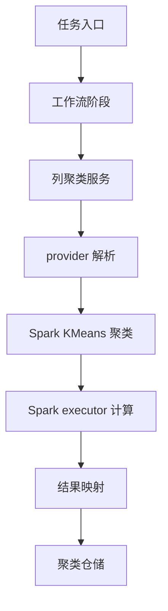

# SparkKMeansColumnClusterer 接入方案

## 结论

建议新增 `SparkKMeansColumnClusterer` 作为显式可选聚类后端，第一阶段不改变默认 `AUTO` 行为。默认链路仍保持小样本走 Smile、大样本走现有 `ScalableColumnClusterer`，通过配置显式切换到 Spark KMeans 做效果和耗时基准。

这样做的好处是：可以验证 Spark MLlib 的收益，同时保留 Smile 结果质量和快速回退能力。待基准稳定后，再考虑把 `AUTO` 的大样本分支切到 Spark KMeans，或新增 `AUTO_SPARK` 这类自动路由 provider。

## 目标

1. 新增 Spark MLlib KMeans 聚类实现，命名为 `SparkKMeansColumnClusterer`。
2. 在 Spark driver 侧统一发起 `KMeans.fit()` 和预测，不在 executor task 内启动 Spark 作业。
3. 保持现有 `ColumnClusterer` 接口输出语义：返回 `ColumnClusteringResult` 与 `ClusterAssignment`。
4. 保持 `cluster-0001` 这类簇编号稳定，避免 Spark 内部簇编号直接泄露到业务结果。
5. 保留 Smile 和现有可扩展近似聚类作为可回退实现。

## 总体流程



图中 `Spark KMeans 聚类` 必须由 driver 线程发起，executor 只承担 Spark 作业内部的分布式计算。

## 推荐启用方式

第一阶段推荐显式配置：

```properties
raha.clustering.provider=SparkKMeansColumnClusterer
raha.clustering.distance-metric=COSINE
raha.clustering.target-cluster-count=100
raha.clustering.max-sample-count=5000
```

说明：

1. `target-cluster-count` 映射到 Spark KMeans 的 `k`。
2. `distance-metric=COSINE` 映射到 Spark KMeans 的 `distanceMeasure=cosine`。
3. `randomSeed` 映射到 Spark KMeans 的 `seed`。
4. `max-sample-count` 第一阶段仍作为 Smile 精确路径阈值保留；显式 Spark provider 下不拦截大样本。

`raha.clustering.provider` 的配置注释需要同步列出 `SparkKMeansColumnClusterer` 可选值，但 Spark KMeans 细项默认值先不进入配置文件，统一写在 `SparkKMeansColumnClusterer` 代码常量中。

## 核心设计

### SparkKMeansColumnClusterer

新增类：

```text
src/main/java/com/fiberhome/ml/raha/cluster/algorithm/SparkKMeansColumnClusterer.java
```

职责：

1. 实现 `ColumnClusterer`。
2. 接收 `SparkSession`、`ClusterVersioner`、`Clock`。
3. 校验只能在 driver 侧发起 Spark 作业。
4. 将 `List<SparseFeatureRow>` 转换成 Spark `Dataset<Row>`。
5. 使用 `org.apache.spark.ml.clustering.KMeans` 训练模型。
6. 调用 `model.transform(frame)` 生成预测簇编号。
7. 把 Spark `prediction` 重新映射为稳定的 `cluster-0001`、`cluster-0002`。
8. 构造 `ColumnClusteringResult` 并返回给现有仓储流程。

推荐算法名：

```text
spark_kmeans_cosine_v1
```

### 输入 DataFrame

推荐 schema：

| 字段 | 类型 | 用途 |
| --- | --- | --- |
| `cell_id` | `StringType` | 单元格稳定标识 |
| `row_order` | `IntegerType` | driver 侧稳定排序后的行序号 |
| `features` | `VectorUDT` | Spark MLlib 稀疏向量 |

向量构造规则：

1. 先按 `cellId` 对输入行排序。
2. 特征维度使用当前 `FeatureDictionary` 中最大特征编号加一。
3. 每个 `SparseFeatureRow.values` 转为 `Vectors.sparse(dimension, indices, values)`。
4. 特征编号必须在字典维度内，否则返回失败或抛出受控异常。
5. 全零特征直接返回 `EMPTY_FEATURES`，避免 Spark KMeans cosine 距离处理零向量的不确定性。

### KMeans 参数

第一阶段不新增配置项，使用保守常量：

| 参数 | 建议值 | 说明 |
| --- | --- | --- |
| `featuresCol` | `features` | 固定输入列 |
| `predictionCol` | `prediction` | 固定输出列 |
| `k` | `min(targetClusterCount, rowCount)` | 避免簇数超过样本数 |
| `seed` | `randomSeed` | 保持可复现 |
| `distanceMeasure` | `cosine` | 对齐当前余弦距离语义 |
| `maxIter` | `50` | 第一阶段固定常量 |
| `initMode` | `k-means||` | Spark 默认初始化策略 |
| `initSteps` | `2` | Spark 默认量级即可 |

后续如果需要调优，再扩展配置：

```properties
raha.clustering.spark-kmeans.max-iterations=50
raha.clustering.spark-kmeans.init-steps=2
```

第一阶段不建议新增这些配置，避免配置面过早膨胀。

也就是说，第一阶段只扩展 `raha.clustering.provider` 的可选值说明，不新增 `raha.clustering.spark-kmeans.*` 默认配置。`maxIter`、`initMode`、`initSteps` 等默认值先写死在 `SparkKMeansColumnClusterer` 中。

### 稳定簇编号

Spark KMeans 的 `prediction` 是模型内部簇编号，不能直接作为业务簇编号。推荐映射规则：

1. 收集 `cell_id` 与 `prediction`。
2. 按 `prediction` 分组。
3. 每组内部 `cell_id` 排序后拼接为签名。
4. 按签名排序所有簇。
5. 依次分配 `cluster-0001`、`cluster-0002`。

这样只要最终成员关系一致，业务簇编号就稳定，不依赖 Spark 内部中心点顺序。

### 距离计算

`ClusterAssignment.distanceToCentroid` 建议继续写入余弦距离：

1. 使用 `KMeansModel.clusterCenters()` 获取中心点。
2. 根据每行的 `prediction` 找到对应中心点。
3. 计算原始稀疏向量与中心点向量的余弦距离。
4. 零向量已在训练前拦截，因此正常情况下不会出现无意义距离。

## Driver 侧约束

必须在 `SparkKMeansColumnClusterer.cluster()` 开始处做运行位置校验。

推荐校验：

1. `SparkEnv.get()` 不为空时，`executorId` 必须是 `driver`。
2. 当前 `SparkSession.sparkContext()` 不能处于 stopped 状态。
3. 发现非 driver 环境时，记录 `error` 日志并返回 `FAILED` 状态，错误信息说明 Spark KMeans 只能在 driver 侧发起。

原因：`KMeans.fit()` 会由 driver 提交 Spark 作业。如果在 executor task 或行级 UDF 中再次提交 Spark 作业，容易触发嵌套 Spark 作业、上下文不可用、任务卡死或运行时异常。

## 并发策略

当前 `ColumnClusteringService.clusterAndSaveParallel()` 会使用本地线程池按列并发聚类。对 Smile 和现有本地近似算法是合理的，但对 Spark KMeans 不建议直接多线程并发提交多个 `fit()`。

推荐改造：

1. 在 `ColumnClusterer` 增加默认方法 `supportsLocalColumnParallelism()`，默认返回 `true`。
2. `SparkKMeansColumnClusterer` 覆盖该方法并返回 `false`。
3. `ColumnClusteringService.clusterAndSaveParallel()` 发现当前 clusterer 不支持本地列并发时，记录 `warn` 日志并降级调用串行 `clusterAndSave()`。

这样采样和训练服务无需分别改造，就能避免多个 Spark KMeans 作业在 driver 线程池里同时提交。

## 涉及文件

### 必须新增

| 文件 | 类型 | 说明 |
| --- | --- | --- |
| `src/main/java/com/fiberhome/ml/raha/cluster/algorithm/SparkKMeansColumnClusterer.java` | 新增 | Spark MLlib KMeans 聚类实现 |
| `src/test/java/com/fiberhome/ml/raha/cluster/algorithm/SparkKMeansColumnClustererIntegrationTest.java` | 新增 | 验证 Spark KMeans 聚类、稳定编号、空输入和单样本边界 |

### 必须修改

| 文件 | 改动点 |
| --- | --- |
| `src/main/java/com/fiberhome/ml/raha/cluster/algorithm/ColumnClusterer.java` | 增加 `supportsLocalColumnParallelism()` 默认方法 |
| `src/main/java/com/fiberhome/ml/raha/cluster/ColumnClusteringService.java` | 并行聚类入口识别 Spark provider 并降级串行执行 |
| `src/main/java/com/fiberhome/ml/raha/cluster/algorithm/ClusteringProviderResolver.java` | 增加 Spark KMeans provider 常量、别名、解析逻辑，并新增带 `SparkSession` 的 `resolve` 重载 |
| `src/main/java/com/fiberhome/ml/raha/service/task/RahaTaskApplicationServiceFactory.java` | 将 `SparkSession` 传入聚类服务装配链路，使 resolver 能创建 Spark KMeans provider |
| `src/main/resources/raha-defaults.properties` | 更新 `raha.clustering.provider` 注释，列出 `SparkKMeansColumnClusterer` 可选值；不新增 Spark KMeans 细项默认配置 |
| `src/test/java/com/fiberhome/ml/raha/cluster/algorithm/AutoColumnClustererTest.java` | 补充 provider 解析用例，确认原有 `AUTO` 行为不变 |
| `src/test/java/com/fiberhome/ml/raha/config/validation/RahaConfigValidatorTest.java` | 补充 Spark KMeans provider 配置校验用例 |

### 通常无需修改

| 文件 | 原因 |
| --- | --- |
| `pom.xml` | 当前已经存在 `spark-mllib_${scala.binary.version}:3.3.1:provided` |
| `src/main/java/com/fiberhome/ml/raha/config/dto/ClusteringConfig.java` | 第一阶段复用已有聚类配置，不新增字段 |
| `src/main/java/com/fiberhome/ml/raha/config/validation/RahaConfigFactory.java` | 第一阶段不新增配置 key |
| `src/main/java/com/fiberhome/ml/raha/service/sample/RahaSampleService.java` | 通过 `ColumnClusteringService` 统一处理并发降级 |
| `src/main/java/com/fiberhome/ml/raha/service/train/RahaTrainService.java` | 通过 `ColumnClusteringService` 统一处理并发降级 |

## Provider 解析设计

`ClusteringProviderResolver` 建议新增标准 provider：

```text
SparkKMeansColumnClusterer
```

建议支持别名：

```text
SparkKMeans
SparkMlKMeans
KMeans
```

新增方法建议：

```java
public static ColumnClusterer resolve(String provider,
                                      ClusterVersioner versioner,
                                      Clock clock,
                                      SparkSession sparkSession)
```

保留原方法：

```java
public static ColumnClusterer resolve(String provider,
                                      ClusterVersioner versioner,
                                      Clock clock)
```

原方法继续支持现有 provider。若通过原方法解析 Spark KMeans，应抛出清晰异常，提示该 provider 需要 `SparkSession`。

## 工厂装配设计

`RahaTaskApplicationServiceFactory` 当前创建 `ColumnClusteringService` 时没有传入 `SparkSession`。需要沿装配链路补充：

1. `createDefaultRuntime` 调用 `createPreparationServices` 时传入 `sparkSession`。
2. `createPreparationServices` 方法签名增加 `SparkSession sparkSession`。
3. `clusteringService` 方法签名增加 `SparkSession sparkSession`。
4. `clusteringService` 内部调用 `ClusteringProviderResolver.resolve(provider, versioner, clock, sparkSession)`。

这样 Spark provider 可以在正常工作流中拿到 driver 侧 Spark 会话。

## 错误处理和日志

`SparkKMeansColumnClusterer` 必须增加日志：

1. `info`：开始聚类，记录 `columnName`、`rowCount`、`targetClusterCount`、`randomSeed`。
2. `info`：聚类完成，记录 `columnName`、`effectiveClusterCount`、`assignmentCount`、耗时。
3. `warn`：输入为空、单样本、空特征、全零特征、非 driver 环境。
4. `error`：Spark KMeans 训练或预测失败，必须带异常堆栈。

异常处理建议：

1. 输入参数非法时抛出 `IllegalArgumentException`。
2. Spark 训练失败时捕获 `RuntimeException | LinkageError`，返回 `ColumnClusteringStatus.FAILED`。
3. 失败结果的 `clusterVersion` 仍通过 `ClusterVersioner` 生成，保持仓储幂等口径。

## 测试方案

### 单元测试

1. provider 解析：
   - `SparkKMeansColumnClusterer` 可被识别。
   - `SparkKMeans`、`KMeans` 等别名映射到标准 provider。
   - 原有 `AUTO`、`SmileHierarchicalColumnClusterer`、`ScalableColumnClusterer` 行为不变。

2. 配置校验：
   - `raha.clustering.provider=SparkKMeansColumnClusterer` 校验通过。
   - 未知 provider 仍校验失败。

3. 并发降级：
   - 使用一个测试 clusterer 覆盖 `supportsLocalColumnParallelism=false`。
   - 调用 `clusterAndSaveParallel()` 时实际走串行逻辑。

### Spark 集成测试

新增 `SparkKMeansColumnClustererIntegrationTest`，使用现有 `SparkTestSession`：

1. 两组明显方向不同的稀疏向量，期望分成两个簇。
2. 同一输入、同一随机种子运行两次，`clusterVersion` 一致。
3. 输入 1 行时返回 `SINGLE_SAMPLE`。
4. 空输入返回 `EMPTY_INPUT`。
5. 空字典或全零特征返回 `EMPTY_FEATURES`。

建议执行：

```powershell
mvn -q -Dtest=SparkKMeansColumnClustererIntegrationTest,AutoColumnClustererTest,RahaConfigValidatorTest test
```

如果改动了并发降级，再补充：

```powershell
mvn -q -Dtest=ColumnClusteringService* test
```

最终回归：

```powershell
mvn test
```

## 基准验证

建议至少用同一批数据对比三组 provider：

| provider | 目的 |
| --- | --- |
| `SmileHierarchicalColumnClusterer` | 小样本质量基准 |
| `ScalableColumnClusterer` | 当前大样本耗时基准 |
| `SparkKMeansColumnClusterer` | Spark MLlib 分布式耗时和质量验证 |

观察指标：

1. 聚类阶段总耗时。
2. driver 堆内存峰值。
3. Spark job 数量和 stage 数量。
4. `assignmentCount` 是否一致。
5. `effectiveClusterCount` 是否接近 `targetClusterCount`。
6. 后续采样覆盖率和人工标注命中情况。
7. 后续训练样本传播数量和模型指标变化。

## 风险

1. 当前 `ColumnClusterer` 接口输入已经是 driver 侧 `List<SparseFeatureRow>`，Spark KMeans 不能完全消除特征行在 driver 内存中的压力。
2. Spark KMeans 是 k-means 思路，不等价于 Smile 的平均链接层次聚类，聚类质量可能变化。
3. Spark KMeans 的 `cosine` 距离对全零向量不友好，必须提前拦截。
4. 如果在 executor UDF 中发起 `fit()`，会有嵌套 Spark 作业风险，必须限制为 driver 侧。
5. 多列并发提交 Spark KMeans 容易造成 Spark 调度拥塞，第一阶段应串行。
6. `spark-mllib` 在 `pom.xml` 中是 `provided`，运行环境必须确认存在同版本 Spark MLlib jar。

## 二期增强

若第一阶段基准效果通过，可以考虑：

1. 新增 `AUTO_SPARK` provider：小样本 Smile，大样本 Spark KMeans。
2. 或修改默认 `AUTO`：小样本 Smile，大样本 Spark KMeans，并保留 `ScalableColumnClusterer` 作为 fallback。
3. 把特征组装阶段直接输出 Spark DataFrame，减少 driver 收集 `List<SparseFeatureRow>` 的压力。
4. 增加 Spark KMeans 调优配置，例如最大迭代次数和初始化步数。
5. 增加同列特征 DataFrame 缓存策略，减少 fit 与 transform 的重复计算成本。

## 推荐实施顺序

1. 新增 `SparkKMeansColumnClusterer`，先只支持显式 provider。
2. 修改 provider 解析和工厂装配，打通 `SparkSession` 注入链路。
3. 修改并发降级能力，避免 Spark KMeans 多列本地线程并发。
4. 补充单元测试和 Spark 集成测试。
5. 使用同一数据集跑 Smile、Scalable、Spark KMeans 三组基准。
6. 根据基准决定是否进入 `AUTO_SPARK` 或默认 `AUTO` 改造。
