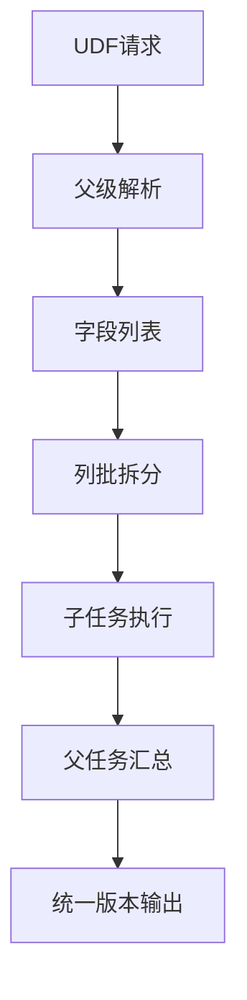
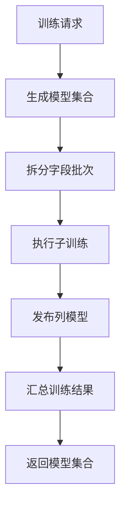
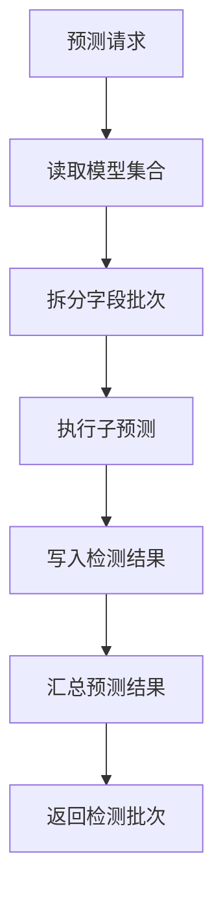
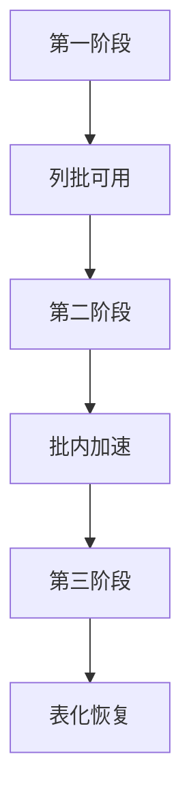

# 宽表按列分批三阶段落地方案

生成时间：2026-07-22 18:51

参考文档：`doc/20260722/宽表按列分批训练预测方案分析-202607221809.md`

## 一、总体结论

建议按原文“十、建议落地路线”拆成三个阶段推进：

1. 第一阶段做轻量列批编排，目标是让 `100` 字段、`5` 万行不再一次性承受约 `500` 万单元格级中间态。
2. 第二阶段做批内优化，目标是在单批 `10` 列范围内降低耗时，优先接通已有并发入口。
3. 第三阶段做中间态表化，目标是减少 driver 内存承压，并支持更可靠的恢复、重跑和审计。

其中第一阶段是必须先落地的主路径，第二阶段可以紧随第一阶段做低风险接线，第三阶段属于生产规模稳定性增强。

## 二、当前工程边界

| 边界 | 当前实现 | 对列批方案的影响 |
| --- | --- | --- |
| 字段白名单 | `DataLoadRequest.includedColumns` 和 `FmdbInputSpec.includedColumns` 已存在 | 子任务可以只处理当前列批 |
| 策略字段过滤 | `StrategyPlanGenerator` 按 `StrategyConfig.includedColumns` 过滤字段 | 子任务必须同步更新策略白名单 |
| 特征组装 | `FeatureAssembler.buildCellRows` 会把可检测字段展开并 `collectAsList()` | 列批能直接降低单批中间态 |
| 训练模型 | `RahaTrainService` 遍历字段字典训练列模型 | 天然适合按列批拆分 |
| 模型集合版本 | `RahaTrainService` 内部生成 `modelSetVersion` | 列批训练必须支持外部覆盖 |
| 预测模型 | `RahaDetectService` 遍历字段字典加载模型并预测 | 天然适合按列批拆分 |
| 检测批次 | 当前 `detection_batch_id` 等于检测任务 `jobId` | 列批预测必须支持父批次号 |
| 策略并发 | `StrategyExecutionService` 已有并发重载 | `StrategyRunStageHandler` 还没有透传 |
| 特征并发 | `FeatureService.assembleAndSaveParallel` 已存在 | `FeatureStageHandler` 还没有接入 |
| 聚类并发 | `ColumnClusteringService.clusterAndSaveParallel` 已存在 | `ClusterStageHandler` 还没有接入 |
| RVD | `StrategyPlanGenerator` 基于启用字段枚举字段对 | 可以只做批内 RVD，默认关闭 |
| 物理表 | 已有模型、检测结果、检查点、训练样本等表 | 第一阶段不需要改 DDL，第三阶段再扩展 |

## 三、总体流程



说明：

1. 父级解析只负责拆字段、生成全局版本、创建子请求和汇总结果。
2. 子任务继续走现有 `TrainingWorkflow` 或 `DetectionWorkflow`。
3. 每个子任务只处理当前 `10` 列。
4. 训练子任务共享同一个 `modelSetVersion`。
5. 预测子任务共享同一个 `detectionBatchId`。
6. 第一阶段批次串行，压测稳定后再开放 `maxParallelColumnBatches=2`。

## 四、第一阶段：轻量分批

### 4.1 阶段目标

不大改核心算法，只在任务入口增加列批编排。

第一阶段完成后应满足：

1. `F_DW_DETTRAIN` 可以把宽表拆成每批 `10` 列训练。
2. 所有成功字段模型归入同一个 `modelSetVersion`。
3. `F_DW_DETRUN` 可以按同一个 `modelSetVersion` 拆批预测。
4. 所有预测结果可以归入同一个父级 `detectionBatchId`。
5. 批内 RVD 能力可实现，但默认关闭。
6. 单批失败可以定位到字段批次，并允许后续重跑。

### 4.2 推荐参数

新增列批参数建议如下：

| 参数 | 默认值 | 说明 |
| --- | --- | --- |
| `columnBatchSize` | `10` | 每批字段数量 |
| `maxParallelColumnBatches` | `1` | 第一阶段先串行执行列批 |
| `batchRvdEnabled` | `false` | 是否开启批内 RVD |
| `batchRvdScope` | `IN_BATCH` | 开启 RVD 时只枚举当前列批内部字段 |
| `failFastColumnBatch` | `false` | 单批失败后是否立即终止父任务 |

兼容建议：

1. UDF 参数不传 `columnBatchSize` 时，可以先保持旧逻辑不分批。
2. 生产压测通过后，再把默认配置切到 `10`。
3. `columnBatchSize <= 0` 或 `columnBatchSize >= 有效字段数` 时走原有单任务路径。

建议新增默认配置：

```properties
raha.column-batch.size=10
raha.column-batch.max-parallel=1
raha.column-batch.rvd.enabled=false
raha.column-batch.rvd.scope=IN_BATCH
raha.column-batch.fail-fast=false
```

### 4.3 训练流程

训练父任务流程：

1. UDF 解析采样批次、标注批次、输入表和列批参数。
2. 父协调器读取目标字段列表。
3. 父协调器生成全局 `modelSetVersion`。
4. 父协调器按 `columnBatchSize=10` 拆分字段。
5. 每个子任务复制原训练请求。
6. 子任务设置当前批次的 `includedColumns`。
7. 子任务同步设置 `StrategyConfig.includedColumns`。
8. 子任务传入同一个 `modelSetVersionOverride`。
9. 子任务执行完整训练阶段链。
10. 父协调器汇总每批模型、失败字段和耗时。
11. UDF 返回父任务汇总和每列模型结果。

训练流程图：



### 4.4 预测流程

预测父任务流程：

1. UDF 解析输入表、`modelSetVersion` 和列批参数。
2. 父协调器读取模型集合清单。
3. 父协调器确定需要预测的字段集合。
4. 父协调器生成全局 `detectionBatchId`。
5. 父协调器按 `columnBatchSize=10` 拆分字段。
6. 每个子任务复制原检测请求。
7. 子任务设置当前批次的 `includedColumns`。
8. 子任务同步设置 `StrategyConfig.includedColumns`。
9. 子任务传入同一个 `detectionBatchIdOverride`。
10. 子任务只加载当前字段批的模型。
11. 子任务写入同一个检测批次号。
12. 父协调器汇总检测单元格数、错误数、失败字段和明细 ZIP。

预测流程图：



### 4.5 批内 RVD 边界

第一阶段只支持批内 RVD，默认关闭。

开启后规则如下：

1. 当前列批是 `10` 列，则 RVD 只枚举这 `10` 列内部字段对。
2. 不跨批枚举字段对。
3. 不做跨批 RVD 命中回填。
4. `StrategyConfig.maxRvdColumnPairs` 仍然生效。
5. 父任务摘要要记录 `batchRvdEnabled` 和 `batchRvdScope`。

实现方式：

1. `batchRvdEnabled=false` 时，子任务策略族保持 `OD,PVD`。
2. `batchRvdEnabled=true` 时，子任务策略族允许包含 `RVD`。
3. 子任务 `StrategyConfig.includedColumns` 只包含当前批次字段，因此 `StrategyPlanGenerator.addRvdPlans` 自然只会枚举批内字段。

### 4.6 第一阶段新增文件

| 文件 | 用途 |
| --- | --- |
| `src/main/java/com/fiberhome/ml/raha/service/task/batch/ColumnBatchOptions.java` | 保存列批大小、列批并发、批内 RVD 和失败策略 |
| `src/main/java/com/fiberhome/ml/raha/service/task/batch/ColumnBatch.java` | 描述单个字段批次的索引、字段列表和批次标识 |
| `src/main/java/com/fiberhome/ml/raha/service/task/batch/ColumnBatchPlanner.java` | 根据有效字段列表生成稳定列批 |
| `src/main/java/com/fiberhome/ml/raha/service/task/batch/ColumnBatchSchemaResolver.java` | 轻量读取表或 SQL 的字段列表，避免父任务先跑完整数据准备 |
| `src/main/java/com/fiberhome/ml/raha/service/task/batch/ColumnBatchExecutionSummary.java` | 保存父任务汇总、子任务状态和字段级统计 |
| `src/main/java/com/fiberhome/ml/raha/service/task/batch/ColumnBatchTaskResult.java` | 保存单个子任务的输出、状态、字段范围和耗时 |
| `src/main/java/com/fiberhome/ml/raha/service/task/batch/ColumnBatchTrainingCoordinator.java` | 编排训练列批子任务并汇总全局模型集合 |
| `src/main/java/com/fiberhome/ml/raha/service/task/batch/ColumnBatchDetectionCoordinator.java` | 编排预测列批子任务并汇总全局检测批次 |
| `src/main/java/com/fiberhome/ml/raha/service/task/batch/ColumnBatchParentJobRecorder.java` | 将父任务状态和汇总写入现有 `job_run` 结果摘要 |

### 4.7 第一阶段修改文件

| 文件 | 修改点 |
| --- | --- |
| `src/main/java/com/fiberhome/ml/raha/udf/RahaUdfRequestParser.java` | 解析 `columnBatchSize`、`maxParallelColumnBatches`、`batchRvdEnabled`、`failFastColumnBatch` |
| `src/main/java/com/fiberhome/ml/raha/udf/RahaDetectionUdfService.java` | 训练和预测入口判断是否启用列批，并调用对应父协调器 |
| `src/main/java/com/fiberhome/ml/raha/udf/RahaUdfFields.java` | 可选追加父级批次统计字段；若要保持兼容，第一阶段不强制改 |
| `src/main/java/com/fiberhome/ml/raha/service/task/TrainingRequestOptions.java` | 增加 `ColumnBatchOptions` |
| `src/main/java/com/fiberhome/ml/raha/service/task/DetectionRequestOptions.java` | 增加 `ColumnBatchOptions` |
| `src/main/java/com/fiberhome/ml/raha/service/task/RahaTaskExecutionRequest.java` | 增加列批上下文、`modelSetVersionOverride`、`detectionBatchIdOverride` |
| `src/main/java/com/fiberhome/ml/raha/service/task/RahaTaskRequestFactory.java` | 创建父请求和子请求，子请求写入列批字段白名单和执行指纹 |
| `src/main/java/com/fiberhome/ml/raha/service/task/RahaTaskApplicationService.java` | 暴露或承接列批父协调器入口 |
| `src/main/java/com/fiberhome/ml/raha/service/task/RahaTaskApplicationServiceFactory.java` | 装配列批协调器、父任务记录器和轻量字段解析器 |
| `src/main/java/com/fiberhome/ml/raha/service/task/FmdbInputSpec.java` | 增加 `withIncludedColumns` 或通用字段范围复制方法 |
| `src/main/java/com/fiberhome/ml/raha/data/loader/DataLoadRequest.java` | 增加 `withIncludedColumns`，便于创建子任务加载请求 |
| `src/main/java/com/fiberhome/ml/raha/config/dto/RahaJobConfig.java` | 增加 `withStrategyConfig`，同步子任务策略字段范围 |
| `src/main/java/com/fiberhome/ml/raha/config/dto/StrategyConfig.java` | 增加 `withIncludedColumns` 和可选的策略族复制方法 |
| `src/main/java/com/fiberhome/ml/raha/config/validation/RahaConfigFactory.java` | 读取列批默认配置 |
| `src/main/java/com/fiberhome/ml/raha/config/validation/RahaConfigValidator.java` | 校验列批大小、列批并发和 RVD 范围 |
| `src/main/resources/raha-defaults.properties` | 增加列批配置默认值 |
| `src/main/java/com/fiberhome/ml/raha/service/task/TrainingWorkflow.java` | 将 `modelSetVersionOverride` 传给训练阶段处理器 |
| `src/main/java/com/fiberhome/ml/raha/service/task/DetectionWorkflow.java` | 将 `detectionBatchIdOverride` 传给预测阶段处理器 |
| `src/main/java/com/fiberhome/ml/raha/job/stage/model/ModelTrainingStageHandler.java` | 构造 `RahaTrainRequest` 时携带 `modelSetVersionOverride` |
| `src/main/java/com/fiberhome/ml/raha/job/stage/detection/PublishedModelDetectionStageHandler.java` | 构造 `RahaDetectRequest` 时携带 `detectionBatchIdOverride` |
| `src/main/java/com/fiberhome/ml/raha/service/train/RahaTrainRequest.java` | 增加 `modelSetVersionOverride` 字段和 getter |
| `src/main/java/com/fiberhome/ml/raha/service/train/RahaTrainService.java` | 优先使用请求中的 `modelSetVersionOverride`，为空时保持原逻辑 |
| `src/main/java/com/fiberhome/ml/raha/service/detect/RahaDetectRequest.java` | 增加 `detectionBatchIdOverride` 字段和 getter |
| `src/main/java/com/fiberhome/ml/raha/service/detect/RahaDetectService.java` | 保存检测结果时使用统一检测批次号 |
| `src/main/java/com/fiberhome/ml/raha/repository/port/DetectionResultSaveContext.java` | 增加 `detectionBatchId`，避免继续强依赖 `jobId` |
| `src/main/java/com/fiberhome/ml/raha/repository/adapter/fmdb/repository/FmdbDetectionResultRepository.java` | 写入 `FmdbDetectionWriteContext` 时传入父级检测批次号 |
| `src/main/java/com/fiberhome/ml/raha/service/train/RahaTrainOutput.java` | 汇总输出可补充父批次统计 |
| `src/main/java/com/fiberhome/ml/raha/service/detect/RahaDetectOutput.java` | 汇总输出可补充 `detectionBatchId` |
| `src/main/java/com/fiberhome/ml/raha/service/task/RahaTaskResultSummaryBuilder.java` | 父子任务摘要增加列批信息 |

### 4.8 第一阶段父任务持久化

推荐第一阶段不新增物理表，直接复用 `dw.raha_job_run.result_summary_json`。

父任务摘要建议包含：

```json
{
  "parentJobId": "job-parent",
  "jobType": "TRAINING",
  "columnBatchSize": 10,
  "columnBatchCount": 10,
  "maxParallelColumnBatches": 1,
  "batchRvdEnabled": false,
  "modelSetVersion": "dw.table@20260722185100-job-parent",
  "childJobIds": ["job-child-001"],
  "succeededColumns": ["c1", "c2"],
  "failedColumns": {},
  "elapsedMillis": 123456
}
```

父任务状态规则：

| 子任务结果 | 父任务状态 |
| --- | --- |
| 全部成功 | `SUCCEEDED` |
| 部分成功且至少一个字段成功 | `PARTIAL_SUCCESS` |
| 全部失败 | `FAILED` |
| 命中可复用父任务 | 直接返回历史父摘要 |

### 4.9 第一阶段验收标准

| 验收项 | 通过标准 |
| --- | --- |
| 字段拆批 | `100` 字段按 `10` 列拆成 `10` 批 |
| 训练版本 | 所有成功字段模型的 `model_set_version` 完全一致 |
| 预测版本 | 指定该 `modelSetVersion` 能预测所有成功字段 |
| 检测批次 | `dw.raha_detection_result.detection_batch_id` 使用父级批次号 |
| RVD 默认 | 默认配置不生成 RVD 策略 |
| 批内 RVD | 显式开启后只生成当前批次内字段对 |
| 失败隔离 | 单批失败不影响已成功批次模型或检测结果 |
| 幂等 | 相同父请求重复提交可以复用父摘要或复用子任务 |
| 输出 | UDF 返回全局 `modelSetVersion` 或全局检测批次统计 |

### 4.10 第一阶段测试文件

| 文件 | 测试重点 |
| --- | --- |
| `src/test/java/com/fiberhome/ml/raha/service/task/batch/ColumnBatchPlannerTest.java` | 字段稳定排序、批次大小、空字段和黑白名单 |
| `src/test/java/com/fiberhome/ml/raha/service/task/batch/ColumnBatchTrainingCoordinatorTest.java` | 多批训练共享模型集合版本 |
| `src/test/java/com/fiberhome/ml/raha/service/task/batch/ColumnBatchDetectionCoordinatorTest.java` | 多批预测共享检测批次号 |
| `src/test/java/com/fiberhome/ml/raha/service/task/RahaTaskRequestFactoryTest.java` | 子任务指纹包含字段批次和父级版本 |
| `src/test/java/com/fiberhome/ml/raha/service/task/RahaTaskApplicationServiceIntegrationTest.java` | 父子任务状态汇总 |
| `src/test/java/com/fiberhome/ml/raha/job/execution/Iteration9FmdbPipelineIntegrationTest.java` | FMDB 训练预测闭环 |
| `src/test/java/com/fiberhome/ml/raha/strategy/plan/StrategyPlanGeneratorTest.java` | 批内 RVD 只枚举当前字段批 |

## 五、第二阶段：批内优化

### 5.1 阶段目标

在第一阶段列批已经可用后，降低每个字段批的耗时。

第二阶段不改变父子任务语义，不改变模型集合版本和检测批次号，只优化单批内部执行。

### 5.2 优先改造项

| 优先级 | 改造项 | 原因 |
| --- | --- | --- |
| 高 | `StrategyRunStageHandler` 透传策略并发 | 服务层已有并发重载，改造小 |
| 高 | `FeatureStageHandler` 接入列并行特征组装 | 服务层已有 `assembleAndSaveParallel` |
| 高 | `ClusterStageHandler` 接入列并行聚类 | 服务层已有 `clusterAndSaveParallel` |
| 中 | 单批输入缓存 | 避免策略、特征、聚类重复触发输入扫描 |
| 中 | 批量画像优化 | `PROFILE` 阶段字段多时仍可能较慢 |
| 低 | 列批并发 | 第一阶段稳定后再允许 `maxParallelColumnBatches=2` |

### 5.3 第二阶段修改文件

| 文件 | 修改点 |
| --- | --- |
| `src/main/java/com/fiberhome/ml/raha/job/stage/strategy/StrategyRunStageHandler.java` | 调用 `StrategyExecutionService.execute` 的并发重载，传入 `maxParallelStrategies` 和 `stageTimeoutMillis` |
| `src/main/java/com/fiberhome/ml/raha/strategy/execution/StrategyExecutionService.java` | 保持现有并发入口，补充日志和批内 RVD 计数 |
| `src/main/java/com/fiberhome/ml/raha/job/stage/feature/FeatureStageHandler.java` | 根据配置调用 `assembleAndSaveParallel` |
| `src/main/java/com/fiberhome/ml/raha/feature/FeatureService.java` | 校验并行合并结果顺序，补充失败字段摘要 |
| `src/main/java/com/fiberhome/ml/raha/feature/assembly/FeatureAssembler.java` | 优化 `buildCellRows`，确保只展开当前可检测字段批 |
| `src/main/java/com/fiberhome/ml/raha/job/stage/feature/ClusterStageHandler.java` | 根据配置调用 `clusterAndSaveParallel` |
| `src/main/java/com/fiberhome/ml/raha/cluster/ColumnClusteringService.java` | 保持 Spark 聚类器自动降级串行，补充批次日志 |
| `src/main/java/com/fiberhome/ml/raha/job/stage/data/DataLoadStageHandler.java` | 可选增加输入缓存标记和释放责任 |
| `src/main/java/com/fiberhome/ml/raha/service/task/AbstractRahaWorkflow.java` | 可选增加缓存释放阶段或阶段共享缓存策略 |
| `src/main/java/com/fiberhome/ml/raha/config/dto/ResourceConfig.java` | 可选增加是否开启并行特征和并行聚类的开关 |
| `src/main/java/com/fiberhome/ml/raha/config/validation/RahaConfigFactory.java` | 读取新增资源开关 |
| `src/main/java/com/fiberhome/ml/raha/config/validation/RahaConfigValidator.java` | 校验并发和超时配置 |
| `src/main/resources/raha-defaults.properties` | 补充批内优化相关默认配置 |

### 5.4 建议配置

```properties
raha.resource.max-parallel-strategies=4
raha.resource.max-parallel-columns=4
raha.resource.stage-timeout-millis=1800000
raha.feature.parallel-enabled=true
raha.clustering.parallel-enabled=true
```

注意：

1. 如果聚类器是 `SparkKMeansColumnClusterer`，`ColumnClusteringService.clusterAndSaveParallel` 已经会降级串行。
2. 不建议同时打开高列批并发和高批内列并发。
3. 第一阶段压测稳定前，`maxParallelColumnBatches` 仍建议保持 `1`。

### 5.5 第二阶段验收标准

| 验收项 | 通过标准 |
| --- | --- |
| 策略并发 | 日志出现 `maxObservedConcurrency` 大于 `1` |
| 特征并发 | 并行特征结果与串行结果字段数、行数、字典版本一致 |
| 聚类并发 | 非 Spark 聚类器可并行，Spark 聚类器自动降级 |
| 结果一致 | OD、PVD 默认路径下模型数量和检测统计不下降 |
| 耗时下降 | 单批 `RUN_STRATEGY` 或 `GENERATE_FEATURE` 耗时下降 |
| 资源可控 | driver 内存峰值不高于第一阶段串行单批 |

### 5.6 第二阶段测试文件

| 文件 | 测试重点 |
| --- | --- |
| `src/test/java/com/fiberhome/ml/raha/strategy/execution/StrategyParallelRecoveryIntegrationTest.java` | 策略并发和失败隔离 |
| `src/test/java/com/fiberhome/ml/raha/feature/assembly/FeatureAssemblerIntegrationTest.java` | 并行特征组装结果一致性 |
| `src/test/java/com/fiberhome/ml/raha/cluster/ColumnClusteringServiceTest.java` | 聚类并行和 Spark 降级 |
| `src/test/java/com/fiberhome/ml/raha/job/execution/RahaJobOrchestratorTest.java` | 阶段失败语义不变 |
| `src/test/java/com/fiberhome/ml/raha/service/task/batch/ColumnBatchTrainingCoordinatorTest.java` | 批内优化开启后父汇总不变 |

## 六、第三阶段：中间态表化

### 6.1 阶段目标

第三阶段目标是把策略命中、特征行、聚类成员和训练样本从 driver 内存中的大对象，逐步改为可查询、可恢复、可分区裁剪的物理中间态。

当前工程中：

1. `FmdbStrategyRepository` 对策略命中主要使用内存缓冲。
2. `FmdbFeatureRepository` 对特征字典和特征行主要使用内存缓冲。
3. `FmdbClusterRepository` 对聚类结果主要使用内存缓冲。
4. `FmdbSnapshotCheckpointRepository` 已能保存检查点，但保存前仍需要完整内存对象。
5. `TrainingArtifactMaterializationService` 已能写训练列产物、训练单元格和训练样本，但主要面向训练审计和恢复，不是通用在线中间态。

因此第三阶段不是简单“打开已有表开关”，而是要改服务契约，让后续阶段可以消费表引用或分区引用。

### 6.2 表化路线选择

推荐分两步：

| 路线 | 说明 | 推荐 |
| --- | --- | --- |
| 复用检查点表 | 扩展 `raha_snapshot_checkpoint` 的分批保存和按列恢复能力 | 先做 |
| 新增专用中间态表 | 新增策略命中、特征单元格、聚类成员专用表 | 压测后做 |

先复用检查点表的原因：

1. 当前 DDL 已有 `record_type`、`record_scope`、`column_name`、`cell_id`、`feature_vector_json`、`cluster_id` 等字段。
2. 可以减少第一轮 DDL 变更。
3. 适合先验证表化恢复链路。

但如果 `100` 字段、`5` 万行继续扩大到更高规模，建议新增专用表，因为检查点表是宽 JSON 形态，查询和分区裁剪不一定最优。

### 6.3 第三阶段新增文件

| 文件 | 用途 |
| --- | --- |
| `src/main/java/com/fiberhome/ml/raha/feature/assembly/FeatureAssemblyHandle.java` | 表示特征结果的轻量引用，包含字典、行数和物理位置 |
| `src/main/java/com/fiberhome/ml/raha/strategy/execution/StrategyHitHandle.java` | 表示策略命中结果的轻量引用 |
| `src/main/java/com/fiberhome/ml/raha/cluster/domain/ClusteringHandle.java` | 表示聚类结果和成员位置的轻量引用 |
| `src/main/java/com/fiberhome/ml/raha/repository/port/StageArtifactRepository.java` | 统一保存和读取阶段中间态 |
| `src/main/java/com/fiberhome/ml/raha/repository/adapter/fmdb/repository/FmdbStageArtifactRepository.java` | FMDB 版本的阶段中间态仓储 |
| `src/main/java/com/fiberhome/ml/raha/repository/adapter/fmdb/repository/FmdbStrategyHitRecord.java` | 可选专用策略命中表记录 |
| `src/main/java/com/fiberhome/ml/raha/repository/adapter/fmdb/repository/FmdbFeatureCellRecord.java` | 可选专用特征单元格表记录 |
| `src/main/java/com/fiberhome/ml/raha/repository/adapter/fmdb/repository/FmdbClusterAssignmentRecord.java` | 可选专用聚类成员表记录 |

### 6.4 第三阶段修改文件

| 文件 | 修改点 |
| --- | --- |
| `src/main/java/com/fiberhome/ml/raha/repository/port/StrategyRepository.java` | 增加按批保存和按列读取策略命中的接口 |
| `src/main/java/com/fiberhome/ml/raha/repository/adapter/fmdb/repository/FmdbStrategyRepository.java` | 从内存缓冲扩展为可写入和恢复策略命中 |
| `src/main/java/com/fiberhome/ml/raha/repository/port/FeatureRepository.java` | 增加保存特征行引用、读取列特征 DataFrame 或迭代器的接口 |
| `src/main/java/com/fiberhome/ml/raha/repository/adapter/fmdb/repository/FmdbFeatureRepository.java` | 从内存缓冲扩展为表化特征存取 |
| `src/main/java/com/fiberhome/ml/raha/repository/port/ClusterRepository.java` | 增加表化聚类成员读取接口 |
| `src/main/java/com/fiberhome/ml/raha/repository/adapter/fmdb/repository/FmdbClusterRepository.java` | 支持按列读取聚类摘要和成员 |
| `src/main/java/com/fiberhome/ml/raha/repository/port/SnapshotCheckpointRepository.java` | 增加按阶段、按列批增量保存接口 |
| `src/main/java/com/fiberhome/ml/raha/repository/adapter/fmdb/repository/FmdbSnapshotCheckpointRepository.java` | 避免一次性接收完整大对象，支持分批追加 |
| `src/main/java/com/fiberhome/ml/raha/feature/assembly/FeatureAssemblyResult.java` | 拆分为内存结果和表引用结果，降低对 `List<SparseFeatureRow>` 的依赖 |
| `src/main/java/com/fiberhome/ml/raha/feature/assembly/FeatureAssembler.java` | 增加表化特征生成路径，避免全量 `collectAsList()` |
| `src/main/java/com/fiberhome/ml/raha/feature/FeatureService.java` | 保存和返回 `FeatureAssemblyHandle` |
| `src/main/java/com/fiberhome/ml/raha/cluster/ColumnClusteringService.java` | 支持从表化特征读取当前列数据 |
| `src/main/java/com/fiberhome/ml/raha/cluster/algorithm/SparkKMeansColumnClusterer.java` | 优先消费 DataFrame 输入，减少 driver 列表构造 |
| `src/main/java/com/fiberhome/ml/raha/label/propagation/LabelPropagationService.java` | 支持从表化聚类成员读取传播输入 |
| `src/main/java/com/fiberhome/ml/raha/model/training/ColumnTrainingDataBuilder.java` | 支持从表化特征和标签构建训练样本 |
| `src/main/java/com/fiberhome/ml/raha/service/train/RahaTrainService.java` | 支持表化中间态训练路径 |
| `src/main/java/com/fiberhome/ml/raha/service/detect/RahaDetectService.java` | 支持表化特征预测路径 |
| `src/main/java/com/fiberhome/ml/raha/repository/adapter/fmdb/schema/FmdbPhysicalTable.java` | 如新增专用表，需要登记物理表和开关 |
| `src/main/java/com/fiberhome/ml/raha/repository/adapter/fmdb/schema/FmdbTableSchemas.java` | 如新增专用表，需要增加 Spark schema |
| `src/main/resources/db/fmdb/raha-fmdb-schema.sql` | 如新增专用表，需要增加 DDL |
| `src/main/resources/raha-defaults.properties` | 增加中间态表化开关 |

### 6.5 可选新增物理表

如果复用检查点表压测不理想，建议新增以下专用表。

| 表 | 用途 | 关键字段 |
| --- | --- | --- |
| `dw.raha_strategy_hit` | 保存策略命中 | `job_id`、`strategy_id`、`column_name`、`cell_id`、`reason_code` |
| `dw.raha_feature_cell` | 保存单元格特征向量 | `job_id`、`feature_batch_id`、`column_name`、`cell_id`、`feature_dictionary_version` |
| `dw.raha_cluster_assignment` | 保存聚类成员 | `job_id`、`cluster_version`、`column_name`、`cell_id`、`cluster_id` |
| `dw.raha_column_batch_run` | 保存父子列批关系 | `parent_job_id`、`child_job_id`、`batch_index`、`column_names_json`、`status` |

其中 `dw.raha_column_batch_run` 不是第一阶段必需表。第一阶段可先把父子关系放入 `job_run.result_summary_json`。

### 6.6 第三阶段验收标准

| 验收项 | 通过标准 |
| --- | --- |
| 特征表化 | `GENERATE_FEATURE` 不再要求把全部列批特征保存在 driver 大列表中 |
| 策略命中恢复 | 任务重试时可以从表恢复命中或摘要 |
| 聚类成员恢复 | 标签传播可以从表读取聚类成员 |
| 训练样本恢复 | 训练可以从表化样本恢复并重训 |
| 检测可重跑 | 指定父检测批次和模型集合可以重跑失败字段批 |
| 资源下降 | driver 内存峰值明显低于第二阶段 |
| 结果一致 | 与第二阶段同配置结果在字段数、模型数、错误数上保持一致 |

### 6.7 第三阶段测试文件

| 文件 | 测试重点 |
| --- | --- |
| `src/test/java/com/fiberhome/ml/raha/repository/adapter/fmdb/repository/FmdbStageArtifactRepositoryTest.java` | 表化中间态保存和读取 |
| `src/test/java/com/fiberhome/ml/raha/repository/adapter/fmdb/repository/FmdbFeatureRepositoryTest.java` | 特征字典和特征行恢复 |
| `src/test/java/com/fiberhome/ml/raha/repository/adapter/fmdb/repository/FmdbStrategyRepositoryTest.java` | 策略命中恢复 |
| `src/test/java/com/fiberhome/ml/raha/repository/adapter/fmdb/repository/FmdbClusterRepositoryTest.java` | 聚类成员恢复 |
| `src/test/java/com/fiberhome/ml/raha/job/execution/Iteration9FmdbPipelineIntegrationTest.java` | 表化路径端到端闭环 |
| `src/test/java/com/fiberhome/ml/raha/service/task/batch/ColumnBatchRecoveryIntegrationTest.java` | 列批失败恢复和重跑 |

## 七、三阶段依赖关系



阶段依赖说明：

1. 第一阶段必须先完成，因为第二阶段和第三阶段都依赖稳定的列批语义。
2. 第二阶段可以在第一阶段完成后独立上线，不依赖第三阶段。
3. 第三阶段会改服务契约和仓储接口，建议单独分支推进。
4. 第一阶段和第二阶段不建议同步引入新增物理表，避免验证面过大。

## 八、推荐迭代顺序

### 8.1 第一轮

1. 新增 `ColumnBatchOptions`、`ColumnBatch`、`ColumnBatchPlanner`。
2. 给 `FmdbInputSpec`、`DataLoadRequest`、`StrategyConfig`、`RahaJobConfig` 增加复制方法。
3. 给训练请求和检测请求增加版本覆盖字段。
4. 修改 `RahaTrainService` 使用 `modelSetVersionOverride`。
5. 修改 `RahaDetectService` 使用 `detectionBatchIdOverride`。
6. 新增训练父协调器和预测父协调器。
7. UDF 入口接入列批参数。
8. 补齐父任务摘要和单元测试。

### 8.2 第二轮

1. `StrategyRunStageHandler` 透传策略并发。
2. `FeatureStageHandler` 接入并行特征组装。
3. `ClusterStageHandler` 接入并行聚类。
4. 增加并发开关和默认配置。
5. 做 `10` 列单批压测。

### 8.3 第三轮

1. 扩展检查点仓储支持按列批增量保存。
2. 把策略命中、特征行、聚类成员从内存缓冲改成可恢复引用。
3. 修改训练和预测服务消费表化引用。
4. 压测后决定是否新增专用中间态表。
5. 补齐失败恢复和重跑测试。

## 九、关键风险

| 风险 | 影响 | 控制方式 |
| --- | --- | --- |
| 子任务快照不一致 | 不同批次训练或预测的行集不同 | 父任务必须固定 `snapshotId` 或 `sourceVersion` |
| 模型集合版本不统一 | 指定模型集合预测时字段不完整 | `RahaTrainService` 必须支持 `modelSetVersionOverride` |
| 检测批次割裂 | 用户看到多个不关联的检测批次 | `RahaDetectService` 必须支持 `detectionBatchIdOverride` |
| 策略白名单不同步 | 数据加载和策略计划字段范围不一致 | 子请求同时更新 `DataLoadRequest` 和 `StrategyConfig` |
| RVD 语义偏差 | 跨批关系不会被发现 | 第一阶段明确只做批内 RVD，默认关闭 |
| 子批并发过高 | 多批同时扫描同表导致资源争用 | 第一阶段固定串行，后续最多先开到 `2` |
| UDF 返回结构变化 | 下游 SQL 兼容性受影响 | 第一阶段尽量复用现有字段，不强制追加返回列 |
| 表化改造过大 | 第三阶段影响面扩大 | 先复用检查点表，再评估专用表 |

## 十、最终建议

第一阶段建议立即按下面最小闭环落地：

1. 子任务字段白名单。
2. 全局 `modelSetVersionOverride`。
3. 全局 `detectionBatchIdOverride`。
4. 父协调器串行执行列批。
5. 批内 RVD 能力可实现但默认关闭。
6. 父任务汇总写入现有 `job_run.result_summary_json`。

第二阶段接通已有并发入口即可，不要先重写算法。

第三阶段再处理表化和恢复，把 driver 大对象逐步替换为可恢复的物理引用。

按这个顺序推进，既能尽快解决 `100` 字段、`5` 万行的宽表峰值问题，又能保留后续生产化扩展空间。
