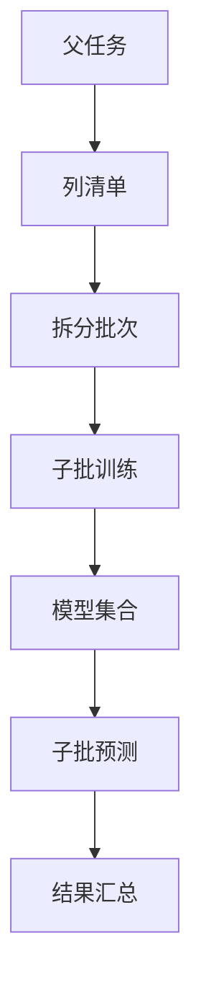

# 宽表按列分批训练预测方案分析

生成时间：2026-07-22 18:09

## 一、结论

按列分批是当前工程支持宽表训练和预测的正确方向，建议作为 `100` 字段、`5` 万行这类场景的生产化主路线。

原因是 Raha 当前模型本身就是列级模型：

1. 训练时每个字段生成独立 `FeatureDictionary`。
2. 每个字段训练独立 `RahaColumnModel`。
3. 预测时 `RahaDetectService` 也是按字段加载模型并预测。
4. 聚类、标签传播、模型训练天然按列隔离。

因此，把一张 100 字段宽表拆成每批 10 列执行，可以把一次 500 万单元格级中间态拆成 10 次约 50 万单元格级中间态，显著降低 driver 内存峰值、单批 Spark 作业压力和失败重跑成本。

但这个方向不能只做“外层循环调用 10 次”这么简单。当前工程还需要补两个关键边界：

1. 训练分批后，要让所有字段模型归入同一个逻辑 `modelSetVersion`，否则预测指定模型集合时只能看到其中一批字段。
2. 预测分批后，要有父任务或批次汇总结果，避免用户看到 10 个互不关联的检测批次。

## 二、当前代码已具备的基础

| 能力 | 当前状态 | 说明 |
| --- | --- | --- |
| 字段白名单 | 已具备 | `DataLoadRequest.includedColumns` 会控制字段是否 detectable |
| 策略字段过滤 | 已具备 | `StrategyPlanGenerator` 会按 `StrategyConfig.includedColumns` 过滤 |
| 特征按可检测字段展开 | 已具备 | `FeatureAssembler` 只对 `ColumnMetadata.isDetectable()` 字段生成特征 |
| 聚类按列执行 | 已具备 | `ColumnClusteringService` 以字段为单位处理 |
| 标签传播按列聚类结果处理 | 已具备 | `LabelPropagationService` 按聚类成员分组传播 |
| 模型训练按列执行 | 已具备 | `RahaTrainService` 遍历字段字典训练列模型 |
| 预测按列执行 | 已具备 | `RahaDetectService` 遍历字段字典加载模型并预测 |
| 大样本聚类 Spark KMeans | 已具备 | `AutoColumnClusterer` 可路由到 `SparkKMeansColumnClusterer` |
| 模型集合版本跨批共享 | 需补齐 | 当前一次训练生成一个 `modelSetVersion` |
| 父子批次汇总 | 需补齐 | 当前任务编排以单个 job 为中心 |

## 三、为什么按列分批有效

100 字段、5 万行时，一次全量准备阶段会产生：

```text
100 * 50000 = 5000000
```

也就是约 500 万个单元格级特征行。

如果每批 10 列：

```text
10 * 50000 = 500000
```

单批中间态下降到约 50 万行。

对当前工程最关键的收益是降低峰值，而不是降低总计算量。

| 项目 | 全量 100 列 | 10 列分批 |
| --- | ---: | ---: |
| 单批特征行 | 约 500 万 | 约 50 万 |
| 单批聚类成员 | 约 500 万 | 约 50 万 |
| 单批检查点记录 | 约 1000 万以上 | 约 100 万以上 |
| 单次失败重跑范围 | 全表 100 列 | 当前 10 列 |
| driver 峰值内存 | 高 | 明显降低 |
| 总作业次数 | 少 | 增加 |
| 总扫描次数 | 少 | 可能增加 |

因此，按列分批是用更多批次和调度成本换取更低单批内存峰值和更好的故障隔离。

## 四、推荐总体架构



推荐新增一个父级批处理编排概念，而不是让用户手工提交 10 次。

父任务负责：

1. 解析目标字段。
2. 按 `batchSize=10` 拆分字段。
3. 生成全局 `modelSetVersion` 或 `detectionBatchId`。
4. 提交多个列批子任务。
5. 汇总每个子任务状态。
6. 对外返回一个统一结果。

子任务负责：

1. 只处理当前批次的目标字段。
2. 保持当前阶段实现基本不变。
3. 将产物写入统一模型集合或统一检测批次。

## 五、训练分批方案

### 5.1 推荐流程

```text
父训练任务
  生成 parentJobId
  生成 globalModelSetVersion
  读取全字段清单
  每 10 列生成一个 columnBatch
  逐批或受限并发执行训练子任务
  汇总所有字段模型
  返回 globalModelSetVersion
```

训练子任务：

```text
LOAD_DATA
PROFILE
GENERATE_STRATEGY
RUN_STRATEGY
GENERATE_FEATURE
CLUSTER
LABEL
PROPAGATE
TRAIN
PERSIST_RESULT
```

每个子任务只让本批字段 detectable。

### 5.2 必须补齐的工程点

#### 5.2.1 全局模型集合版本

当前 `RahaTrainService` 内部生成：

```text
ModelReadableVersioner.modelSetVersion(sourceName, clock.millis(), jobId)
```

如果 100 字段拆成 10 个子任务，就会产生 10 个不同 `modelSetVersion`。

推荐新增：

```text
modelSetVersionOverride
```

父任务先生成一个全局版本，例如：

```text
dw.person_info@202607221809-parent-job-xxxx
```

每个子任务训练模型时都使用这个全局版本。

这样 `dw.raha_model_artifact` 中 100 个字段模型都属于同一个模型集合，预测时可以继续传一个 `modelSetVersion`。

#### 5.2.2 字段批次上下文

建议新增或复用请求字段：

| 字段 | 说明 |
| --- | --- |
| `targetColumns` | 当前父任务目标字段列表 |
| `columnBatchSize` | 默认 10 |
| `columnBatchId` | 子任务批次号 |
| `parentJobId` | 父任务标识 |
| `modelSetVersionOverride` | 父任务统一模型集合版本 |

其中 `targetColumns` 应同时写入：

1. `DataLoadRequest.includedColumns`。
2. `StrategyConfig.includedColumns`。

这样画像、策略、特征、聚类和训练都只处理当前批次字段。

#### 5.2.3 模型发布状态

当前每个字段训练成功后会自动发布，发布时会停用同字段旧模型。这一逻辑对列批训练是合理的。

但父任务应在汇总时判断：

1. 所有目标字段都训练成功，父模型集合为完整成功。
2. 部分字段成功，父模型集合为部分成功。
3. 如果产品要求强一致发布，则可以先写候选，全部成功后再统一发布。

短期可以接受“字段级自动发布”，中长期建议增加“集合级发布屏障”。

### 5.3 训练分批的优点

| 优点 | 说明 |
| --- | --- |
| 降低 driver 峰值 | 单批只处理 10 列，特征和聚类成员数量下降 |
| 失败隔离 | 某 10 列失败只重跑当前批 |
| 符合列级模型 | 不改变模型训练的基本语义 |
| 易于灰度 | 可以先对 20 列或 50 列验证 |
| 可配置资源 | 不同批次可按字段复杂度调度 |

### 5.4 训练分批的缺点

| 缺点 | 说明 |
| --- | --- |
| 总扫描次数增加 | 每批可能重新读取同一张表 |
| 总调度开销增加 | 10 个子任务会有更多 Spark job 和任务记录 |
| 模型集合管理复杂 | 必须保证所有批次归入同一集合 |
| 快照一致性要求更高 | 所有批次必须使用同一 `snapshotId`、`schemaHash` 和行身份规则 |
| RVD 跨批复杂 | 跨列关系策略会被批次边界切开 |

## 六、预测分批方案

### 6.1 推荐流程

```text
父预测任务
  接收 modelSetVersion
  读取目标字段和模型字段
  每 10 列生成一个 columnBatch
  执行预测子任务
  结果写入同一逻辑检测批次
  汇总检测数量和失败字段
```

预测子任务：

```text
LOAD_DATA
PROFILE
GENERATE_STRATEGY
RUN_STRATEGY
GENERATE_FEATURE
PREDICT
PERSIST_RESULT
```

每个子任务只生成当前 10 列的特征并预测当前 10 列。

### 6.2 必须补齐的工程点

#### 6.2.1 统一检测批次标识

当前检测结果通常使用 `jobId` 作为检测批次。

分批预测后，如果每个子任务使用自己的 `jobId`，结果表会出现多个检测批次。

推荐新增：

```text
detectionBatchIdOverride
```

父任务生成统一 `detectionBatchId`，所有子任务写检测结果时使用同一个批次号。

如果短期不改写入逻辑，也可以接受多个子检测批次，但 UDF 返回和下游查询会复杂很多。

#### 6.2.2 模型集合字段过滤

如果预测指定 `modelSetVersion`，每批只加载当前 10 列模型。

当前 `PublishedColumnModelLoader.load(modelSetVersion, datasetId, columnName, ...)` 支持按列加载指定集合模型，所以按批预测是可落地的。

需要确保：

1. 当前批字段在模型集合中存在唯一模型。
2. 缺失字段按 `MissingModelPolicy` 处理。
3. 父任务汇总所有批次的缺失字段和失败字段。

### 6.3 预测分批的优点

| 优点 | 说明 |
| --- | --- |
| 降低特征生成峰值 | 一批只展开 10 列 |
| 降低预测内存 | `RahaDetectService` 每批只保留部分结果 |
| 可增量重跑 | 某批字段预测失败可单独重试 |
| 适配宽表 | 不需要一次构造 100 列所有特征 |

### 6.4 预测分批的缺点

| 缺点 | 说明 |
| --- | --- |
| 重复读表 | 每批预测都可能重新读取同一份数据 |
| 结果汇总复杂 | 需要父任务合并检测数量、错误数量和失败字段 |
| 输出 ZIP 复杂 | 明细文件和压缩包需要按父任务汇总 |
| 策略版本告警可能增多 | 每批策略计划版本可能不同，需要兼容处理 |

## 七、关于 RVD 的边界

按列分批对 OD、PVD 很自然，因为它们主要是单列策略。

但 RVD 是跨列关系策略，100 字段拆成 10 列后会遇到三种选择：

| 选择 | 说明 | 推荐度 |
| --- | --- | --- |
| 禁用 RVD | 只做 OD、PVD | 高 |
| 只做批内 RVD | 每批 10 列内部枚举关系 | 中 |
| 做全局 RVD | 跨所有列枚举并回填到各批 | 低 |

当前默认配置是：

```properties
raha.strategy.families=OD,PVD
```

因此按列分批的第一阶段建议继续禁用 RVD。等 OD/PVD 分批稳定后，再单独设计 RVD 全局批处理。

## 八、字段分批大小建议

`batchSize=10` 是合理起点，但建议做成配置项。

| batchSize | 适用场景 |
| ---: | --- |
| 5 | 字段复杂、命中多、driver 内存较小 |
| 10 | 推荐默认值 |
| 20 | driver 内存充足、字段简单 |
| 50 | 压测通过后才考虑 |

实际 batchSize 不只看字段数，还要看：

1. 单字段值基数。
2. 低频策略命中数量。
3. 字段文本长度。
4. 是否启用聚类检查点。
5. driver 堆内存。
6. Spark 集群并发能力。

## 九、是否按批并发

第一阶段建议批次串行执行，而不是 10 个批次同时执行。

原因：

1. 当前每个子任务内部已经会发起 Spark 作业。
2. 多个批次并发会同时读同一张表，容易放大资源争用。
3. Spark KMeans 不适合多个列批同时抢占 driver 调度。
4. 串行更容易定位失败和统计耗时。

压测稳定后，可以开放小并发：

```text
maxParallelColumnBatches=2
```

不建议一开始超过 2。

## 十、建议落地路线

### 第一阶段：轻量分批

目标：不大改核心算法，只在任务入口增加列批编排。

需要改动：

1. 新增父级列批请求参数。
2. 子任务设置 `includedColumns`。
3. `RahaTrainService` 支持 `modelSetVersionOverride`。
4. 检测写入支持 `detectionBatchIdOverride` 或父任务汇总多个子批次。
5. UDF 返回父任务汇总结果。

验收：

1. 100 字段按 10 列拆成 10 批。
2. 所有成功模型共享一个 `modelSetVersion`。
3. 指定该 `modelSetVersion` 可以预测所有成功字段。
4. 单批失败可重跑。

### 第二阶段：批内优化

目标：降低单批耗时。

需要改动：

1. `StrategyRunStageHandler` 透传 `maxParallelStrategies`。
2. 准备阶段增加输入 DataFrame 受控缓存。
3. `FeatureStageHandler` 支持按列受限并行或分批。
4. 优化 `PROFILE` 批量画像。

### 第三阶段：中间态表化

目标：让 100 字段、5 万行更稳定。

需要改动：

1. 策略命中表化。
2. 特征行表化。
3. 聚类成员表化或压缩。
4. 检查点瘦身。
5. 父任务直接按物理表汇总状态。

## 十一、对当前工程的最终建议

可以调整为一批 10 列，训练和预测都按列批执行，而且建议这样做。

建议采用下面产品形态：

```text
F_DW_DETTRAIN
  参数增加 columnBatchSize=10
  返回一个全局 modelSetVersion
  内部拆成多个列批训练子任务

F_DW_DETRUN
  参数增加 columnBatchSize=10
  输入同一个 modelSetVersion
  内部拆成多个列批预测子任务
  返回一个全局 detectionBatchId 和汇总统计
```

第一阶段先保持批次串行，默认禁用 RVD。这样对宽表最有帮助，改造风险也相对可控。

如果只做一个最小可用版本，优先实现三个点：

1. 子任务字段白名单。
2. 全局 `modelSetVersionOverride`。
3. 父任务汇总训练和预测结果。

这三个点打通后，100 字段、5 万行就不必一次承受 500 万单元格级中间态，生产可行性会明显提升。
