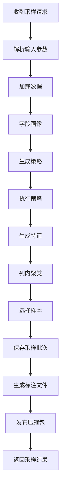
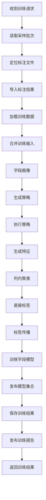
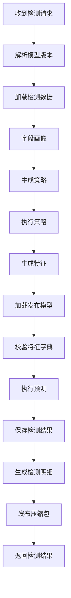

# Raha 三函数 UDF 汇报材料

生成时间：2026-07-23 09:43  
资料来源：`doc/20260721/三函数SQL执行耗时定位与优化分析-202607212219.md`、`README.md`、当前工程源码。

## 一、先说结论

目前三函数已经形成闭环：采样、训练、检测都可以通过 SQL 直接调用。  
本次实测对象是 `dw.person_info`，实际执行 SQL 为：

```sql
select * from dw.person_info limit 400
```

本次数据量是 400 行、6 个字段。采样生成 300 条待标注样本；训练使用 300 条有效标注；检测阶段对 4 个已发布模型字段完成预测，共检测 1600 个单元格，检出 134 个错误。

整体上，功能链路已经跑通，但性能瓶颈比较明确：慢点主要在聚类、策略执行、阶段表写入和 Spark SQL 启动开销，不在最终训练或预测本身。

## 二、三个 UDF 函数怎么调用

前提是函数已经注册好。最简单的调用方式就是 `SELECT * FROM 函数名('参数字符串')`。

### 1. 采样函数 F_DW_DETCOLLECT

功能：读取表或 SQL 数据，生成待标注样本、字段统计、聚类信息，并输出待标注 Excel 和 ZIP。

最简单调用：

```sql
SELECT *
FROM F_DW_DETCOLLECT(
  'sourceType=TABLE&tableName=dw.person_info&rowKeyColumns=id&labelingBudget=300&samplingRound=4'
);
```

本次实测按 400 行 SQL 调用：

```sql
SELECT *
FROM F_DW_DETCOLLECT(
  '{"sourceType":"SQL","sqlText":"select * from dw.person_info limit 400","rowKeyColumns":"id","labelingBudget":"300","samplingRound":"4"}'
);
```

核心返回：`sampleBatchId`、采样记录数、待标注 Excel 名称、待标注 ZIP 地址。

### 2. 训练函数 F_DW_DETTRAIN

功能：根据采样批次和人工标注文件训练字段模型，并生成模型集合版本。

最简单调用：

```sql
SELECT *
FROM F_DW_DETTRAIN(
  'sampleBatchId=sample_dw.person_info@20260721134516.455'
);
```

说明：`sampleBatchId` 来自采样函数返回值。标注文件默认从 `/fmdb/detection/annotation/` 查找。

核心返回：`modelSetVersion`、字段名、字段模型版本、模型状态、训练指标、训练报告 ZIP 地址。

### 3. 检测函数 F_DW_DETRUN

功能：加载已发布模型集合，对表或 SQL 数据执行错误检测，输出错误数量、结果表和明细 ZIP。

最简单调用：

```sql
SELECT *
FROM F_DW_DETRUN(
  'sourceType=TABLE&tableName=dw.person_info&rowKeyColumns=id&missingModelPolicy=PARTIAL'
);
```

本次实测按 400 行 SQL 调用：

```sql
SELECT *
FROM F_DW_DETRUN(
  '{"sourceType":"SQL","sqlText":"select * from dw.person_info limit 400","rowKeyColumns":"id","missingModelPolicy":"PARTIAL"}'
);
```

如果要固定使用某一次训练出的模型，可以显式传 `modelSetVersion`：

```sql
SELECT *
FROM F_DW_DETRUN(
  'sourceType=TABLE&tableName=dw.person_info&rowKeyColumns=id&modelSetVersion=dw.person_info@20260721135853.933-job-43d61f46-cee7-43b0-ae80-1202caebe51c'
);
```

核心返回：`modelSetVersion`、检测行数、命中模型字段数、失败字段数、检测单元格数、检出错误数、检测明细 ZIP 地址。

## 三、函数流程图

### 1. F_DW_DETCOLLECT 采样流程



### 2. F_DW_DETTRAIN 训练流程



### 3. F_DW_DETRUN 检测流程



## 四、目前完成情况

| 模块 | 当前状态 | 说明 |
| --- | --- | --- |
| 三个 UDF 函数 | 已完成 | `F_DW_DETCOLLECT`、`F_DW_DETTRAIN`、`F_DW_DETRUN` 均已实现 |
| SQL 直接调用 | 已跑通 | 当前可以通过 Spark SQL 直接执行，不依赖 app 提交 |
| 表输入和 SQL 输入 | 已支持 | 支持 `tableName` 和 `sqlText` 两种输入 |
| 采样输出 | 已完成 | 可生成样本批次、标注 Excel 和 ZIP |
| 标注导入 | 已完成 | 训练时可从默认 HDFS 标注目录定位并导入标注文件 |
| 模型训练 | 已完成 | 可按字段训练模型，并发布模型集合 |
| 检测执行 | 已完成 | 可加载已发布模型集合并输出检测明细 |
| 结果持久化 | 已接入 | 任务表、阶段表、模型表、采样表、检测结果表已接入 |
| 耗时定位 | 已完成 | 已拆出 SQL 外层、Raha job、核心服务和阶段耗时 |
| 主要遗留 | 待优化 | 聚类慢、策略重复跑、阶段表写入开销大、特征一致性需加强 |

这次实测训练和检测整体返回 `SUCCESS`，但内部有 `PARTIAL_SUCCESS`：`phone` 和 `home_address` 两个字段没有发布可用模型。检测使用了 `missingModelPolicy=PARTIAL`，所以其他字段照常完成预测。

## 五、本次 SQL 实测耗时

### 1. 执行对象和数据量

| 项 | 值 |
| --- | --- |
| 表 | `dw.person_info` |
| 执行 SQL | `select * from dw.person_info limit 400` |
| 输入行数 | 400 |
| 字段数 | 6 |
| 采样记录数 | 300 |
| 有效标注数 | 300 |
| 检测模型字段数 | 4 |
| 检测单元格数 | 1600 |
| 检出错误数 | 134 |

### 2. 三函数执行总览

| 函数 | jobId | 任务类型 | SQL 外层耗时 | Raha job 耗时 | 核心服务耗时 | 最终状态 |
| --- | --- | --- | ---: | ---: | ---: | --- |
| `F_DW_DETCOLLECT` | `job-12d54e69-f397-46fd-a348-16345c954335` | `SAMPLING` | 261.868 秒 | 248.413 秒 | 50 毫秒 | `SUCCESS` |
| `F_DW_DETTRAIN` | `job-43d61f46-cee7-43b0-ae80-1202caebe51c` | `TRAINING` | 354.936 秒 | 333.851 秒 | 24.714 秒 | `SUCCESS`，内部 `PARTIAL_SUCCESS` |
| `F_DW_DETRUN` | `job-ac1bf372-dfbb-49dd-bb21-160bc3c47abe` | `DETECTION` | 114.879 秒 | 97.124 秒 | 4.664 秒 | `SUCCESS`，内部 `PARTIAL_SUCCESS` |

一句话看耗时：SQL 外层看到的时间明显大于算法本身时间，很多时间花在 Spark SQL 启动、公共阶段重复执行、Hive 元数据和阶段结果写入上。

### 3. 采样阶段耗时

| 阶段 | 耗时 | 占 SQL 外层耗时 |
| --- | ---: | ---: |
| `LOAD_DATA` | 8.786 秒 | 3.36% |
| `PROFILE` | 14.415 秒 | 5.50% |
| `GENERATE_STRATEGY` | 1.332 秒 | 0.51% |
| `RUN_STRATEGY` | 31.786 秒 | 12.14% |
| `GENERATE_FEATURE` | 2.304 秒 | 0.88% |
| `CLUSTER` | 157.315 秒 | 60.07% |
| `SAMPLE` | 3.430 秒 | 1.31% |
| `PERSIST_RESULT` | 1.477 秒 | 0.56% |

采样最慢的是 `CLUSTER`，一个阶段占了 60% 左右。

### 4. 训练阶段耗时

| 阶段 | 耗时 | 占 SQL 外层耗时 |
| --- | ---: | ---: |
| `LOAD_DATA` | 6.081 秒 | 1.71% |
| `MERGE_TRAINING_INPUT` | 25.514 秒 | 7.19% |
| `PROFILE` | 13.757 秒 | 3.88% |
| `GENERATE_STRATEGY` | 1.680 秒 | 0.47% |
| `RUN_STRATEGY` | 48.196 秒 | 13.58% |
| `GENERATE_FEATURE` | 2.636 秒 | 0.74% |
| `CLUSTER` | 163.545 秒 | 46.08% |
| `LABEL` | 1.033 秒 | 0.29% |
| `PROPAGATE` | 1.197 秒 | 0.34% |
| `TRAIN` | 25.848 秒 | 7.28% |
| `PERSIST_RESULT` | 2.572 秒 | 0.72% |

训练最大耗时仍然是 `CLUSTER`，不是 `TRAIN`。真正训练模型只用了 25.848 秒。

### 5. 检测阶段耗时

| 阶段 | 耗时 | 占 SQL 外层耗时 |
| --- | ---: | ---: |
| `LOAD_DATA` | 7.645 秒 | 6.65% |
| `PROFILE` | 12.632 秒 | 11.00% |
| `GENERATE_STRATEGY` | 1.949 秒 | 1.70% |
| `RUN_STRATEGY` | 28.273 秒 | 24.61% |
| `GENERATE_FEATURE` | 2.389 秒 | 2.08% |
| `PREDICT` | 6.501 秒 | 5.66% |
| `PERSIST_RESULT` | 2.161 秒 | 1.88% |

检测真正预测只有 6.501 秒，前面的策略执行和公共准备阶段反而更重。

### 6. 耗时小结

| 类别 | 采样 | 训练 | 检测 |
| --- | ---: | ---: | ---: |
| SQL 外层总耗时 | 261.868 秒 | 354.936 秒 | 114.879 秒 |
| Raha job 内耗时 | 248.413 秒 | 333.851 秒 | 97.124 秒 |
| 阶段累计耗时 | 220.845 秒 | 292.059 秒 | 61.550 秒 |
| 阶段间和持久化调度开销 | 27.568 秒 | 41.792 秒 | 35.574 秒 |
| SQL 启动和 UDF 框架开销 | 13.455 秒 | 21.085 秒 | 17.755 秒 |

当前优先优化方向很明确：

1. 采样、训练、检测不要重复跑同一批数据的画像、策略、特征和聚类。
2. 聚类阶段要做轻量化或复用。
3. 预测阶段应尽量直接使用训练冻结的策略计划和特征字典。
4. 阶段表和任务表的写入次数要收敛，减少 Hive 和 HDFS 元数据开销。
5. SQL 验证可以放在同一个 Spark SQL 会话里，减少重复启动成本。

## 六、论文方案里的特征一致性问题

这里要单独提一下。论文里的思路在算法上能成立，但工程落地时有一个容易踩坑的问题：训练时生成的特征，和预测时重新生成的特征，可能不是同一套。

模型训练出来的权重是按“训练时的特征编号”学习的。比如训练时下标 0 代表空值特征，下标 1 代表邮箱格式特征；如果预测时重新生成特征后，下标 0 变成了邮箱格式特征，下标 1 变成了空值特征，那模型还能运行，但分数含义已经错了。更严重时，如果特征维度变了，预测会直接失败。

当前代码已有兜底处理：检测时会校验模型特征维度和当前特征维度；维度不一致会失败。维度一致但版本不同，目前会做字典版本适配后继续预测。这个处理能让链路跑通，但还不是最稳的最终方案。

建议后续按这个方向收敛：

1. 训练时冻结策略计划、特征字典和模型元数据。
2. 预测时优先读取模型绑定的冻结特征字典，不重新生成一套可能不同的字典。
3. 兼容校验不能只看维度，还要看特征下标、名称、类型、来源和默认值。
4. 如果结构不一致，应直接失败，避免输出看似成功但实际不可信的预测结果。

这件事的核心不是“版本号是否一样”，而是模型训练时看到的特征含义，和预测时送进模型的特征含义必须一致。

## 七、给领导汇报时可以这样收口

三函数现在已经能通过 SQL 串起来跑完整闭环：采样生成待标注文件，训练生成模型集合，检测输出错误明细。  
本次 400 行、6 字段的实测链路成功，性能瓶颈已经定位清楚：聚类和策略执行是主耗时，任务阶段持久化和 SQL 启动是固定开销。  
下一步重点不是再证明能不能跑，而是把重复公共阶段复用起来，把预测侧的训练特征一致性校验补强，这样才能从“验证可用”推进到“生产稳定可用”。
