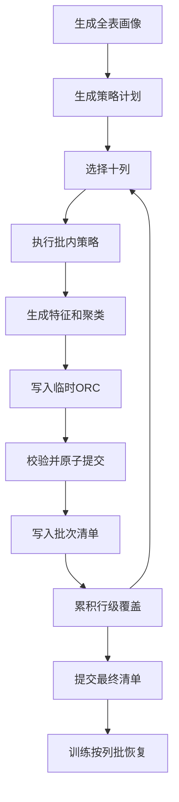

# 快照检查点 98 万记录构成与优化分析

## 零、分析依据

本报告结论来自以下可复核证据：

1. `SamplingWorkflow` 当前顺序是全量准备、全量聚类、保存检查点、最后生成 500 条采样任务，说明 `labelingBudget` 不限制前置中间态规模。
2. `FmdbSnapshotCheckpointRepository` 分别遍历 `features.getRows()` 和 `result.getAssignments()`，同一 `cell_id` 被写成一条特征记录和一条聚类成员记录。
3. `LabelPropagationService` 按 `columnName + clusterVersion + clusterId` 分组传播标签，没有读取 `clusterDistance`。
4. `ColumnTrainingDataBuilder` 使用字段特征字典、`SparseFeatureRow` 和标签构造训练样本，证明稀疏特征是训练核心输入。
5. 容器实测 `SELECT F_DW_DETCOLLECT(...)` 成功处理 1 万行、49 个可检测字段和 500 条采样记录，耗时 `1574.825 秒`。
6. 同一次容器执行记录了 99 条 Spark 大任务告警，首个检查点写任务约 2039 KiB，后续多数批次约 1869 至 1928 KiB，与 99 次明细追加计算结果一致。
7. 容器最终返回 245 个簇，即 49 个字段乘以验证配置中的 5 个目标簇；检查点写入从约 `06:01` 持续到 `06:21`，是总耗时的主要部分。

## 一、结论

当前 1 万行、50 字段宽表中，`row_key` 不参与检测，实际可检测字段为 49 个。

检查点不是只保存 500 条待标注记录，而是保存全量单元格级特征和全量单元格聚类归属：

```text
特征记录数 = 10000 × 49 = 490000
聚类成员记录数 = 10000 × 49 = 490000
元数据记录数 = 49 + 1 + 49 + 49 = 148
明细和元数据合计 = 980148
最后提交清单 = 1
总记录数 = 980149
```

按每批 10000 条写入时，需要 99 次明细追加，再单独追加 1 次清单，总计约 100 次 Hive 写操作。

本次容器实测每批通常需要 12 至 18 秒，因此检查点阶段耗时主要来自约 100 次 Hive 元数据处理、HDFS 文件提交和 Spark 写任务启动，而不是 98 万条记录本身的纯序列化耗时。

## 二、为什么 500 条标注仍产生 98 万条检查点记录

`labelingBudget=500` 只控制最终选择多少条待人工标注记录，不控制画像、策略、特征和聚类的输入规模。

当前流程需要先对全部 1 万行执行以下处理：

1. 为 49 个可检测字段生成单元格特征。
2. 为每个单元格计算聚类归属。
3. 根据全量聚类覆盖情况选择 500 条代表性记录。
4. 训练时使用 500 条人工标签，通过聚类归属向同簇单元格传播标签。

因此，500 条是人工工作量，不是检查点数据量。

## 三、七类记录的数量与内容

| 记录类型 | 数量 | 主要内容 | 当前作用 |
| --- | ---: | --- | --- |
| `MANIFEST` | 1 | 表结构、快照、行数、字段清单、策略版本 | 判断检查点完整，并恢复快照元数据 |
| `PROFILE` | 49 | 空值数、不同值数、数值统计、类型分布 | 恢复字段画像和策略上下文 |
| `STRATEGY_PLAN` | 1 | 全字段策略计划和策略执行摘要 JSON | 恢复特征语义及模型兼容信息 |
| `FEATURE_DICTIONARY` | 49 | 每列特征索引、类型、默认值和版本 | 解释稀疏向量并校验模型维度 |
| `CELL_FEATURE` | 490000 | 行列坐标、值哈希、稀疏向量、特征摘要 | 构造训练样本，是模型训练核心输入 |
| `CLUSTER_SUMMARY` | 49 | 算法、版本、簇数量、成员数量摘要 | 重建每列聚类结果对象 |
| `CLUSTER_ASSIGNMENT` | 490000 | 单元格、簇标识、簇版本、距离 | 标签传播和采样覆盖计算 |

## 四、记录示例

### 4.1 单元格特征记录

以下为结构化示意，不是原始表完整导出：

```json
{
  "record_type": "CELL_FEATURE",
  "column_name": "c01",
  "row_id": "123",
  "cell_id": "单元格稳定哈希",
  "cell_value": "脱敏展示值",
  "artifact_version": "特征字典版本",
  "feature_vector_json": "{\"0\":1.0,\"2\":0.35}",
  "feature_summary_json": "{\"命中策略\":\"低频值\"}"
}
```

### 4.2 聚类成员记录

```json
{
  "record_type": "CLUSTER_ASSIGNMENT",
  "column_name": "c01",
  "row_id": "123",
  "cell_id": "与特征记录相同的单元格稳定哈希",
  "cluster_version": "聚类版本",
  "cluster_id": "cluster-0003",
  "cluster_distance": 0.12
}
```

这两条记录描述同一个单元格，只是当前实现把特征和聚类归属拆成两行，因此单元格级记录数量翻倍。

## 五、哪些数据是必须的

### 5.1 保持当前训练语义时必须保留

| 内容 | 必要性 | 原因 |
| --- | --- | --- |
| 清单和快照字段元数据 | 必须 | 用于完整性判断、字段校验和恢复数据集对象 |
| 字段画像 | 当前契约必须 | 恢复后的数据集和策略上下文依赖画像 |
| 策略计划和执行摘要 | 必须 | 特征来源、版本兼容和模型解释依赖 |
| 特征字典 | 必须 | 稀疏向量索引和模型维度校验依赖 |
| 单元格稀疏特征 | 必须 | 模型训练直接输入 |
| 簇标识和簇版本 | 启用标签传播时必须 | 人工标签需要按簇传播到未标注单元格 |
| 聚类摘要 | 当前恢复实现必须 | 当前代码先恢复列聚类摘要，再挂载成员记录 |

### 5.2 可以删除、降级或按需保存

| 内容 | 优化判断 | 说明 |
| --- | --- | --- |
| `cluster_distance` | 可选 | 当前标签传播只使用簇标识和簇版本，不读取距离 |
| `cell_value` | 可按需 | 模型数学计算使用稀疏向量，展示值主要服务报告和排查 |
| `feature_summary_json` | 可按需 | 主要用于解释和物化摘要，不是分类器计算必需字段 |
| `strategy_hit_json` | 可删除空写 | 当前检查点保存路径没有填充该字段 |
| `sample_batch_id` | 可删除空写 | 当前检查点基础记录中始终为空 |
| 每行重复的来源字段 | 可压缩 | 快照、配置、结构等公共值已在清单中存在，但当前表结构要求重复写入 |

## 六、最终采用方案

本工程按新系统直接采用版本 2 检查点协议，不保留旧格式兼容分支：

1. `dw.raha_snapshot_checkpoint` 只保存画像、策略摘要、特征字典、聚类摘要、列批清单、最终清单和清理审计。
2. 单元格特征和聚类归属合并为同一条 HDFS ORC 记录。
3. 每 10 个可检测字段形成一个逻辑批次，每批只执行一次 ORC 写入和一次轻量元数据入表。
4. 策略执行、特征生成和聚类都在批内完成，保存后只把覆盖信息折叠到 `row_id` 级状态。
5. 单元格明细固定只保存训练和标签传播必须字段，不提供内容模式开关。
6. 最终清单最后提交，没有最终清单的中断批次不能被训练发现。

版本 2 的单元格明细固定为 10 个字段，其中前两个是批次治理字段：

```text
checkpoint_id
batch_index
column_name
row_id
cell_id
value_hash
feature_dictionary_version
feature_values
cluster_version
cluster_id
```

`cell_value`、`feature_summary_json` 和 `cluster_distance` 已从检查点协议删除，不再通过可选开关写入。

## 七、不建议的优化

1. 不建议只因为人工标注 500 条，就把检查点缩减为 500 行；这会直接失去未标注单元格的标签传播和完整训练样本。
2. 不建议把整列 1 万个特征和聚类成员塞进一个超大 JSON；虽然行数少，但单行解析、失败重试和内存峰值会更差。
3. 不建议在当前 4 GB 容器中直接把批次调到 10 万以上；训练和预测已经观察到接近 3 GB 的驱动内存占用。
4. 不新增专用中间态表；现有检查点表负责清单，HDFS 负责重明细。

## 八、实施顺序

1. 删除检查点表内单元格明细字段和旧微批写入器。
2. 建立分批写会话、HDFS ORC 原子提交和 `DETAIL_BATCH` 清单。
3. 把策略执行、特征、聚类改为每 10 列计算和释放。
4. 使用行级紧凑覆盖累积器生成采样分数。
5. 训练按目标字段选择对应列批路径并校验行数后恢复。
6. 模型发布成功后按保留周期清理 HDFS 明细。

## 九、当前判断

现有 98 万条记录在语义上并非全部重复：49 万条特征和49 万条聚类归属承担不同职责。

但它们使用相同的 `cell_id` 一一对应，物理上没有必要拆成两行。版本 2 已将二者合并为同一条 ORC 记录，并把重明细移出检查点元数据表。

## 十、采样函数是否只需要给训练必须的数据

需要区分两种“输出”：

| 输出范围 | 当前内容 | 建议 |
| --- | --- | --- |
| 采样函数对调用方的返回 | 任务摘要、500 条待标注任务、Excel | 保持，不输出 98 万条中间态 |
| 采样到训练的内部检查点 | 全量特征、全量聚类成员及元数据 | 裁剪为标签传播和训练真正需要的内容 |

对外输出本身不是问题，98 万条数据没有返回给 SQL 调用方，而是内部写入 `dw.raha_snapshot_checkpoint`。

保持“标签传播后训练”语义时，内部每个单元格最小必要内容可以收敛为：

```text
column_name
row_id
cell_id
feature_dictionary_version
feature_vector
cluster_version
cluster_id
```

以下内容不应继续作为每个单元格的默认必填输出：

```text
cluster_distance
cell_value
feature_summary_json
strategy_hit_json
sample_batch_id
重复的 schema_hash、source_version、config_fingerprint
```

公共字段可由最终清单恢复，解释类字段可通过独立开关按需保存。

如果明确关闭标签传播，`cluster_version` 和 `cluster_id` 也可以不保存；但这会改变当前训练语义，不能作为默认行为。

## 十一、每批结束保存还是全部采集完再保存

### 11.1 三种方式对比

| 方式 | 内存峰值 | 写入次数 | 失败重试 | 推荐度 |
| --- | --- | --- | --- | --- |
| 每 1 万条记录写一次 Hive | 低 | 约 100 次 | 细粒度，但提交开销高 | 不推荐作为最终形态 |
| 49 列全部计算完成后一次保存 | 最高 | 1 次 | 失败需要重做全部 | 不推荐宽表使用 |
| 每个 10 列逻辑批次完成后保存一次 | 中低 | 5 次 | 只重做失败列批 | 推荐 |

推荐的“每批”不是当前写入器按记录数切出的 1 万条微批，而是训练与预测已经采用的 10 列逻辑批次。

10 列批次在特征与聚类同行保存后包含约 10 万条单元格记录：

```text
10000 行 × 10 列 = 100000 条合并记录
```

正确执行顺序建议为：

1. 完成一个 10 列批次的策略、特征和聚类计算。
2. 将该批次写到临时 HDFS 路径。
3. 校验字段数、行数、字典版本和聚类版本。
4. 原子提交批次目录或写入批次完成标记。
5. 释放该批次特征和聚类对象。
6. 更新仅包含 1 万个行标识的紧凑采样覆盖摘要。
7. 五个列批全部完成后，根据覆盖摘要选择 500 条待标注记录。
8. 最后提交全局 `MANIFEST`，此时训练才可以发现并复用检查点。

这种方式同时避免两个极端：不会积压 98 万个中间态对象，也不会触发约 100 次 Hive 提交。

### 11.2 与当前采样顺序的关系

当前代码先完成全部聚类并保存检查点，再执行采样任务生成。

要改为按列批计算和落盘，采样覆盖评分需要改成紧凑累加器：每个列批只更新 `row_id` 的覆盖数量和稀有簇摘要，不保留所有列的完整成员对象。

该累加器最多约 1 万条行级状态，远小于 98 万条单元格状态。

## 十二、直接写 HDFS 是否比保存 Hive 表更快

### 12.1 为什么可能更快

当前 Hive 表的数据文件本身也位于 HDFS，性能差异不在存储介质，而在写入路径：

```text
当前：每批启动 Spark 写任务 + 查询 Hive 分区 + 提交 HDFS 文件 + 更新 Metastore
直接 HDFS：按路径写 ORC + 提交目录或完成标记
```

本次 99 条大任务告警证明当前每个 1 万条批次都独立启动了 Spark 写任务。直接按 10 列批次写 HDFS，可把主要明细写任务从约 99 次减少到约 5 次。

### 12.2 纯 HDFS 的问题

| 风险 | 说明 |
| --- | --- |
| 发现能力 | 训练端需要知道最新完整检查点路径 |
| 原子性 | 写到一半的目录不能被训练读取 |
| 模式演进 | 必须自行维护文件结构版本 |
| 孤儿清理 | 失败任务会留下临时目录 |
| 审计查询 | 不能直接通过 Hive SQL 查看检查点状态 |
| 权限治理 | 需要单独配置 HDFS 路径权限和生命周期 |

因此，纯 HDFS 会更快，但不一定整体更好。

### 12.3 推荐的混合方案

不新增专用表，继续复用 `dw.raha_snapshot_checkpoint`：

1. 单元格明细按 10 列批次直接写 HDFS ORC。
2. 现有检查点表只保存字段画像、特征字典、批次路径、行数、校验和与最终清单。
3. 每个批次完成后写一条轻量批次清单记录。
4. 所有批次成功后最后写 `MANIFEST`。
5. 按列恢复时先查询清单，只读取目标列批对应的 HDFS 路径。

建议路径结构：

```text
/fmdb/raha/checkpoint/
  dataset=<datasetId>/
  snapshot=<snapshotId>/
  checkpoint=<checkpointId>/
  column_batch=0001/
```

该方案仍由检查点表提供可发现性、完整性和审计能力，同时避免大量 Hive 明细行和频繁 Metastore 提交。

## 十三、HDFS 明细格式建议

建议使用结构化 ORC，不再把向量编码为 JSON 字符串：

| 字段 | 建议类型 |
| --- | --- |
| `column_name` | `string` |
| `row_id` | `string` |
| `cell_id` | `string` |
| `feature_dictionary_version` | `string` |
| `feature_values` | `map<int,double>` |
| `cluster_version` | `string` |
| `cluster_id` | `string` |

结构化 ORC 可以获得列裁剪、压缩和谓词下推，避免 JSON 编解码和重复字段名开销。

每个 10 列批次建议写成 4 至 8 个 ORC 文件，而不是一个巨大文件或 1 万条一个小文件。

## 十四、最终建议

最终方案已经按以下顺序落地：

1. 合并特征和聚类成员，每个单元格只保留一条 ORC 记录。
2. 删除距离、展示值和解释摘要等非训练必需字段。
3. 将采样前置处理改为每 10 列计算、保存、校验并释放一次。
4. 将重明细迁移为按列批写 HDFS ORC，现有表只保存索引、批次清单和最终清单。
5. 训练按目标列批读取对应 HDFS 路径，继续执行标签传播和模型训练。
6. 模型集合成功发布后按保留周期清理检查点明细，避免中间态长期占用 HDFS。

综合性能、内存、恢复和治理考虑，最佳方案不是“全部放表”或“完全不要表”，而是“现有表管清单，HDFS 管批次明细”。

## 十五、落地结果

### 15.1 数据规模变化

以 1 万行、49 个可检测字段为例：

| 项目 | 改造前 | 改造后 |
| --- | ---: | ---: |
| 检查点表单元格明细 | 980000 | 0 |
| HDFS ORC 单元格明细 | 0 | 490000 |
| 检查点表元数据和清单 | 149 | 约 155 |
| 主要 Hive 提交次数 | 约 100 | 约 6 |
| 采样阶段长期持有的单元格对象 | 特征和聚类全量 | 当前 10 列批次 |
| 跨批采样状态 | 全量聚类成员 | 约 1 万条行级覆盖状态 |

检查点表记录约为：49 条画像、1 条策略、49 条字典、49 条聚类摘要、5 条批次清单、1 条最终清单，共约 154 条；清理后再追加 1 条 `CLEANED` 审计记录。

### 15.2 写入与恢复



恢复端先查询最终清单和 `DETAIL_BATCH`，只选择与训练字段相交的路径；每个路径先核对清单声明的 ORC 行数，再进行字段过滤和对象恢复。

### 15.3 原子性和失败处理

1. 每批先写入带随机后缀的临时路径。
2. 写后读取并核对记录数，同时在 driver 流式计算内容校验和。
3. 校验成功后通过 HDFS 重命名提交正式目录。
4. 策略失败超过容忍阈值时中止会话并删除本次 HDFS 根目录。
5. 所有批次完成后写入策略摘要和最终清单。
6. 训练只发现带最终清单且没有 `CLEANED` 记录的检查点。

### 15.4 生命周期

默认保留期为 7 天。训练模型发布并完成结果校验后触发清理：删除超过保留期的 HDFS 检查点根目录，并在现有表追加 `CLEANED` 记录。清理异常只记录告警，不回滚已经发布的模型。

### 15.5 新工程约束

`dw.raha_snapshot_checkpoint` 的表结构版本已经从 1 调整为 2，删除了旧单元格明细字段。部署时必须使用新版建表脚本创建空表，不支持直接读取或续写旧格式检查点。
