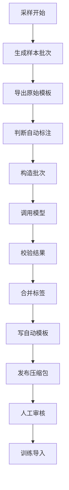

# 采样 Excel 大模型自动标注方案

## 一、目标

当前采集函数已经能够生成待人工标注的 Excel 文件。希望在采样时，如果调用方传入大模型地址和密钥等配置，系统在生成原始标注 Excel 后，自动调用大模型完成初始标注，再额外生成一份自动标注 Excel。用户下载后只需要审核和修正，然后按现有训练流程上传标注文件即可。

本方案的核心结论是：可以在采样阶段自动标注，并且必须采用分批调用和合并回写机制，不能把整份采样 Excel 一次性传给大模型。

## 二、当前代码现状

采集主入口位于 `src/main/java/com/fiberhome/ml/raha/udf/RahaDetectionUdfService.java` 的 `collect` 方法。该方法先执行采样任务，再生成标注模板，最后按需发布 ZIP。

关键现状如下：

| 位置 | 当前职责 |
| --- | --- |
| `RahaDetectionUdfService.collect` | 编排采样、导出 Excel、打包 ZIP |
| `AnnotationTemplateService.exportTemplate` | 从 c1 采样记录读取标注行并导出模板 |
| `AnnotationWorkbookAdapter.exportTemplate` | 使用 `HSSFWorkbook` 生成 `.xls` 标注模板 |
| `AnnotationWorkbookAdapter.read` | 读取用户标注 Excel |
| `AnnotationImportService.importWorkbook` | 校验 Excel、展开标签并写入标注记录 |
| `AnnotationUploadFileLocator.matches` | 训练阶段按文件名匹配指定 `sampleBatchId` 的标注文件 |
| `RahaUdfFields.COLLECT` | 定义采集 UDF 返回字段 |

现有 Excel 协议已经比较适合自动标注：

| 字段 | 类型 | 当前含义 | 自动标注处理 |
| --- | --- | --- | --- |
| `_annotation_task_id` | 系统列 | 标注任务标识 | 只读，不允许修改 |
| `_row_id` | 系统列 | 逻辑行标识 | 只读，不允许修改 |
| `_row_content_hash` | 系统列 | 行内容校验哈希 | 只读，不允许修改 |
| `_display_row_no` | 展示列 | 展示行号 | 只读，不允许修改 |
| `_row_label` | 标注列 | `0` 正常，`1` 异常 | 自动填入 |
| `_error_columns` | 标注列 | 异常字段名，多个字段逗号分隔 | 自动填入 |
| `_comment` | 标注列 | 标注说明 | 自动填入置信度和原因 |
| 业务字段 | 数据列 | 原始采样数据 | 只读，不允许修改 |

训练导入会校验系统列、业务字段值、行内容哈希、异常字段范围和标签合法性。因此自动标注服务只能填写 `_row_label`、`_error_columns`、`_comment`，不能修改任何业务数据。

## 三、推荐总体方案

推荐把自动标注作为采集 UDF 的可选能力接入，默认关闭。

流程为：

1. 调用 `F_DW_DETCOLLECT`。
2. 采样任务正常完成，生成 c1 采样批次。
3. 生成原始待标注 Excel。
4. 如果开启自动标注，则读取原始 Excel 或 c1 采样行。
5. 按上下文限制分批调用大模型。
6. 校验每批大模型返回结果。
7. 使用 `_row_id` 合并所有批次结果。
8. 复制原始 Excel 并只回写三个标注列，生成自动标注 Excel。
9. ZIP 中同时放入原始 Excel、自动标注 Excel、自动标注明细和摘要。
10. 用户下载自动标注 Excel，审核后上传到训练目录。

流程图如下：



## 四、为什么必须分批

采样结果可能达到几千到几万行，当前 Excel 配置允许最多 `50000` 行。即使每行只有十几个字段，完整内容也会远超大模型上下文窗口，并且会带来较高调用成本、较长耗时和较差稳定性。

因此自动标注应采用双层分批：

| 分批维度 | 触发条件 | 合并方式 |
| --- | --- | --- |
| 按行分批 | 行数多或输入字符数超过阈值 | 按 `_row_id` 合并 |
| 按列分批 | 宽表单行字段过多，单行也接近上下文上限 | 同一行的异常字段取并集 |

默认优先按行分批。当单批中任意行过宽，或者业务字段数量超过配置阈值时，再进入行列二维分批。

## 五、分批输入构造

每批请求不直接发送 Excel 文件，而是发送结构化 JSON。输入只包含大模型判断所需内容。

建议每批包含：

```json
{
  "task": "raha_auto_annotation",
  "datasetId": "dw.customer",
  "sampleBatchId": "sample_xxx",
  "batchId": "batch-0001",
  "detectableColumns": ["phone", "email", "age"],
  "columnSummary": {
    "phone": {
      "emptyCount": 1,
      "examples": ["13800138000", "027-88888888"]
    }
  },
  "rows": [
    {
      "rowId": "row-1",
      "values": {
        "phone": "13800138000",
        "email": "a@example.com",
        "age": "32"
      }
    }
  ]
}
```

`columnSummary` 是全局压缩摘要，可以从本次采样数据或字段模式中计算，控制在固定长度内。它可以减少不同批次之间判断标准漂移的问题。

推荐摘要包括：

| 摘要项 | 用途 |
| --- | --- |
| 字段名列表 | 告诉模型可判断范围 |
| 可检测字段列表 | 限制 `_error_columns` 只能从这些字段选择 |
| 空值数量 | 帮助判断空值是否异常 |
| 样例值 | 帮助识别常见格式 |
| 常见长度 | 辅助判断编码、手机号、证件号等 |
| 简单类型推断 | 辅助判断数值、日期、枚举和文本 |

如果字段属于 `sensitiveColumns`，建议默认对发给大模型的值做脱敏或不发送，仅保留长度、是否为空和格式摘要。自动标注 Excel 仍保留原始值供人工审核。

## 六、批次大小控制

建议使用字符数近似控制上下文，而不是依赖具体模型的分词器。原因是当前工程没有模型专属分词依赖，Java 8 环境下引入分词器会增加部署复杂度。

推荐配置如下：

| 配置项 | 默认值 | 说明 |
| --- | --- | --- |
| `autoLabelMaxRowsPerBatch` | `20` | 单次调用最大行数 |
| `autoLabelMaxCharsPerBatch` | `12000` | 单次请求最大输入字符数 |
| `autoLabelMaxColumnsPerBatch` | `40` | 宽表按列分批阈值 |
| `autoLabelMaxParallelBatches` | `1` | 默认串行调用，避免触发限流 |
| `autoLabelMaxRetryCount` | `2` | 单批失败重试次数 |
| `autoLabelBatchTimeoutMillis` | `120000` | 单批调用超时 |
| `autoLabelMaxTotalRows` | `0` | `0` 表示不限制总自动标注行数 |

批次构造规则：

1. 先生成全局列摘要。
2. 逐行追加到当前批次。
3. 若追加后超过 `autoLabelMaxRowsPerBatch` 或 `autoLabelMaxCharsPerBatch`，则关闭当前批次并开启新批次。
4. 若单行超过阈值，则按列窗口拆分该行。
5. 每个批次都有稳定 `batchId`，便于日志、重试和结果合并。

## 七、大模型返回协议

大模型必须返回严格 JSON，不允许返回自然语言正文。

建议返回结构：

```json
{
  "batchId": "batch-0001",
  "items": [
    {
      "rowId": "row-1",
      "rowLabel": 1,
      "errorColumns": ["phone"],
      "confidence": 0.82,
      "reason": "手机号格式与同列常见格式不一致"
    }
  ]
}
```

返回结果必须通过程序校验：

| 校验项 | 规则 |
| --- | --- |
| `batchId` | 必须等于请求批次 |
| `rowId` | 必须来自当前批次 |
| `rowLabel` | 只能为 `0` 或 `1` |
| `errorColumns` | 只能来自可检测字段 |
| 正常行 | `rowLabel=0` 时异常字段必须为空 |
| 异常行 | `rowLabel=1` 时异常字段不能为空 |
| 缺失行 | 可重试，最终按失败策略处理 |
| 额外行 | 记录告警并忽略 |

## 八、合并策略

按行分批时，合并规则很简单：`rowId` 是唯一键，每个 `rowId` 只接受一个决策。

按列分批时，同一行可能被多个列窗口处理，合并规则如下：

| 场景 | 合并规则 |
| --- | --- |
| 所有列窗口都正常 | `_row_label=0` |
| 任意列窗口发现异常字段 | `_row_label=1` |
| 多个列窗口发现异常字段 | `_error_columns` 取字段并集，按模板字段顺序排序 |
| 某列窗口失败但允许部分结果 | 已有异常字段保留，`_comment` 标记需要人工复核 |
| 某列窗口失败且策略为失败 | 采集 UDF 返回失败 |

评论列建议写入简短说明：

```text
自动标注：置信度 0.82；原因：手机号格式与同列常见格式不一致
```

当多个列窗口合并到一行时，评论可以压缩为：

```text
自动标注：异常字段 phone,email；最低置信度 0.76；请人工复核
```

## 九、Excel 回写方式

建议新增 `AnnotationAutoLabelWorkbookWriter`，不要修改现有 `AnnotationWorkbookAdapter.exportTemplate` 的模板导出职责。

回写步骤：

1. 打开原始模板。
2. 定位 `标注数据` 工作表。
3. 根据表头定位 `_row_id`、`_row_label`、`_error_columns`、`_comment`。
4. 根据 `_row_id` 找到对应自动标注结果。
5. 只写入 `_row_label`、`_error_columns`、`_comment`。
6. 保留系统信息、隐藏列、业务列、校验表、说明表和保护设置。
7. 新增可选工作表 `自动标注明细`，记录批次、置信度、原因和失败信息。

自动标注文件建议命名为：

```text
raha-annotation_<sampleBatchToken>_<fileTime>_auto.xls
```

这个命名仍满足训练阶段 `AnnotationUploadFileLocator.matches` 的匹配规则。用户审核后可以直接上传该文件，也可以另存为：

```text
raha-annotation_<sampleBatchToken>_<fileTime>_reviewed.xls
```

## 十、ZIP 产物建议

当前采集 ZIP 包含标注 Excel、`summary.json`、`manifest.json` 和 `column-clusters.csv`。

开启自动标注后建议 ZIP 内容调整为：

| ZIP 路径 | 内容 |
| --- | --- |
| `annotation/raw/<raw>.xls` | 原始空白标注模板 |
| `annotation/auto/<auto>.xls` | 自动标注模板 |
| `auto-label/summary.json` | 自动标注摘要 |
| `auto-label/decisions.jsonl` | 每行自动标注决策 |
| `auto-label/batches.jsonl` | 每批调用状态 |
| `summary.json` | 采集 UDF 摘要 |
| `manifest.json` | 采样批次元数据 |
| `column-clusters.csv` | 字段聚类摘要 |

为兼容旧下载习惯，也可以继续在 `annotation/<raw>.xls` 放一份原始模板。

## 十一、UDF 入参设计

建议采集 UDF 增加以下可选参数，全部默认关闭或保守值。

| 参数 | 默认值 | 说明 |
| --- | --- | --- |
| `autoLabelEnabled` | `false` | 是否启用自动标注 |
| `autoLabelModelUrl` | 空 | 大模型接口完整地址 |
| `autoLabelApiKey` | 空 | 请求密钥，不建议在生产直接传入 |
| `autoLabelApiKeyEnv` | `RAHA_AUTO_LABEL_API_KEY` | 从环境变量读取密钥 |
| `autoLabelModel` | 空 | 模型名称，按服务要求传入 |
| `autoLabelTemperature` | `0` | 固定低随机性 |
| `autoLabelMaxRowsPerBatch` | `20` | 单批最大行数 |
| `autoLabelMaxCharsPerBatch` | `12000` | 单批最大输入字符数 |
| `autoLabelMaxColumnsPerBatch` | `40` | 单批最大字段数 |
| `autoLabelMaxParallelBatches` | `1` | 并发批次数 |
| `autoLabelMaxRetryCount` | `2` | 单批最大重试次数 |
| `autoLabelFailPolicy` | `WARN_ONLY` | 失败策略 |
| `autoLabelMaskSensitiveColumns` | `true` | 是否对敏感字段脱敏后发送给模型 |

`autoLabelFailPolicy` 建议支持：

| 值 | 含义 |
| --- | --- |
| `WARN_ONLY` | 自动标注失败不影响采集成功，只输出原始模板 |
| `PARTIAL` | 成功批次写入，失败行留空并写明需要复核 |
| `FAIL` | 任意批次失败则采集失败 |

调用示例建议使用 JSON，避免模型地址中的特殊字符需要表单编码：

```sql
SELECT *
FROM F_DW_DETCOLLECT(
  '{
    "sourceType":"TABLE",
    "tableName":"dw.customer",
    "rowKeyColumns":"id",
    "labelingBudget":"200",
    "autoLabelEnabled":"true",
    "autoLabelModelUrl":"https://model.example.com/v1/chat/completions",
    "autoLabelApiKeyEnv":"RAHA_AUTO_LABEL_API_KEY",
    "autoLabelModel":"quality-labeler",
    "autoLabelMaxRowsPerBatch":"20",
    "autoLabelMaxCharsPerBatch":"12000",
    "publishZip":"true"
  }'
);
```

## 十二、UDF 出参设计

如果平台允许扩展采集 UDF 返回结构，建议在 `RahaUdfFields.COLLECT` 尾部追加字段，避免打乱现有字段顺序。

| 字段 | 类型 | 说明 |
| --- | --- | --- |
| `autoAnnotationStatus` | 字符串 | `DISABLED`、`SUCCEEDED`、`PARTIAL`、`FAILED` |
| `autoAnnotationExcelName` | 字符串 | 自动标注 Excel 文件名 |
| `autoAnnotationRecordCount` | 长整数 | 参与自动标注的行数 |
| `autoAnnotationLabeledCount` | 长整数 | 已成功回写标签的行数 |
| `autoAnnotationFailedCount` | 长整数 | 自动标注失败行数 |
| `autoAnnotationBatchCount` | 整数 | 大模型调用批次数 |
| `autoAnnotationReportName` | 字符串 | 自动标注明细文件名 |

如果平台对 UDF 返回字段已经固化，短期也可以不改返回结构，只把自动标注文件放入 ZIP，并在 `summary.json` 中记录上述信息。

## 十三、新增类建议

建议新增包：

```text
src/main/java/com/fiberhome/ml/raha/annotation/auto/
```

建议类如下：

| 类名 | 职责 |
| --- | --- |
| `AutoAnnotationConfig` | 保存模型地址、密钥来源、批次大小、失败策略和脱敏策略 |
| `AutoAnnotationRequest` | 保存原始模板路径、输出路径、数据集和采样批次 |
| `AutoAnnotationResult` | 保存自动标注状态、统计指标和输出文件 |
| `AutoAnnotationDecision` | 保存单行自动标注结果 |
| `AutoAnnotationBatch` | 保存一次模型调用的输入行和列窗口 |
| `AutoAnnotationBatchBuilder` | 按行数、字符数和字段数构造批次 |
| `AutoAnnotationMergeService` | 合并分批结果并处理缺失、冲突和部分失败 |
| `AnnotationAutoLabelWorkbookWriter` | 复制模板并回写标注列 |
| `LlmAutoAnnotationService` | 自动标注主编排服务 |
| `LlmPromptBuilder` | 构造稳定提示词和 JSON 输入 |
| `LlmResponseValidator` | 校验大模型返回结构和字段合法性 |
| `OpenCompatibleLlmClient` | 使用标准库发起 HTTP 请求 |

当前工程使用 Java 8，建议大模型客户端先使用 `HttpURLConnection`，避免引入新的 HTTP 依赖和集群依赖冲突。

## 十四、采集入口改造点

`RahaDetectionUdfService.collect` 的推荐改造位置如下：

1. 在 `annotationTemplateService.exportTemplate` 之后，得到 `excelPath`。
2. 解析 `autoLabelEnabled` 和模型配置。
3. 如果关闭自动标注，保持当前行为。
4. 如果开启自动标注，调用 `LlmAutoAnnotationService.autoLabel`。
5. 将自动标注结果写入返回 `row`。
6. 修改 `collectPackageFiles`，把自动标注 Excel 和明细文件加入 ZIP。

伪流程如下：

```text
exportTemplate();
autoResult = autoLabelIfEnabled(excelPath, sampleBatch, parser);
row.put(autoResult summary);
files = collectPackageFiles(rawExcel, autoResult, summary);
publishZip(files);
```

不建议把自动标注放到训练 UDF 中。训练阶段的语义应保持为导入已经审核过的标注文件并训练模型，自动标注不应绕过人工审核直接进入训练。

## 十五、日志与可观测性

自动标注涉及外部接口调用，必须补充日志。

建议日志点：

| 位置 | 级别 | 内容 |
| --- | --- | --- |
| 自动标注开始 | `info` | 数据集、采样批次、总行数、批次数 |
| 批次构造完成 | `info` | 批次数、最大行数、最大字符数 |
| 单批调用开始 | `debug` | 批次号、行数、字段数、估算字符数 |
| 单批调用结束 | `info` | 批次号、状态、耗时、返回行数 |
| 单批可恢复失败 | `warn` | 批次号、重试次数、错误摘要 |
| 自动标注失败 | `error` | 采样批次、失败策略、异常堆栈 |
| Excel 回写完成 | `info` | 输出文件、成功行数、失败行数 |

密钥和原始大字段值不应进入日志。

建议在 `auto-label/summary.json` 中记录：

| 字段 | 说明 |
| --- | --- |
| `status` | 自动标注状态 |
| `sampleBatchId` | 采样批次 |
| `rowCount` | 总行数 |
| `labeledCount` | 成功标注行数 |
| `failedCount` | 失败行数 |
| `batchCount` | 批次数 |
| `modelUrlHash` | 模型地址哈希，不保存原文 |
| `model` | 模型名称 |
| `startedAt` | 开始时间 |
| `finishedAt` | 结束时间 |
| `promptVersion` | 提示词版本 |

## 十六、安全边界

必须注意以下边界：

1. 不把 `autoLabelApiKey` 写入日志、Excel、ZIP、`summary.json` 或异常消息。
2. 推荐生产使用 `autoLabelApiKeyEnv`，由运行环境注入密钥。
3. 默认不把敏感字段原值发送给大模型。
4. 自动标注 Excel 只作为审核草稿，不默认写入 `annotationDir`。
5. 不自动触发训练，训练仍由用户审核上传后的文件驱动。
6. 大模型返回不得修改业务字段。
7. 大模型返回必须经过程序校验，不可信任自由文本。

## 十七、异常策略

建议默认使用 `WARN_ONLY`。原因是采集任务的主价值是生成样本和原始模板，大模型不可用不应阻塞人工标注闭环。

| 异常 | 默认处理 |
| --- | --- |
| 模型地址为空 | 自动标注状态为 `DISABLED` 或参数错误 |
| 密钥为空 | 自动标注状态为 `FAILED`，采集按策略处理 |
| 单批超时 | 重试，超过次数后按失败策略处理 |
| 返回不是 JSON | 重试，仍失败则记录该批失败 |
| 返回字段非法 | 拒绝该批结果并重试 |
| 部分行缺失 | 重试缺失行，仍缺失则标记失败 |
| Excel 回写失败 | 自动标注失败，原始模板仍保留 |

## 十八、测试建议

建议至少补充以下测试：

| 测试 | 重点 |
| --- | --- |
| `AutoAnnotationConfigTest` | 参数默认值、密钥环境变量、失败策略解析 |
| `AutoAnnotationBatchBuilderTest` | 行数限制、字符限制、宽表列窗口拆分 |
| `LlmResponseValidatorTest` | 非法标签、非法字段、缺失行、额外行 |
| `AutoAnnotationMergeServiceTest` | 多批合并、列窗口异常字段并集、部分失败 |
| `AnnotationAutoLabelWorkbookWriterTest` | 只修改三个标注列，不修改业务列和系统列 |
| `LlmAutoAnnotationServiceTest` | 使用模拟客户端完成端到端自动标注 |
| `RahaDetectionUdfServiceCollectTest` | 开启自动标注后 ZIP 包含自动 Excel 和明细 |
| `AnnotationImportServiceIntegrationTest` | 自动标注 Excel 经人工不改也能被导入校验 |

集成验证建议使用本地模拟 HTTP 服务，返回固定 JSON，避免单元测试依赖真实大模型。

## 十九、落地阶段

建议分三期落地：

| 阶段 | 范围 | 目标 |
| --- | --- | --- |
| 第一期 | 单线程分批、结构化返回、Excel 回写、ZIP 输出 | 能生成自动标注 Excel |
| 第二期 | 宽表列窗口、部分失败、明细报告、返回字段扩展 | 支持大样本和宽表 |
| 第三期 | 并发限流、规则预热、审计报表、自动评估 | 提升稳定性和一致性 |

第一期即可满足当前需求，但分批合并框架应在第一期就设计好，否则后续面对大样本会返工。

## 二十、最终建议

推荐采用“采集后自动标注，人工审核后训练”的闭环：

1. `F_DW_DETCOLLECT` 继续生成原始标注 Excel。
2. 新增自动标注可选参数，开启后额外生成自动标注 Excel。
3. 自动标注必须按行和列分批，按 `_row_id` 和字段名确定性合并。
4. 大模型只输出标签、异常字段和原因，不允许输出修改后的业务数据。
5. ZIP 中同时保留原始模板和自动标注模板。
6. 用户审核自动标注模板后，再上传到 `annotationDir` 进入现有训练流程。

该方案对现有采样、训练和标注导入链路侵入较小，同时能够控制上下文长度、成本、失败影响和数据安全风险。
