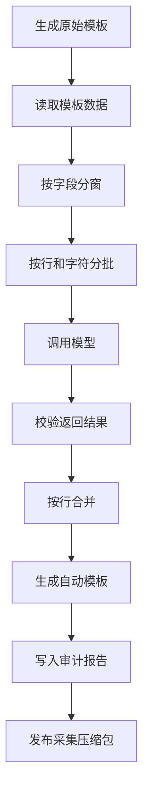

# 采样 Excel 大模型自动标注落地说明

## 一、落地结论

采集 UDF 已支持可选的大模型自动标注能力。

默认不开启自动标注，现有采集行为保持不变。调用方传入模型地址、模型名称和密钥后，系统会在原始标注 Excel 生成完成后执行以下流程：



自动标注只修改以下三列：

| 字段 | 写入内容 |
| --- | --- |
| `_row_label` | `0` 表示正常，`1` 表示异常 |
| `_error_columns` | 异常字段名，多个字段使用英文逗号分隔 |
| `_comment` | 自动标注置信度、原因和人工复核提示 |

系统列、展示列、业务列、哈希、工作表保护和原始模板均不会被修改。

## 二、调用参数

自动标注参数全部属于采集 UDF 的可选参数。

| 参数 | 默认值 | 说明 |
| --- | --- | --- |
| `autoLabelEnabled` | `false` | 是否开启自动标注 |
| `autoLabelModelUrl` | 空 | OpenAI 兼容聊天补全接口完整地址 |
| `autoLabelApiKey` | 空 | 显式密钥，仅保存在当前调用内存中 |
| `autoLabelApiKeyEnv` | `RAHA_AUTO_LABEL_API_KEY` | 密钥环境变量名 |
| `autoLabelModel` | 空 | 模型名称 |
| `autoLabelTemperature` | `0` | 模型采样温度 |
| `autoLabelContextWindowTokens` | 按模型识别 | 模型上下文窗口，私有部署可显式覆盖 |
| `autoLabelMaxRowsPerBatch` | 按容量计算 | 单批最大行数，显式传入时优先 |
| `autoLabelMaxCharsPerBatch` | 按容量计算 | 系统提示与用户消息的最大近似字符数 |
| `autoLabelMaxColumnsPerBatch` | 按容量计算 | 单个字段窗口最大字段数 |
| `autoLabelMaxValueChars` | `1000` | 单字段发送给模型的最大字符数 |
| `autoLabelMaxParallelBatches` | `1` | 最大并发模型调用数 |
| `autoLabelMaxRetryCount` | `2` | 单批最大重试次数 |
| `autoLabelBatchTimeoutMillis` | `120000` | 连接和读取超时时间 |
| `autoLabelMaxTotalRows` | `0` | 最大处理总行数，零表示不限制 |
| `autoLabelMaxResponseBytes` | `4194304` | 单次响应最大字节数 |
| `autoLabelMaxOutputTokens` | 按模型识别 | 单次模型最大输出令牌数 |
| `autoLabelFailPolicy` | `WARN_ONLY` | 批次失败后的处理策略 |
| `autoLabelMaskSensitiveColumns` | `true` | 是否脱敏 `sensitiveColumns` 原值 |

生产环境建议只传 `autoLabelApiKeyEnv`，由运行环境注入密钥，不在 SQL 中出现密钥明文。

模型容量档案如下：

| 模型名称匹配 | 上下文 | 默认最大输出 | 档案名称 |
| --- | ---: | ---: | --- |
| `qwen3-coder-plus`、`qwen3.5-plus` | 1000000 | 65536 | `QWEN_HOSTED_1M` |
| `qwen3-coder-next`、`qwen3-coder-30b`、`qwen3-coder-480b` | 262144 | 32768 | `QWEN_CODER_256K` |
| `qwen3.5code`、`qwen3.5-code`、`qwen3.5-coder` | 262144 | 32768 | `QWEN_CODER_256K` |
| `qwen2.5-3b` | 32768 | 8192 | `QWEN_2_5_3B_32K` |
| 其它模型 | 32768 | 4096 | `CONSERVATIVE_32K` |

`qwen3.5code` 不是统一的官方模型标识，当前按 256K 私有部署档案处理。如果服务端实际只开放更小窗口，必须通过 `autoLabelContextWindowTokens` 覆盖。

调用示例：

```sql
SELECT *
FROM F_DW_DETCOLLECT(
  '{
    "sourceType":"TABLE",
    "tableName":"dw.customer",
    "rowKeyColumns":"id",
    "labelingBudget":"200",
    "sensitiveColumns":["phone","id_card"],
    "autoLabelEnabled":"true",
    "autoLabelModelUrl":"https://model.example.com/v1/chat/completions",
    "autoLabelApiKeyEnv":"RAHA_AUTO_LABEL_API_KEY",
    "autoLabelModel":"quality-labeler",
    "autoLabelFailPolicy":"WARN_ONLY",
    "publishZip":"true"
  }'
);
```

## 三、分批与上下文控制

系统不会把整个 Excel 发送给模型。

用户未显式传入批次限制时，默认值按以下规则计算：

```text
安全预留令牌 = max(2048, 上下文令牌数 * 5%)
输入令牌预算 = 上下文令牌数 - 最大输出令牌数 - 安全预留令牌
最大字符数 = 输入令牌预算 * 75%
最大行数 = 最大输出令牌数 * 70% / 128
最大字段数 = 输入令牌预算 / 512
```

最大行数封顶 500，最大字段数封顶 200。`qwen3.5code` 默认计算结果为 179 行、162201 字符和 200 字段。

第一层按照 `autoLabelMaxColumnsPerBatch` 对可检测字段分窗。第二层在每个字段窗口中按照最大行数和实际序列化字符数分批。

每次构造候选批次时，系统会序列化真实 JSON 并计算系统提示词与用户消息总字符数。超过 `autoLabelMaxCharsPerBatch` 时关闭当前批次并开启下一批。

超长单元格只截断发送给模型的副本，截断长度由 `autoLabelMaxValueChars` 控制。Excel 中的原始值不受影响。

字段摘要基于实际参与自动标注的目标行计算，包括空值数量、样例值和观测长度。不同批次使用同一字段窗口摘要，降低批次间判断漂移。

敏感字段只向模型发送以下形式的占位值：

```text
<MASKED:length=18>
```

## 四、模型请求协议

HTTP 客户端使用 `POST` 调用配置的完整地址，并发送以下请求头：

```text
Content-Type: application/json
Accept: application/json
Authorization: Bearer <密钥>
```

请求正文采用 OpenAI 兼容的聊天补全结构，包含 `model`、`temperature`、`response_format`、`max_tokens` 和两条消息。

用户消息中的核心数据结构如下：

```json
{
  "task": "raha_auto_annotation",
  "datasetId": "dw.customer",
  "sampleBatchId": "sample_xxx",
  "batchId": "batch-000001",
  "detectableColumns": ["phone", "email"],
  "columnSummary": {},
  "rows": [
    {
      "rowId": "row-1",
      "values": {
        "phone": "<MASKED:length=11>",
        "email": "a@example.com"
      }
    }
  ]
}
```

模型消息正文必须返回：

```json
{
  "batchId": "batch-000001",
  "items": [
    {
      "rowId": "row-1",
      "rowLabel": 1,
      "errorColumns": ["email"],
      "confidence": 0.92,
      "reason": "邮箱格式与同列主要模式不一致"
    }
  ]
}
```

## 五、返回校验与合并

程序会拒绝以下模型结果：

| 场景 | 处理 |
| --- | --- |
| `batchId` 不一致 | 当前批次失败并重试 |
| 返回内容不是 JSON | 当前批次失败并重试 |
| 预期行缺失 | 当前批次失败并重试 |
| 同一 `rowId` 重复 | 当前批次失败并重试 |
| `rowLabel` 不是整数零或一 | 当前批次失败并重试 |
| 异常字段不在当前可检测字段窗口 | 当前批次失败并重试 |
| 正常行包含异常字段 | 当前批次失败并重试 |
| 异常行没有异常字段 | 当前批次失败并重试 |
| 置信度不在零到一之间 | 当前批次失败并重试 |
| 返回额外行 | 忽略并记录警告 |

同一行跨字段窗口时，异常字段按照原模板字段顺序取并集。任意成功窗口识别出异常，该行即合并为异常。

如果某一字段窗口失败，而其他成功窗口只判断为正常，该行保持空白，不会写入不完整的正常结论。如果其他窗口已经识别出异常，则保留已确认异常并在说明中标记人工复核。

## 六、失败策略

| 策略 | 行为 |
| --- | --- |
| `WARN_ONLY` | 任意模型批次最终失败时不生成自动标注 Excel，保留原始模板和审计报告，采集继续成功 |
| `PARTIAL` | 生成自动标注 Excel，成功行正常回写，失败或不完整行留空，已确认异常保留并标记复核 |
| `FAIL` | 任意批次最终失败时抛出 `AUTO_ANNOTATION_FAILED`，采集终止 |

配置错误、工作簿读取错误和回写错误也遵循上述失败策略。

## 七、采集返回字段

`RahaUdfFields.COLLECT` 尾部已追加：

| 字段 | 说明 |
| --- | --- |
| `autoAnnotationStatus` | `DISABLED`、`SUCCEEDED`、`PARTIAL` 或 `FAILED` |
| `autoAnnotationExcelName` | 自动标注 Excel 文件名 |
| `autoAnnotationRecordCount` | 原工作簿总记录数 |
| `autoAnnotationLabeledCount` | 成功回写标签的记录数 |
| `autoAnnotationFailedCount` | 未获得完整可用标签的记录数 |
| `autoAnnotationBatchCount` | 模型批次数 |
| `autoAnnotationReportName` | 自动标注摘要报告文件名 |

## 八、压缩包内容

关闭自动标注时，ZIP 结构与原流程保持一致。

开启自动标注后包含：

| ZIP 路径 | 内容 |
| --- | --- |
| `annotation/<原文件名>.xls` | 兼容旧下载方的原始模板 |
| `annotation/raw/<原文件名>.xls` | 明确归档的原始模板 |
| `annotation/auto/<自动文件名>_auto.xls` | 可直接审核的自动标注模板 |
| `auto-label/summary.json` | 自动标注状态、统计、模型地址哈希和提示词版本 |
| `auto-label/decisions.jsonl` | 合并后的逐行标注决策 |
| `auto-label/batches.jsonl` | 批次状态、调用次数、耗时和失败摘要 |
| `summary.json` | 采集 UDF 摘要 |
| `manifest.json` | 采样批次元数据 |
| `column-clusters.csv` | 字段聚类摘要 |

自动标注文件名以 `_auto.xls` 结尾，人工审核后可另存为 `_reviewed.xls`。两种文件名均符合现有训练文件定位规则。

## 九、安全与可观测性

密钥不会写入日志、Excel、ZIP、摘要报告或异常消息。

模型接口错误只记录 HTTP 状态码，不记录外部服务响应正文，避免服务端回显请求数据时进入日志。

HTTP 客户端禁止跨地址自动重定向，防止 `Authorization` 请求头被转发到非预期主机。

日志已覆盖自动标注开始、批次调用、批次重试、返回校验、合并结果、Excel 文件读写、报告文件写入和最终统计。

自动标注不会自动上传训练目录，也不会自动触发训练。用户审核 `_auto.xls` 后仍通过原训练入口导入。

## 十、代码位置

核心实现位于：

```text
src/main/java/com/fiberhome/ml/raha/annotation/auto/
```

采集入口修改位于：

```text
src/main/java/com/fiberhome/ml/raha/udf/RahaDetectionUdfService.java
src/main/java/com/fiberhome/ml/raha/udf/RahaUdfFields.java
```

测试位于：

```text
src/test/java/com/fiberhome/ml/raha/annotation/auto/AutoAnnotationPipelineTest.java
src/test/java/com/fiberhome/ml/raha/annotation/service/AnnotationUploadFileLocatorTest.java
```

## 十一、验证结果

定向测试共十三项，全部通过：

```text
mvn -Dtest=AutoAnnotationPipelineTest,AnnotationUploadFileLocatorTest test
```

覆盖范围包括配置解析、模型容量动态默认值、行列分批、字符上限、敏感字段脱敏、严格响应校验、失败窗口合并、Excel 回写、审计报告、重试策略、真实本地 HTTP 模拟接口和自动标注文件名匹配。

标注导入相关回归共十九项，全部通过：

```text
mvn -DargLine=--add-opens=java.base/sun.nio.ch=ALL-UNNAMED -Dtest=AnnotationImportServiceIntegrationTest,AnnotationUploadFileLocatorTest,AutoAnnotationPipelineTest test
```

全量测试执行了 239 项。本功能新增测试全部通过；工作区已有状态导致十项失败和一项错误，集中在默认配置、FMDB 表数量、训练仓储、模型生命周期、Spark 聚类与快照检查点，不涉及本次自动标注模块及修改文件。
